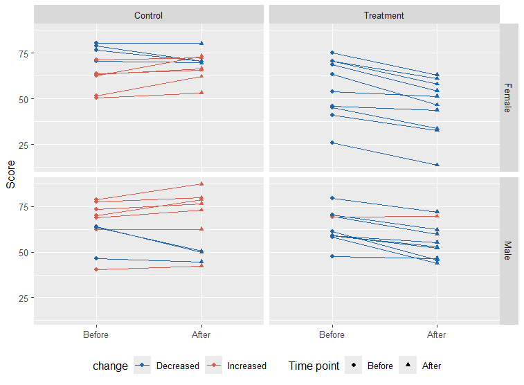

```{r setup, include=FALSE}
knitr::opts_chunk$set(echo = TRUE, fig.width = 9, fig.height = 6, fig.align = "center")
library(ggplot2)
library(shiny)
library(plotly)
library(dplyr)
library(tidyr)
```

```{=html}
<style>
  .fig {width: 50%}
  @import url(https://fonts.googleapis.com/css?family=Fira+Sans:300,300i,400,400i,500,500i,700,700i);
  @import url(https://cdn.rawgit.com/tonsky/FiraCode/1.204/distr/fira_code.css);

.center {
  text-align: center;
}
</style>
```
<hr>

<b><i>Directions</i>:</b>
<b>1.</b> The Data visualization will last a total of 2 hours. Ask us any questions during that time.
<b>2.</b> You may consult with any allowed materials you wish from https://marta-coronado.github.io/data_visualization (screens will be recorded, and no sharing the video will have a penalization). You can also check your own notes, as long as they correspond to present course materials.
<b>3.</b> Deliver the rendered HTML and Rmd with your answers to Atenea.
<b>4.</b> Answers must be written in English.
<b>5.</b> Plagiarism (copying directly from a source) and cheating (including the use of ChatGPT or other AI, for example Google searches AI) are forbidden and will result in failing of the exam with grade 0.
<b>6.</b> Good luck!

<b>Recommendations</b>:
<b>1.</b> Before you start, read the exam and check the points for each question.
<b>2.</b> If you get stuck, ask for help. If you spend more than 10 minutes without progressing on a question, go to the next one.
<b>3.</b> Allocate the time wisely: distribute your time according to the weight of each question to maximize your score.

<hr>

### **1. Short exercises and questions (5 points)**

#### **QUESTION 1**

**The following `ggplot2` calls have small problems so they are not working as intended. Fix them, and briefly explain why they were wrong and what have you done to solve them. It may be more than one error per call. ** (1 point)

1. I want one boxplot per month.

```{r q1.1, eval = FALSE}

ggplot(airquality, aes(airquality$Month, airquality$Temp)) +
    geom_boxplot()

# Answer:

ggplot(airquality, aes(as.factor(Month), Temp)) +
    geom_boxplot()

# Month is numeric, so ggplot treats it as continuous and draws one
# boxplot for all data. Converting to factor creates one group per month.
# The usage of df$var is discouraged
```

2. I want to divide the plot into small multiples by `class`, arranging the panels in columns and allowing panel widths to vary accordingly.

```{r q1.2, eval = FALSE}

ggplot(mpg, aes(displ, hwy)) +
    geom_point() +
    facet_grid(class)

# Answer:

ggplot(mpg, aes(displ, hwy)) +
    geom_point() +
    facet_grid(~class, space="free", scale="free")

# facet_grid() requires a formula interface. Writing `class` alone
# does not specify how to facet the plot. Using `~class` places
# the facets in columns. Additionally, `scales = "free"` allows
# each panel to have its own axis scales, and `space = "free"`
# adjusts the panel widths accordingly.

```

3. I want one individual line per `Seed` without coloring the lines.

```{r q1.3, eval = FALSE}

ggplot(Loblolly, aes(age, height, Seed)) +
    geom_line()

# Answer:

ggplot(Loblolly, aes(age, height, group = Seed)) +
    geom_line()

# The third positional argument in aes() does not map to group.
# group must be named explicitly so ggplot2 knows to draw
# a separate line for each Seed value.

```

4. I want a bar chart showing the number of survivors per `Class`.

```{r q1.4, eval = FALSE}

ggplot(as.data.frame(Titanic), aes(Class, Freq)) +
    geom_bar()

# Answer:
ggplot(as.data.frame(Titanic), aes(Class, Freq)) +
    geom_col()

# geom_bar() uses stat = "count" by default, so it ignores the
# provided y variable and counts rows instead. Since we already
# have counts in Freq, we must use geom_col(), which takes the
# y values as they are.
```


#### **QUESTION 2**

**Reproduce the following figure using the dataframe `df` that is created below.** (2.5 points)



**Hint**: colour codes are "#2166AC" and "#D6604D".

Execute the following chunck to create the dataframe `df`.

```{r create-df}
set.seed(2024)
n <- 40

ids    <- 1:n
sex    <- rep(c("Female", "Male"),    each = n/2)
group  <- rep(c("Control", "Treatment", "Control", "Treatment"), each = n/4)
before <- rnorm(n, mean = 65, sd = 12)
after  <- before + ifelse(group == "Treatment", -8, -1) + rnorm(n, sd = 6)

df <- data.frame(
  id    = rep(ids, 2),
  time  = factor(rep(c("Before", "After"), each = n), levels = c("Before", "After")),
  score = c(before, after),
  sex   = rep(sex, 2),
  group = rep(group, 2)
)

# Direction of change per subject
wide <- reshape(df,
                idvar   = c("id", "sex", "group"),
                timevar = "time",
                direction = "wide")
wide$change <- ifelse(wide$score.After < wide$score.Before, "Decreased", "Increased")
df <- merge(df, wide[, c("id", "change")], by = "id")
```

```{r q3.2}
ggplot(df, aes(time, score, group = id)) +
  geom_line(aes(color = change)) +
  geom_point(aes(color = change, shape = time)) +
  facet_grid(sex ~ group) +
  scale_color_manual(values = c("Decreased" = "#2166AC", "Increased" = "#D6604D")) +
  labs(
    x        = NULL,
    y        = "Score",
    shape    = "Time point"
  ) +
  theme(legend.position  = "bottom")
```


#### **QUESTION 3**

**Do you think the previous figure is suitable for a conference presentation with an audience of over 200 people? (max. 100 words) Propose at least three specific changes to improve the figure and implement them.** (1.5 points)

Note: Do not remove or replace `geom_line`, `geom_point`, or `facet_grid`, but you may adjust the aesthetic parameters.


```{r q3.1, eval = FALSE}

ggplot(df, aes(time, score, group = id)) +
  geom_line(aes(color = change)) +
  geom_point(aes(color = change, shape = time)) +
  facet_grid(sex ~ group) +
  scale_color_manual(values = c("Decreased" = "cadetblue3", "Increased" = "orange3")) + # color-blind friendly palette
  labs(
    x        = NULL,
    y        = "Score",
    shape    = "Time point",
    color = "Direction", # clear labels
    title = "Individual Score Changes Before and After Treatment by Sex and Group" # title
  ) +
  theme_classic(base_size = 18) + # increase ink-data ratio, use bigger font
  theme(legend.position  = "bottom",
        axis.text.x = element_blank(), # before - after is redundant
        axis.ticks.x = element_blank())
```

<hr>

### **2. Problem (5 points)**

**In this problem you will need to create a static figure using `ggplot2`, and then create an interactive version using `shiny`. We will use the `msleep` dataset.** 

#### Static `ggplot2` figure (2 points)

The `msleep` dataset contains information about the sleeping patterns, body mass, and brain weight of 83 species of mammals with 4 different diet types (carnivore, herbivore, insectivore and omnivore).

Hypothesis: Theory predicts that the fraction of sleeping time spent in REM phase should be constant, around 3/16, and independent of body mass. 

For the figure, represent a scatter plot of the fraction of sleep spent in REM (`rem_fraction`) against the logarithm of the body weight (`bodywt`). Show the raw data, summaries and annotations (1 point) and finish it with publication-quality details (0.5 points). Interpret the results: does the hypothesis hold? (0.5 points).

```{r create-rem_faction}
# We create the extra variable
msleep$rem_fraction <- msleep$sleep_rem/msleep$sleep_total
```

```{r p1}

ggplot(msleep, aes(x = log(bodywt), y = rem_fraction)) +
  geom_point() +
  geom_smooth(method="lm", color = "black", linewidth = 1) +
  geom_hline(yintercept = 3/16, linetype = "dashed", color = "firebrick3", linewidth = 1) +
  annotate("text", 
           x = -3, 
           y = 3/16 + 0.01, 
           label = "Theoretical value (3/16)", 
           color = "firebrick3") +  labs(
    title = "REM sleep fraction vs body mass in mammals",
    x = "Logarithm of body weight",
    y = "REM sleep fraction"
  ) +
  theme_minimal(base_size = 14)
```

The hypothesis holds.

##### **`shiny` application (3 points):**

**Create a shiny application that allows you to explore the relationship between brain weight and body mass in the `msleep` dataset. The app must allow users to select one or more groups of animals based on their diet (`vore`) and visualize the relationship between the logarithm of brain weight and body mass.**

Mandatory:
- Input widget to select one or more groups of animals based on the diet
- Plot to visualize the relationship between the log of brain weight and log of body mass

Implement 5 out of 6 of the following features:

- Include a title and your name in the app using some HTML features
- Add a linear regression line to the plot
- Include a slider input to filter by body weight range
- Display a data table with the filtered dataset
- Add dynamic text summarizing the number of selected species
- Make the plot interactive with plotly


Remember that you can use `dplyr` to filter a dataframe (P4), for example:

```{r, eval = F}
filtered_data <- msleep %>% 
                    filter(vore %in% input$... &
                           bodywt >= input$... )
```

You have the following `shiny` template:

```{r p2, eval = F}
library(shiny)
library(ggplot2)
library(plotly)

ui <- fluidPage(

  sidebarLayout(
    sidebarPanel(
 
    )
  ),
    
    mainPanel(
      
    )
)

server <- function(input, output) {
  
}

shinyApp(ui, server)

```


<hr>


```{r p2-answer}

library(shiny)
library(ggplot2)
library(plotly)

ui <- fluidPage(
  
  # 1. Title + name
  titlePanel("Brain vs body mass explorer"),
  
  sidebarLayout(
    sidebarPanel(
      
      # Diet selection
      checkboxGroupInput(
        "vore",
        "Select diet type:",
        choices = unique(msleep$vore),
        selected = unique(msleep$vore)
      ),
      
      # 3. Slider for body weight
      sliderInput(
        "bodywt",
        "Body weight range:",
        min = min(msleep$bodywt),
        max = max(msleep$bodywt),
        value = c(min(msleep$bodywt),
                  max(msleep$bodywt))
      )
    ),
    
    mainPanel(
      
      # 5. Dynamic text
      textOutput("summary_text"),
      
      # Plot
      plotlyOutput("plot"),
      
      # 4. Data table
      dataTableOutput("table")
    )
  )
)

server <- function(input, output) {
  
  # Reactive data filtering
  filtered_data <- reactive({
    msleep |>
      subset(vore %in% input$vore &
             bodywt >= input$bodywt[1] &
             bodywt <= input$bodywt[2])
  })
  
  # 5. Dynamic text
  output$summary_text <- renderText({
    paste("Number of selected species:", nrow(filtered_data()))
  })
  
  # Plot
  output$plot <- renderPlotly({
    
    p <- ggplot(filtered_data(),
                aes(x = log(bodywt), y = log(brainwt),
                    text = name)) +
      geom_point() +
      
      # 2. Regression line
      geom_smooth(method = "lm", se = FALSE, color = "black") +
      
      labs(
        x = "Log Body Weight",
        y = "Log Brain Weight"
      ) +
      theme_minimal()
    
    # 6. Interactive plot with hover
    ggplotly(p, tooltip = c("text", "x", "y"))
  })
  
  # 4. Data table
  output$table <- renderDataTable({
    filtered_data()
  })
}

shinyApp(ui, server)

```


<hr>
