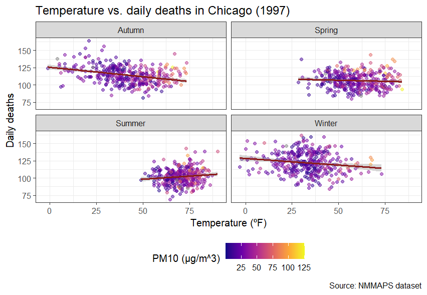

```{r setup, include=FALSE}
knitr::opts_chunk$set(echo = TRUE, fig.width = 9, fig.height = 6, fig.align = "center")
library(ggplot2)
library(shiny)
library(plotly)
library(dplyr)
library(tidyr)
```

```{=html}
<style>
  .fig {width: 50%}
  @import url(https://fonts.googleapis.com/css?family=Fira+Sans:300,300i,400,400i,500,500i,700,700i);
  @import url(https://cdn.rawgit.com/tonsky/FiraCode/1.204/distr/fira_code.css);

.center {
  text-align: center;
}
</style>
```
<hr>

<b><i>Directions</i>:</b>
<b>1.</b> The Data visualization will last a total of 2 hours. Ask us any questions during that time.
<b>2.</b> You may consult with any allowed materials you wish from https://marta-coronado.github.io/data_visualization (screens will be recorded, and no sharing the video will have a penalization). You can also check your own notes, as long as they correspond to present course materials.
<b>3.</b> Deliver the rendered HTML and Rmd with your answers to Atenea.
<b>4.</b> Answers must be written in English.
<b>5.</b> Plagiarism (copying directly from a source) and cheating (including the use of ChatGPT or other AI, for example Google searches AI) are forbidden and will result in failing of the exam with grade 0.
<b>6.</b> Good luck!

<b>Recommendations</b>:
<b>1.</b> Before you start, read the exam and check the points for each question.
<b>2.</b> If you get stuck, ask for help. If you spend more than 10 minutes without progressing on a question, go to the next one.
<b>3.</b> Allocate the time wisely: distribute your time according to the weight of each question to maximize your score.

<hr>

#### **QUESTION 1**

**Help your  colleague to address the following `ggplot2` requirements and briefly explain them why they were wrong and what have you done to solve it. Note that there may be some redundancices in the code that also need to be removed.** (1 point)

💬 I want to color the histogram bars with color "#F8766D".

```{r q1.1, eval = FALSE}

ggplot(iris, aes(iris$Petal.Width)) +
    geom_histogram()

# Answer:


```

💬 I want to apply the "viridis" palette to color the inside of the bars.

```{r q1.2, eval = FALSE}

ggplot(mpg) +
    geom_bar(data = mpg, aes(drv, color = as.factor(cyl))) +
    scale_fill_virids_c()

# Answer:


```

💬 I want to remove the legend.

```{r q1.3, eval = FALSE}

ggplot(diamonds, aes(factor(clarity), price)) +
  geom_boxplot(aes(factor(cut), price, fill = clarity)) +
  + guides(colour = "none")

# Answer:


```

<hr>
#### **QUESTION 2**

**Why is it generally preferable to generate figures programmatically rather than with graphical editing software in a research context? Give at least 3 advantages.** (1.5 points)


<hr>
#### **QUESTION 3**

**Reproduce the following figure using the National Morbidity and Mortality Air Pollution Study (NMMAPS). This dataset is the largest multisite time-series study of the effects of air pollution on mortality in Chicago.** (3 points)

- The points use a transparency of 0.5.
- The color of the correlation line is `firebrick4`
- The scale color of PM10 is `scale_color_viridis_c` with `option = "plasma"`
- `facet_wrap` is being used



```{r q3}
library(ggplot2)
library(dplyr)

chic <- read.csv("nmmaps-data2022_12_8D13_4_0.csv")

# Load data
chic$date <- as.Date(chic$date)

# Plot

```


<hr>
#### **QUESTION 4**

**Is `chic` data frame an example of a wide or a long data frame? Justify your answer and show which package and function would you need to convert it to the other format (no need to do the conversion) ** (0.5 point)


<hr>
#### **QUESTION 5**

**Imagine that this figure appears in a research article. Propose a figure caption that briefly explains what it shows and the main conclusions.** (1 points)


<hr>
#### **QUESTION 6**

**Using the `chic` dataset, design and implement a `Shiny` application that allows the interactive exploration of the relationship between environmental variables (Temperature [`temp`], PM10 [`pm10`] and ozone [`o3`]) and daily mortality in Chicago.**  (3 points)

Your app must include at least:

1. One input widget that lets the user select which variable to plot on the `x`-axis (`temp`, `pm10` or `o3`), only one can be selected
2. One input widget to filter by season, more than one season can be selected
3. One reactive plot, using `ggplot2`, that updates based on the user inputs, showing the selected variable against daily deaths
4. Add a regression line (as in Question 3)
5. Add a table that displays the season filtered data (bonus: use a data.table)

```{r q6}

```

<hr>