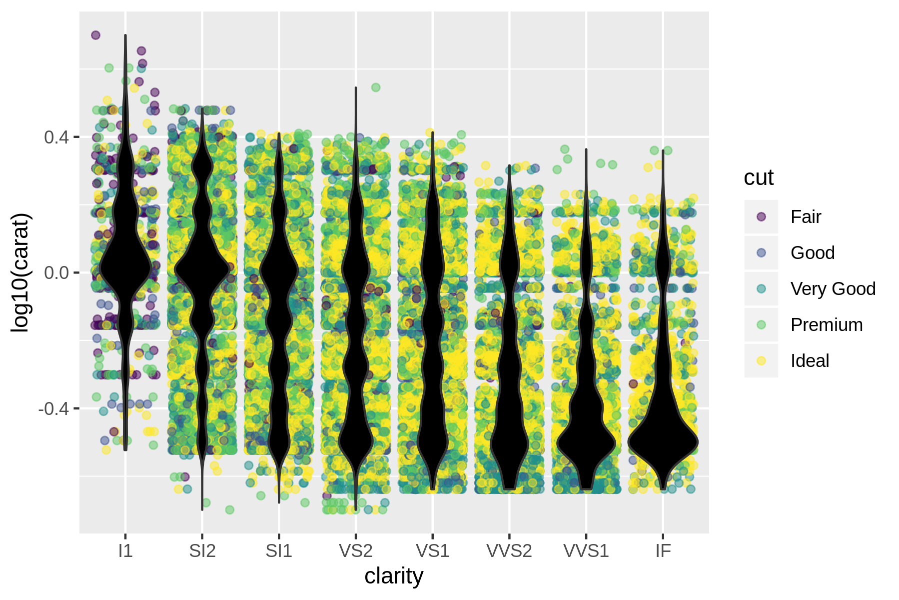
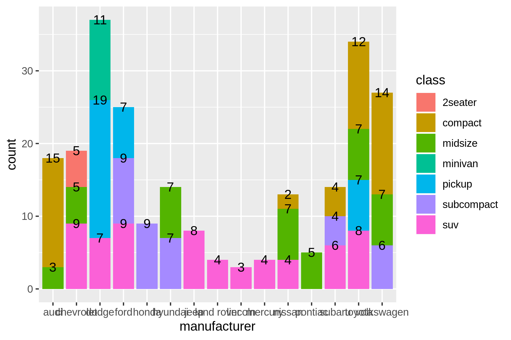
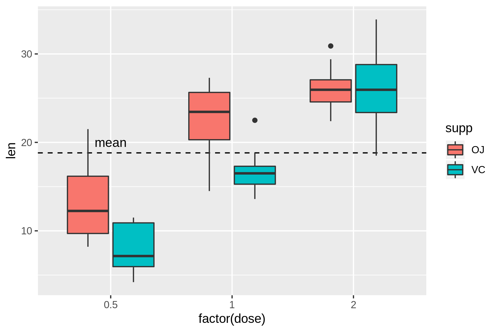
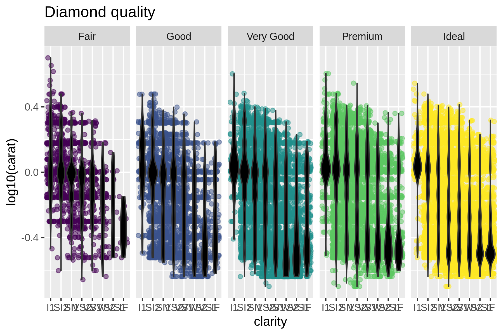
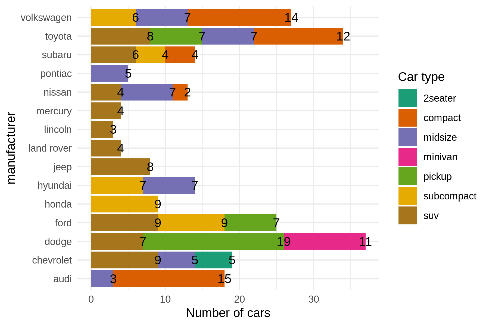
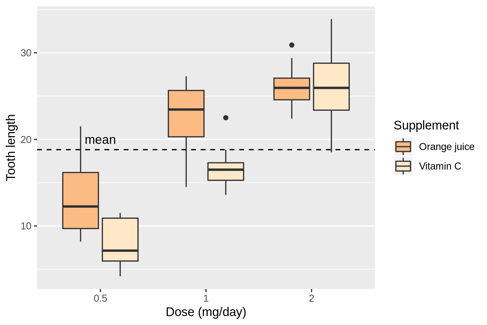

```{r setup, include=FALSE}
knitr::opts_chunk$set(echo = TRUE, fig.width = 6, fig.height = 4, fig.align='center')
# install.packages("prettydoc")
```

```{=html}
<style>
  @import url(https://fonts.googleapis.com/css?family=Fira+Sans:300,300i,400,400i,500,500i,700,700i);
  @import url(https://cdn.rawgit.com/tonsky/FiraCode/1.204/distr/fira_code.css);
  @import url("https://use.fontawesome.com/releases/v5.10.1/css/all.css");
  
  body {
    font-family: 'Fira Sans','Droid Serif', 'Palatino Linotype', 'Book Antiqua', Palatino, 'Microsoft YaHei', 'Songti SC', serif;
  }
  
  /* Make bold syntax compile to RU-red */
  strong {
    color: #cc0033;
  }
  
  .nav3 {
    height: auto;
    float: left;
    padding-left: 20px;
    padding-top: 20px;
    padding-right: 20px;
}
</style>
```
## Introduction

We are going to reproduce three different plots, of which we are only
given the data set and the final image file. Each of them has two
versions:

-   The first version is a plot made just using the layer functions of
    `ggplot2` and leaving everything else with the defaults. This is,
    using `ggplot`, `geom_*`, `stat_*` and `annotate_*` functions (click
    on the image to see it bigger).

<a href="Graphics/p1_simple.png" target="new">

</a><a href="Graphics/p2_simple.png" target="new">
 </a>
<a href="Graphics/p3_simple.png" target="new">
 </a>

-   The second version builds from the first plot to create a more
    complex display with customized `scales_*`, `coord_*`, `facet_*` or
    `theme_*`. Helper functions such as `labs()` or `guides()` could
    also be used (click on the image to see it bigger).

<a href="Graphics/p1_complete.png" target="new">

</a> <a href="Graphics/p2_complete.png" target="new">

</a> <a href="Graphics/p3_complete.png" target="new">

</a>

```{r}
library(ggplot2)
```

 <i class="fas fa-info-circle"></i>: `ggplot2` will automatically load
all three data sets used in this practical.

### Organization of the practical

You will see different icons through the document, the meaning of which
is:

 <i class="fas fa-info-circle"></i>: additional or useful
information<br>  <i class="fas fa-search"></i>: a worked example<br>
 <i class="fa fa-cogs"></i>: a practical exercise<br>
 <i class="fas fa-comment-dots"></i>: a space to answer the exercise<br>
 <i class="fa fa-key"></i>: a hint to solve an exercise<br>
 <i class="fa fa-rocket"></i>: a more challenging exercise<br><br>

------------------------------------------------------------------------

## <i class="fa fa-cogs"></i> Simple versions

### **Plot 1**

```{r answer1.1}
# Dataset used: diamonds

```

::: {style="background-color:#F0F0F0"}
#####  <i class="fas fa-comment-dots"></i> Answer:

 
:::

### **Plot 2**

```{r answer1.2}
# Dataset used: mpg

```

 <i class="fa fa-key"></i> Need help with the count numbers shown in
each stacked bar?
<https://stackoverflow.com/questions/6644997/showing-data-values-on-stacked-bar-chart-in-ggplot2>

::: {style="background-color:#F0F0F0"}
#####  <i class="fas fa-comment-dots"></i> Answer:

 
:::

### **Plot 3**

```{r answer1.3}
# Dataset: ToothGrowth

```

::: {style="background-color:#F0F0F0"}
#####  <i class="fas fa-comment-dots"></i> Answer:

 
:::

------------------------------------------------------------------------

## <i class="fa fa-rocket"></i> Complex versions

### **Plot 1**

```{r answer2.1}

```

::: {style="background-color:#F0F0F0"}
#####  <i class="fas fa-comment-dots"></i> Answer:

 
:::

### **Plot 2**

```{r answer2.2}

```

::: {style="background-color:#F0F0F0"}
#####  <i class="fas fa-comment-dots"></i> Answer:

 
:::

 <i class="fa fa-key"></i> This graph uses a `scale_fill_brewer`
palette, can you find which one?

### **Plot 3**

```{r answer2.3}

```

::: {style="background-color:#F0F0F0"}
#####  <i class="fas fa-comment-dots"></i> Answer:

 
:::

 <i class="fa fa-key"></i> This graph uses a `scale_fill_brewer`
palette, can you find which one?
