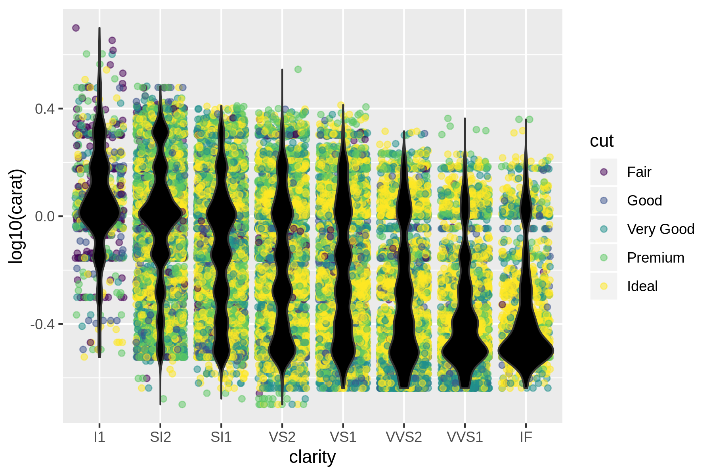
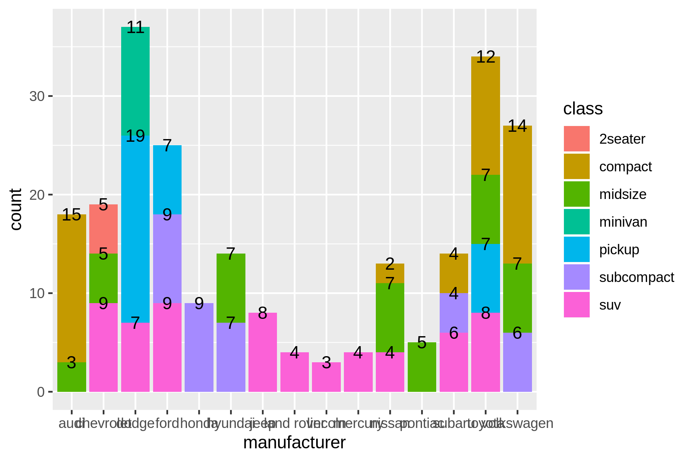
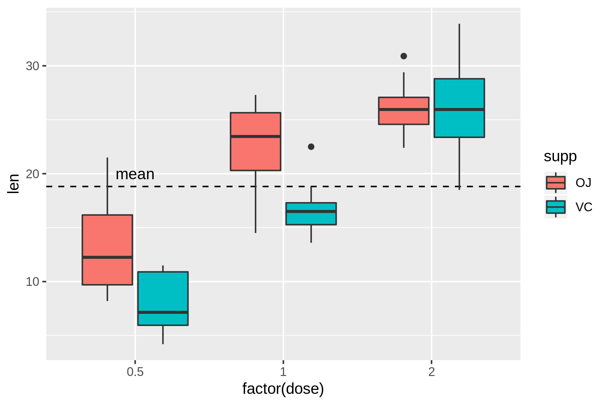
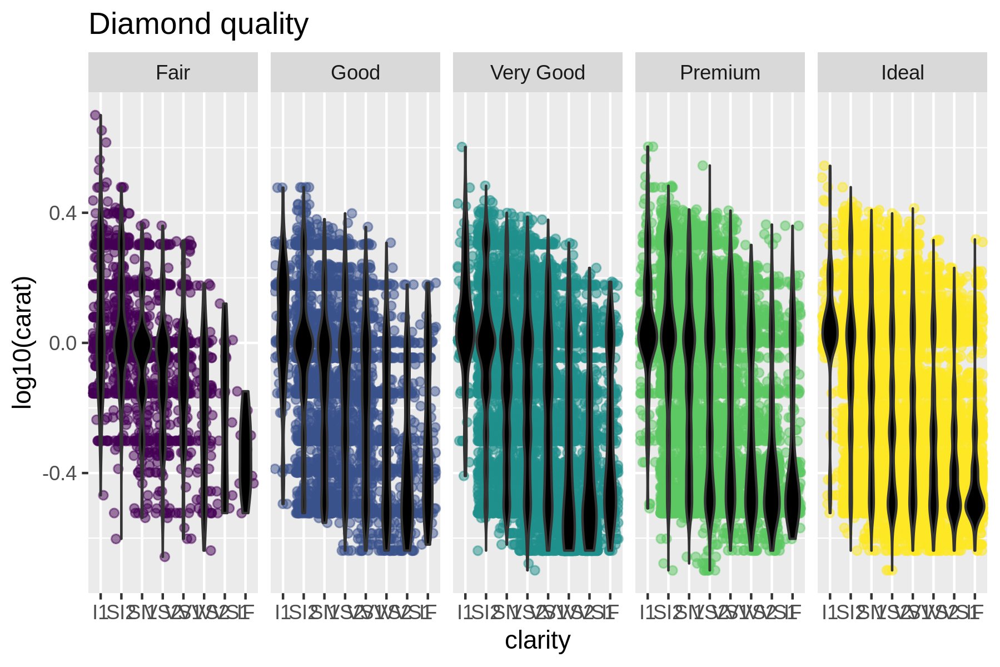
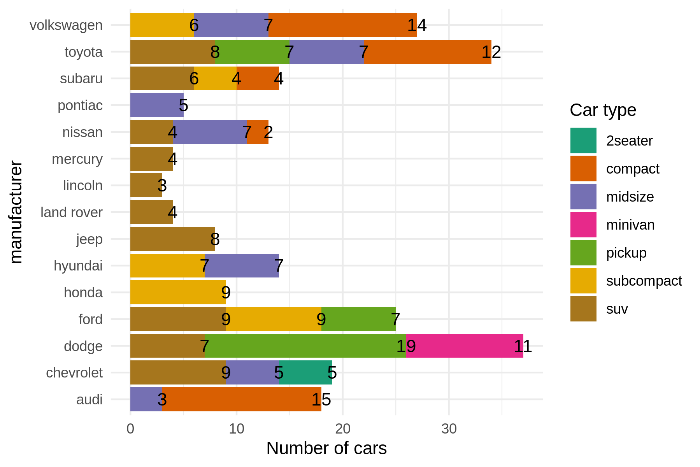
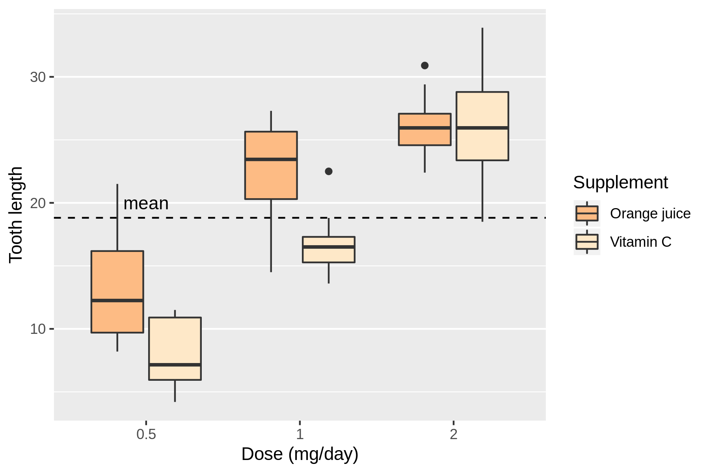

```{r setup, include=FALSE}
knitr::opts_chunk$set(echo = TRUE, fig.width = 6, fig.height = 4, fig.align='center')
# install.packages("prettydoc")
```

<style>
  @import url(https://fonts.googleapis.com/css?family=Fira+Sans:300,300i,400,400i,500,500i,700,700i);
  @import url(https://cdn.rawgit.com/tonsky/FiraCode/1.204/distr/fira_code.css);
  @import url("https://use.fontawesome.com/releases/v5.10.1/css/all.css");
  
  body {
    font-family: 'Fira Sans','Droid Serif', 'Palatino Linotype', 'Book Antiqua', Palatino, 'Microsoft YaHei', 'Songti SC', serif;
  }
  
  /* Make bold syntax compile to RU-red */
  strong {
    color: #cc0033;
  }
  
  .nav3 {
    height: auto;
    float: left;
    padding-left: 20px;
    padding-top: 20px;
    padding-right: 20px;
}
</style>


## Introduction

We are going to reproduce three different plots, of which we are only given the data set and the final image file. Each of them has two versions:

- The first version is a plot made just using the layer functions of `ggplot2` and leaving everything else with the defaults. This is, using `ggplot`, `geom_*`, `stat_*` and `annotate_*` functions (click on the image to see it bigger). 

<a href="Graphics/p1_simple.png" target="new">
    
</a><a href="Graphics/p2_simple.png" target="new">
    
</a> <a href="Graphics/p3_simple.png" target="new">
    
</a>

- The second version builds from the first plot to create a more complex display with customized `scales_*`, `coord_*`, `facet_*` or `theme_*`. Helper functions such as `labs()` or `guides()` could also be used (click on the image to see it bigger). 

<a href="Graphics/p1_complete.png" target="new">
    
</a> <a href="Graphics/p2_complete.png" target="new">
    
</a> <a href="Graphics/p3_complete.png" target="new">
    
</a>


```{r}
library(ggplot2)
```

&emsp;<i class="fas fa-info-circle"></i>: `ggplot2` will automatically load all three data sets used in this practical.

### Organization of the practical

You will see different icons through the document, the meaning of which is:

&emsp;<i class="fas fa-info-circle"></i>: additional or useful information<br>
&emsp;<i class="fas fa-search"></i>: a worked example<br>
&emsp;<i class="fa fa-cogs"></i>: a practical exercise<br>
&emsp;<i class="fas fa-comment-dots"></i>: a space to answer the exercise<br>
&emsp;<i class="fa fa-key"></i>: a hint to solve an exercise<br>
&emsp;<i class="fa fa-rocket"></i>: a more challenging exercise<br><br>

----------------------------------------------------------------------------------

## **<i class="fa fa-cogs"></i> Simple versions**

### **Plot 1**

```{r answer1.1}
# Data set used: diamonds

p1_simple <- ggplot(diamonds, aes(clarity, log10(carat))) + 
  geom_point(aes(colour = cut), position = "jitter", alpha = 0.5) + 
  geom_violin(aes(group = clarity), fill = "black")
p1_simple

```


### **Plot 2**

```{r answer1.2}
# Data set used: mpg

p2_simple <- ggplot(mpg, aes(manufacturer, fill = class)) +
  geom_bar() +
  geom_text(aes(label = after_stat(count)), stat = "count", position = position_stack(vjust = 0.5))
p2_simple

```

&emsp;<i class="fa fa-key"></i> Need help with the count numbers shown in each stacked bar? https://stackoverflow.com/questions/6644997/showing-data-values-on-stacked-bar-chart-in-ggplot2

### **Plot 3**

```{r answer1.3}
# Data set: ToothGrowth

p3_simple <- ggplot(ToothGrowth, aes(factor(dose), len, fill = supp)) +
  geom_hline(yintercept = mean(ToothGrowth$len), linetype = 2) +
  annotate(geom = "text", x = "0.5", y = 20, label = "mean") +
  geom_boxplot()
p3_simple

```


----------------------------------------------------------------------------------

## **<i class="fa fa-rocket"></i> Complex versions**

### **Plot 1**

```{r answer2.1}

p1_complete <- p1_simple +
  theme_bw() + 
  facet_grid(. ~ cut) +
  theme(legend.position = "none") +
  labs(title = "Diamond quality") +
  theme(axis.text.x = element_text(angle = 45, hjust=1))
p1_complete

```

### **Plot 2**

```{r answer2.2}

p2_complete <- p2_simple +
  scale_fill_brewer(palette = "Dark2", name = "Car type") +
  coord_flip() +
  theme_minimal() +
  labs(y = "Number of cars", x = "Manufacturer")
p2_complete

```

&emsp;<i class="fa fa-key"></i> This graph uses a `scale_fill_brewer` palette, can you find which one?

### **Plot 3**

```{r answer2.3}

p3_complete <- p3_simple +
  theme_classic() + 
  scale_fill_brewer(palette = "OrRd", labels = c("Orange juice", "Vitamin C"), direction = -1) +
  theme(panel.grid.major.x = element_blank()) +
  labs(x = "Dose (mg/day)", y = "Tooth length", fill = "Supplement")
p3_complete

```


&emsp;<i class="fa fa-key"></i> This graph uses a `scale_fill_brewer` palette, can you find which one?
