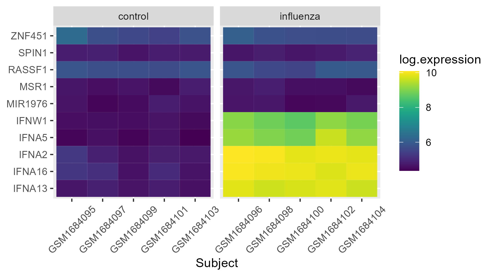
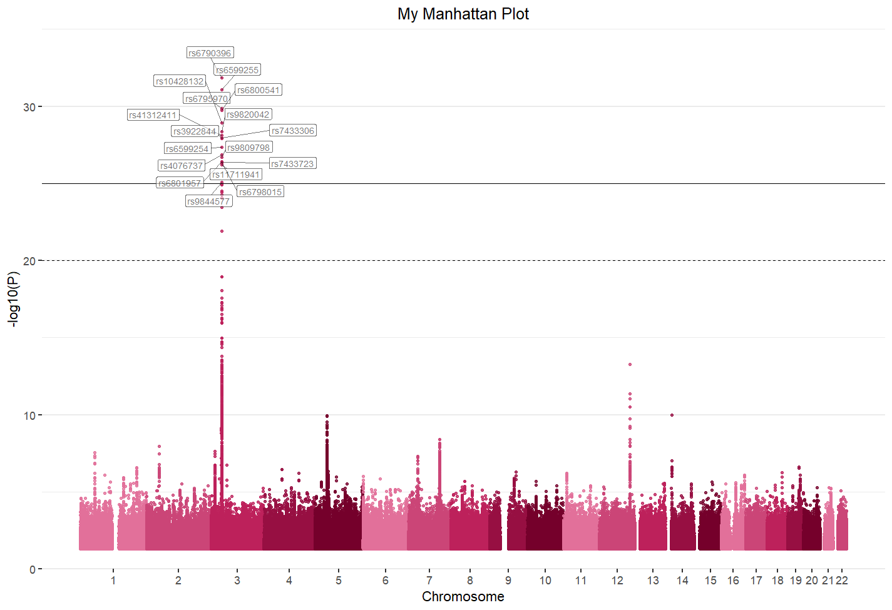
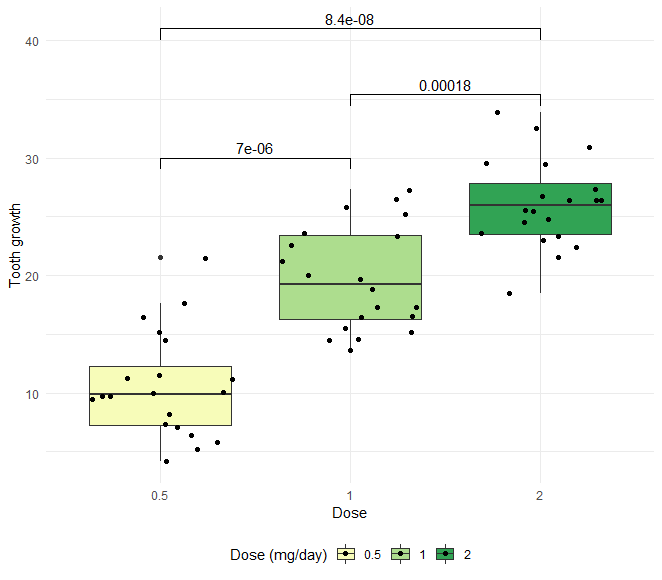

```{r setup, include=FALSE}
knitr::opts_chunk$set(echo = TRUE, fig.width = 6, fig.height = 4, fig.align='center')
# install.packages("prettydoc")
```

<style>
  @import url(https://fonts.googleapis.com/css?family=Fira+Sans:300,300i,400,400i,500,500i,700,700i);
  @import url(https://cdn.rawgit.com/tonsky/FiraCode/1.204/distr/fira_code.css);
  @import url("https://use.fontawesome.com/releases/v5.10.1/css/all.css");
  
  body {
    font-family: 'Fira Sans','Droid Serif', 'Palatino Linotype', 'Book Antiqua', Palatino, 'Microsoft YaHei', 'Songti SC', serif;
  }
  
  /* Make bold syntax compile to RU-red */
  strong {
    color: #cc0033;
  }

</style>


## Introduction

We are going to create three different visualizations commonly used in scientific research: 

- a **heatmap**, a graph that represents a matrix of values as colors, topically used in scientific articles related with gene expression data (micro-array or RNA-seq data)
- a **Manhattan plot**, used to summarize genome-wide association data. It has a point for every SNP or location tested with the position in the genome along the `x`-axis and the -log<sub>10</sub> p-value on the `y`-axis
- a **boxplot with significance levels**, automatically add p-values or significance levels to a ggplot boxplot

The following figures show the final plot that you should obtain after this practical (click on the image to see it bigger).

<a href="img/heatmap2022_10_6D10_10_45.png" target="new">
    
</a><a href="img/electrocardiographic2020_10_13D14_37_6.png" target="new">
    
</a> <a href="img/boxplot2020_10_13D14_36_46.png" target="new">
    
</a>

### Organization of the practical

You will see different icons through the document, the meaning of which is:

&emsp;<i class="fas fa-info-circle"></i>: additional or useful information<br>
&emsp;<i class="fas fa-search"></i>: a worked example<br>
&emsp;<i class="fa fa-cogs"></i>: a practical exercise<br>
&emsp;<i class="fas fa-comment-dots"></i>: a space to answer the exercise<br>
&emsp;<i class="fa fa-key"></i>: a hint to solve an exercise<br>
&emsp;<i class="fa fa-rocket"></i>: a more challenging exercise<br><br>

### Installing and loading packages

Some of the graphs are created simply using `ggplot2`, but others need additional libraries based on `ggplot2`. Install the following libraries (if you don't have them yet):

```{r message = FALSE, echo = TRUE}
# install.packages("ggplot2")
# install.packages("tidyr")
# install.packages("viridis")
# install.packages("ggrepel")
# install.packages("RColorBrewer")
# install.packages("dplyr")
# install.packages("ggsignif")
library(ggplot2)
library(tidyr)
library(viridis)
library(ggrepel)
library(RColorBrewer)
library(dplyr)
library(ggsignif)
```

Follow the step-by-step guides to create every plot and answer the questions. In most cases, the example provided by the R package tutorial has been used to create the practical.

----------------------------------------------------------------------------------

## **<i class="fa fa-cogs"></i> Creating a heatmap**

**Heatmaps** are a tool of data visualization broadly widely used with biological data. The concept is to represent a matrix of values as colors where usually is organized by a gradient. We can find a large number of these graphics in scientific articles related with gene expression, such as micro-array or RNA-seq data.

In this worked exampled we are going to use data on a [study](https://www.jimmunol.org/content/196/5/2004) of gene expression in cells infected with the influenza virus ([Bajwa et al., 2016](https://www.jimmunol.org/content/196/5/2004)). The study infected human plasmacytoid dendritic cells with the influenza virus, and compared gene expression in those cells to gene expression in uninfected cells. The goal was to see how the flu virus affected the function of these immune system cells.

<i class="fas fa-info-circle"></i> This example has been created based on Jeff Oliver [tutorial](https://jcoliver.github.io/learn-r/009-expression-heatmaps.html).

### Preparing the data

We will need start by loading the data to our current session and formatting it for `ggplot2`.

```{r, eval = T}
# Load data
expressionData <- read.csv(file = "https://raw.githubusercontent.com/marta-coronado/data/refs/heads/main/P3/GSE68849-expression.csv")
```

The data frame has `r nrow(expressionData)` rows (or subjects, some infected by the virus and some uninfected) and `r ncol(expressionData)` columns (or variables). The first two columns have information about the observation (`r colnames(expressionData)[1:2]`), and the remaining columns have measurements for the expression of 10 genes (<em>`r colnames(expressionData)[3:length(colnames(expressionData))]`</em>). 

We want a heatmap where the different subjects are shown along the `x`-axis, the genes are shown along the `y`-axis, and the shading of the cell reflects how much each gene is expressed within a subject, distinguishing control and infected, using a color gradient. To this end, we need our data formatted so we have a column corresponding to each of these four dimensions. That is, from the original wide format:

subject |treatment |IFNA5 |IFNA13 |IFNA2 | ...
:-----:|:-----:|:-----:|:-----:|:-----:|:-----:
GSM1684095 |control |83.129 |107.219 |195.175|...
GSM1684096 |influenza |10096.47 |18974.16 |195.175|...
... | ... | ... | ...| ...| ...| ...

To a long format:

subject | treatment |gene |expression
:-----:|:-----:|:-----:|:-----:
GSM1684095 |control |IFNA5 |83.129
GSM1684096 |influenza |IFNA5 |10096.47000
GSM1684097 |control | IFNA5 |97.80374
GSM1684098 |influenza| IFNA5 |8180.98900
GSM1684099 |control | IFNA5 |81.70878
GSM1684100 |influenza| IFNA5 |7054.90200
... |... |...|...

#### **<i class="fa fa-cogs"></i>** Write the R code necessary to transform the dataset from a wide to a long format

```{r}
# Transform expressionData object from wide to long format (name the new dataset as exp.long)

# exp.long <- ...

```

<i class="fa fa-key"></i> Use the `gather` or  `melt` functions from the `tidyr` or `reshape2` packages. If you use the `melt` function, you need to transform the `gene` column to character, because `melt` transform it to factor: `exp.long$gene<-as.character(exp.long$gene)`.

To  better visualize the variation of lower expression values, we can transform the `expression` column with the log expression values using the `log()` function:

```{r eval = T}
# Transform expression to log scale (change object names if necessary)
# exp.long$log.expression <- log(exp.long$expression)
```

### Visualize the data

First, we are going to create the heatmap object with the `ggplot` function, and print a plot. As we have said, we want a heatmap where the different subjects are shown along the `x`-axis (`subject`) and the genes are shown along the `y`-axis  (`gene`) and the shading of the cell reflects how much each gene is expressed within a subject (`fill = log.expression`). For that, we will use a new geom, `geom_tile()`.

#### **<i class="fa fa-cogs"></i>** Creating a layer (data + aesthetics + geom)

Create a basic ggplot object with the previous information. 

```{r}
# Basic ggplot

```

Although it's a good start, we can improve several things:

- The axes could be displayed better, since we can't read subject names.
- It would be nice to have all the infected cells on one side of the graph and the control cells on the other side of the graph.
- Use another scale color.

#### **<i class="fa fa-cogs"></i>** Improving our graph

For the axes clean up, we’ll:

1. use  a nicer label for the `x`-axis title (e.g. "Subject")
2. rotate the values of the `x`-axis labels with an angle of 45 degrees so we can read the name of the subjects
3. omit the title of the `y`-axis entirely

```{r}
# Axes clean up

```

Next, we need to separate out the control cells from flu cells. For that, we use the `facet_grid()` of `ggplot` using the `treatment` variable:


```{r}
# Faceting

```

<i class="fas fa-info-circle"></i> Add `scales = "free_x", space = "free_x"` inside the `facet_grid()` in order to remove the empty data of the plot.

And we can finally change the scale colour, for example we could use the `scale_fill_viridis` scale colour:


```{r}
# Change scale colour

```

If you have followed all the steps, now your graph should look like exactly as the one provided.

**Which genes are over-expressed in the infected group?**

<div style="background-color:#F0F0F0">
##### &emsp;<i class="fas fa-comment-dots"></i> Answer:
&emsp;

</div>


----------------------------------------------------------------------------------

## **<i class="fa fa-cogs"></i> Creating a Manhattan plot**

A useful way to summarize genome-wide association data is with a Manhattan plot. This type of plot has a point for every SNP or location tested with the position in the genome along the `x`-axis and the -log<sub>10</sub> p-value on the `y`-axis. 

There are many ways to create a Manhattan plot: online tools, R packages (e.g. `manhattan` package), etc. However, these options often do not offer the customization that we want in our visualization. For that reason, we can write our code in `ggplot2` to create a Manhattan plot.

### Import the data

The first step is to read our GWAS data. We are going to use data from a [study](https://www.ncbi.nlm.nih.gov/pubmed/28794112) that explore the genetic basis of P-wave morphology in 44,456 individuals ([Christophersen et al., 2017](https://www.ncbi.nlm.nih.gov/pubmed/28794112)). You can download this data [here](https://raw.githubusercontent.com/marta-coronado/data/refs/heads/main/P3/electrocardiographicGWAS2019_9_23D12_42_31.txt).

This activity has been adapted from this [tutorial](https://github.com/pcgoddard/Burchardlab_Tutorials/wiki/GGplot2-Manhattan-Plot-Function) and this [tutorial](https://danielroelfs.com/blog/how-i-create-manhattan-plots-using-ggplot/).

<i class="fas fa-info-circle"></i> Because the data frame is huge an can affect the R performance, you can load a smaller simulated GWAS dataset to perform this exercise available [here](https://raw.githubusercontent.com/marta-coronado/data/refs/heads/main/P3/gwasSample2019_9_23D12_42_50.txt). **I STRONGLY RECOMMEND USING THIS DATASET IF YOU'RE USING A LAPTOP WITH LOW COMPUTER RESOURCES!**

```{r}
# Load the summary statistics file
# gwasData <- read.table("https://raw.githubusercontent.com/marta-coronado/data/refs/heads/main/P3/electrocardiographicGWAS2019_9_23D12_42_31.txt", header = TRUE) 

gwasData <- read.table("https://raw.githubusercontent.com/marta-coronado/data/refs/heads/main/P3/gwasSample2019_9_23D12_42_50.txt", header = TRUE) 
```

This will create a dataframe with as many rows as there are SNPs in the summary statistics file. 

A GWAS summary statistic file should have the following columns: the chromosome (in the `CHR` column), the position of the SNP on the chromosome (in the column `BP`), the p-value (in a column called `P`), and the SNP name (in a column named `SNP`).


```{r}
head(gwasData)
```

### Preparing the data

Since the only columns we have indicating position are the chromosome number and the base pair position of the SNP on that chromosome, we want to combine those so that we have one column with position that we can use for the `x`-axis. So, what we want to do is to create a column with **cumulative base pair position** in a way that puts the SNPs on the first chromosome first, and the SNPs on chromosome 22 last. The following code loop through the chromosomes and add to each base pair position the latest position from the previous chromosome. This will create a column in which the relative base pair position is the position as if it was stitched together. For each chromosome, we extract the largest base pair position, put it in a list, and then in a temporary variable, we add the length of the previous chromosomes together and add them to the relative base pair position in the current chromosome and save it in a column called `BPcum`.

```{r}
# Run it!
nCHR <- length(unique(gwasData$CHR))
gwasData$BPcum <- NA
s <- 0
nbp <- c()
for (i in 1:nCHR){
  nbp[i] <- max(gwasData[gwasData$CHR == i,]$BP)
  gwasData[gwasData$CHR == i,"BPcum"] <- gwasData[gwasData$CHR == i,"BP"] + s
  s <- s + nbp[i]
}
```

We want the center position of each chromosome. This position we’ll use later to place the labels on the `x`-axis of the Manhattan plot neatly in the middle of each chromosome. In order to get this position, we'll pipe the `gwasData` dataframe into this `dplyr` function which we then ask to calculate the difference between the maximum and minimum cumulative base pair position for each chromosome and divide it by two to get the middle of each chromosome. 

```{r}
# Get chromosome center positions for x-axis
axisdf <- gwasData %>%
            group_by(CHR) %>%
              summarize(center=(max(BPcum) + min(BPcum))/2)
  
```

Here, we choose to get a Bonferroni-corrected threshold, which is 0.05 divided by the number of SNPs in the summary statistics. 

<i class="fa fa-info-circle"></i> Many scientists will use the “standard” threshold of 0.05 divided by 1 $\times$ 10<sup>6</sup>, which is 5 $\times$ 10<sup>-8</sup>. 

```{r eval=F}
# Bonferroni-corrected threshold
sig <- 0.05/???
```

<i class="fa fa-key"></i> You can use the `nrow()` function to know the number of rows a dataframe has.

### Visualize the data

Let's build our Manhattan plot step by step. Each SNP will be one point on the plot. Therefore, we map in the `x`-axis the relative base pair position we calculated earlier (`BPcum`) and the -lo<sub>g10</sub> P-value in the `y`-axis (`-log10(P)`). Each SNP will be colored based on the chromosome (`CHR`).

```{r}
# Basic point plot (manhattanPlot)

# manhattanPlot1 <- ...

```

#### **<i class="fa fa-cogs"></i>** Improving our graph

This already looks like a real Manhattan plot, however, there are several things we can improve:

1. Add a custom `x`-axis with the name of the chromosomes (e.g. 1, 2...). For that, we use the `scale_x_continous` function, indicating in the `label` the name of the chromosome (`CHR`), and in the `breaks` the center point (`center`) we calculated earlier in the `axisdf` object. Fill the ???:

```{r eval=F}
# Custom X axis

manhattanPlot2 <- manhattanPlot1 +
  scale_x_continuous(???)

```

2. Add plot and axis titles:
```{r}
# Plot and axis titles

# manhattanPlot3 <- manhattanPlot2 + ...

```

3. Add a genome-wide significant line using the significance calculated before:

```{r}
# Genome-wide significant line

# manhattanPlot4 <- manhattanPlot3 + ...

```

4. Customize the theme: remove the legend and the grid.

```{r}
# Remove legend and grid

# manhattanPlot5 <- manhattanPlot4 + ...

```

5. Add a custom palette. We can use a custom palette (`mypalette`). For that, we have to use the `scale_color_manual` function, because we will manually set the colours. Because the palette has 5 colours but we have 10 chromosomes, we are going to use simple R syntax to repeat the palette.

```{r}
mypalette <- c("#E2709A", "#CB4577", "#BD215B", "#970F42", "#75002B") 
```

```{r eval = F}
# Custom palette

manhattanPlot6 <- manhattanPlot5 +
  scale_color_manual(values = rep(mypalette, length(unique(gwasData$CHR))))

```

One finally thing we can do is to annotate the name of the significant SNPs. For that we can use the `geom_label_repel` function from the `ggrepel` library. 

```{r eval=F}
# Run it!
manhattanPlot7 <- manhattanPlot6 + geom_label_repel(data=gwasData[gwasData$P<sig,], aes(label=as.factor(SNP), alpha=0.7), size=5, force=1.3)
manhattanPlot7
```

**Can you explain what is the previous function doing? Which data are we using in the `geom_label_repel`?**
<div style="background-color:#F0F0F0">
##### &emsp;<i class="fas fa-comment-dots"></i> Answer:
&emsp;

</div>

**Which SNPs are significant in this GWAS analysis?**

<div style="background-color:#F0F0F0">
##### &emsp;<i class="fas fa-comment-dots"></i> Answer:
&emsp;

</div>


----------------------------------------------------------------------------------


## **<i class="fa fa-cogs"></i> Boxplot with significance levels**

In this example, we’ll describe how compare means of two or multiple groups and automatically add p-values and significance levels to a boxplot created with `ggplot2` using the `ggsignif` package. This package provides an extension for `ggplot2` package that helps annotating a p-value when comparing two or more groups.

We'll use the `ToothGrowth` dataset that contains the result from an experiment studying the effect of vitamin C on tooth growth in 60 Guinea pigs. The response is the length of odontoblasts (cells responsible for tooth growth) (`len`). Each animal received one of three dose levels of vitamin C (0.5, 1, and 2 mg/day, `dose`) by one of two delivery methods (`supp`), (orange juice or ascorbic acid (a form of vitamin C and coded as VC). This package is already pre-loaded in our R session.


```{r, echo = T, eval = T}
data("ToothGrowth")
head(ToothGrowth)
```


#### Which delivery method is better: orange juice or ascorbic acid?

We're going to visually answer our question by plotting the tooth growth (`len`) when comparing the two delivery methods (`supp`). For that we create a boxplot with `ggplot2`, where `x` is the delivery method (`supp`) and `y` the tooth growth (`len`). 

```{r}
# Basic boxplot

```

To statistically answer our question, we  need to perform a statistical test. A Wilcoxon test allows to compare two groups:


```{r warning=F}
# Statistical analysis
wilcox.test(ToothGrowth %>%
              filter (supp == "OJ") %>%
              pull(len), ToothGrowth %>%
              filter (supp == "VC") %>%
              pull(len))

```

**Are there statistical differences in the tooth growth when comparing the two delivery methods?**

<div style="background-color:#F0F0F0">
##### &emsp;<i class="fas fa-comment-dots"></i> Answer:
&emsp;

</div>

Imagine that we want to add the p-value information in the plot. We could do it manually using `annotate` or we can use the `geom_signif()` geom provided in the `ggsignif` package. The syntax is as `geom_signif(comparisons = list(c("group1", "group2")), map_signif_level=FALSE)`, where in list you write the name of the two groups that you want to compare. `map_signif_level` will add the p-value as in a number (`map_signif_level=FALSE`) or using asterisks (`map_signif_level=TRUE`). By default, this method uses the Wilcoxon test, but you can specify another typing `test = ` and specifying another statistical test.


```{r}
# Basic boxplot with + geom_signif

```

#### Are there statistical differences when comparing the different dose of vitamin C?

Now, we're going to create a similar plot, but instead of comparing the delivery method, we'll compare the three doses vitamin C. For that we create a boxplot with `ggplot2`, where `x` is the dose of vitamin C (`dose`) and `y` the tooth growth (`len`). 

<i class="fa fa-key"></i> Remember to treat `dose` as a factor.

```{r}
# Basic boxplot

```

Now we want to add the significance level. Because there are three different groups, you'll have to call the `map_signif_level` function three times: one for comparing 0.5 vs 1, one for comparing 1 vs 2, and another for comparing 0.5 vs 2. You can use the `y_position` inside `geom_signif()` if the labels overlap.


```{r}
# Basic boxplot with + geom_signif

```

<i class="fa fa-rocket"></i> For an extra challenge, modify the `ggplot2` call to reproduce the graph showed as example in the top.


```{r}
# Customization

```


**Are there statistical differences in the tooth growth when comparing the three doses of vitamin C?**

<div style="background-color:#F0F0F0">
##### &emsp;<i class="fas fa-comment-dots"></i> Answer:
&emsp;
</div>


