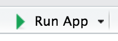

```{r setup, include=FALSE}
knitr::opts_chunk$set(echo = TRUE, fig.width = 6, fig.height = 4, fig.align='center', eval = FALSE)
# install.packages("prettydoc")
```

<style>
  @import url(https://fonts.googleapis.com/css?family=Fira+Sans:300,300i,400,400i,500,500i,700,700i);
  @import url(https://cdn.rawgit.com/tonsky/FiraCode/1.204/distr/fira_code.css);
  @import url("https://use.fontawesome.com/releases/v5.10.1/css/all.css");
  
  body {
    font-family: 'Fira Sans','Droid Serif', 'Palatino Linotype', 'Book Antiqua', Palatino, 'Microsoft YaHei', 'Songti SC', serif;
  }
  
  /* Make bold syntax compile to RU-red */
  strong {
    color: #cc0033;
  }

</style>


## Introduction

### First steps with `shiny`

Shiny is a package from RStudio that can be used to build interactive applications and web pages with R. A great advantage of using shiny and R is that you don't need to know anything about HTML/CSS/JavaScript to create a web page.

This tutorial is a hands-on activity for learning how to build a Shiny apps. In this activity, we'll walk through all the steps for building a Shiny app using a dataset that compiles the expression level of genes in different human tissues. This data is available to download from [here](https://raw.githubusercontent.com/marta-coronado/data/refs/heads/main/expression_data.txt).

This activity is adapted from Dean Attali's [tutorial]( https://deanattali.com/blog/building-shiny-apps-tutorial/).


### Organization of the practical

You will see different icons through the document, the meaning of which is:

&emsp;<i class="fas fa-info-circle"></i>: additional or useful information<br>
&emsp;<i class="fas fa-search"></i>: a worked example<br>
&emsp;<i class="fa fa-cogs"></i>: a practical exercise<br>
&emsp;<i class="fas fa-comment-dots"></i>: a space to answer the exercise<br>
&emsp;<i class="fa fa-key"></i>: a hint to solve an exercise<br>
&emsp;<i class="fa fa-cogs"></i>: a more challenging exercise<br><br>

### Installing and loading packages

Install the following libraries (if you don't have them yet):

```{r message = FALSE, echo = TRUE}
# install.packages("ggplot2")
install.packages("shiny")
library(ggplot2)
library(shiny)
```

Follow the step-by-step guide to build your Shiny app.


## **<i class="fa fa-cogs"></i> First Shiny app**

Every **Shiny app** is composed of two parts: a **web page** that shows the app to the user, and a **computer**. The computer that runs the app can either be your own laptop or a server. Today, we will write these two parts. In Shiny terminology, they are called **UI** (user interface) and **server**.

### 1. Create an empty Shiny app

Create an `app.R` file an add the following code:

```{r}
library(shiny)

ui <- fluidPage()

server <- function(input, output) {
  
}

shinyApp(ui = ui, server = server)
```

This simple template is by itself a working minimal Shiny app that does basically nothing. It simply initializes an **empty UI** and an **empty server**, and runs an app using these empty parts. 
After saving the file in your computer, RStudio should recognize that this is a Shiny app, and you should see the usual Run button at the top change to Run App.

<center>
**** 
</center>
### <i class="fa fa-question"></i> Question

Which function is being called when you click on the Run App button?

<div style="background-color:#F0F0F0">
##### &emsp;<i class="fas fa-comment-dots"></i> Answer:
&emsp;
</div>

Another way to define a Shiny app is by separating the UI and server code into two files: `ui.R` and `server.R`. This is the preferable way to write Shiny apps when the app is complex and involves more code, but in this tutorial we'll stick to the simple single file (`app.R`).

### 2. Load the dataset

The dataset we'll be using contains expression data from from [GTEx project](https://gtexportal.org/home/). 

Download it from [here](https://raw.githubusercontent.com/marta-coronado/data/refs/heads/main/expression_data.txt) and place it in the same folder as your Shiny app.

<i class="fas fa-info-circle"></i> The file is quite long, so if you experience a slow performance, you can download a smaller dataset from [here](https://raw.githubusercontent.com/marta-coronado/data/refs/heads/main/expression_data_tiny.txt).

Add a line in your app to load the data into a variable called `expressionData`. It should look something like this:

```{r}
expressionData <- read.table("/Users/miriam/Downloads/gene_idgene_nametissuemedian_expressiontissue_", header = T, stringsAsFactors = FALSE)
expressionData$median_expression <- log(expressionData$median_expression) # Normalize the data
```

Place these lines in your app as the second line, just after `library(shiny)`.

### 3. Build the basic UI

Let's start the app adding some visual elements to the UI. This is usually the first thing you do when writing a Shiny app.

#### 3.1. Add a title

Shiny has a special function `titlePanel()` that  adds a big title text to the top of the page, but it also sets the “official” title of the webpage. You can define it inside the `fluidPage()`.

### <i class="fa fa-cogs"></i> Exercise

Add a title to the `fluidPage`.

<div style="background-color:#F0F0F0">
##### &emsp;<i class="fas fa-comment-dots"></i> Answer:
&emsp;
</div>

#### 3.2. Add more formatted text

You can also add plain text to the UI by simply writing text inside the `fluidPage()`, after the `titlePanel()`. By combining text with HTML tags, you can format your text. For example, you can use:

- `strong()` will make text bold
- `em()` will make it italized
- `br()` will add a line break


### <i class="fa fa-cogs"></i> Exercise

Add more formatted information such as your name, the date, etc. under the `titlePanel()`.

<div style="background-color:#F0F0F0">
##### &emsp;<i class="fas fa-comment-dots"></i> Answer:
&emsp;
</div>

<i class="fas fa-info-circle"></i> Remember that all the arguments inside `fluidPage()` need to be separated by commas.

#### 3.3. Add a layout

If you run your app, you'll see that all the elements, text, and HTML tags are unstructured, they appear one below the other in the page. we'll use `sidebarLayout()` to add a simple structure. This layout provides a simple two-column layout with a smaller sidebar in the left and a larger main panel in the right, and the title in the top.


Add the following code after the `titlePanel()` and the formatted text you have added:

```{r}
sidebarLayout(
  sidebarPanel("Inputs will be placed here"),
  mainPanel("Results will be placed here")
)
```

<i class="fas fa-info-circle"></i> Remember that all the arguments inside `fluidPage()` need to be separated by commas.

### 4. Add inputs to the UI

Input widgets gives users a way to interact with a Shiny app, and there are many different input functions. For example, `textInput()` is used to enter text, `numericInput()` to select a number, `dateInput()` is for selecting a date, `selectInput()` is for creating a select box (a dropdown menu).


All input functions have the same first two arguments: `inputId` and `label`.

- The `inputId` will be the name that shiny will use to refer to this input when you want to retrieve its current value. It is important to note that every input must have a unique `inputId`. 
- The `label` argument specifies the text in the display label that goes along with the input widget.

#### Input for gene expression

The first input we want to have is for specifying an expression range (minimum and maximum expression). For that, we will use the `sliderInput()`.

Place the following code for the slider input inside `sidebarPanel()` (replace the text _Inputs will be placed here_).

```{r}
sliderInput("expressionInput", "Median expression (log)", min = -6, max = 12,
                             value = c(1, 5))
```

### <i class="fa fa-cogs"></i> Exercise

Run the code of the `sliderInput()` in the R console and see what it returns: can you recognize the language? Change some of the parameters of `sliderInput()`, and see how that changes the result.

<div style="background-color:#F0F0F0">
##### &emsp;<i class="fas fa-comment-dots"></i> Answer:
&emsp;
</div>

#### Input for tissue

Next, we'll add a widget that allows us to select one (or more) tissues from the dataset. We'll use the `checkboxGroupInput()` widget. Again, we specify a `inputId` (`tissueInput`) and a `label` ("Tissue"). In `choices =` we write the different tissues available in the dataset. In selected, we can specify which tissue we want already selected, in the example is the Brain. 

```{r}
checkboxGroupInput("tissueInput", "Tissue",
                   choices = c("Adipose", "Brain", "Liver",
                               "Lung", "Lymphocytes", "Muscle",
                               "Stomach", "Testis"),
                   selected = "Brain")
```

Add this input code inside `sidebarPanel()`, after the previous input (separate them with a comma).

#### Input for gene annotation

Genes have been annotated using two different pipelines: HAVANA and ENSEMBL. With the next input, we'll be able to choose one or the other The input is `radioButtons()`, it's similar to the previous one but this one only allows to click on one item.

```{r}
radioButtons("geneAnnotInput", "Gene annotation",
             choices = c("ENSEMBL", "HAVANA"),
             selected = "HAVANA")
```

Add this input code inside `sidebarPanel()`, after the previous input (separate them with a comma).

#### Input for gene type

Finally, we can create a dropdown list to select a type of gene. 

```{r}
selectInput("geneTypeInput", "Gene type",
            choices = c("antisense", "lincRNA", "miRNA", "misc_RNA", "protein_coding", "pseudogene", "rRNA", "snoRNA", "snRNA"), selected = "protein_coding")
```

Add this input code inside `sidebarPanel()`, after the previous input (separate them with a comma).

### <i class="fa fa-cogs"></i> Exercise: add more input data

Add a new input; for example for selecting a chromosome, or the gene status, etc.

<div style="background-color:#F0F0F0">
##### &emsp;<i class="fas fa-comment-dots"></i> Answer:
&emsp;
</div>

### 4. Add placeholders for outputs

After creating all the inputs, we should add elements to the UI to display the outputs. Outputs can be any object that R creates and that we want to display in our app: a plot, a table, text, etc.

Types of outputs:
  
- Plot: `plotOutput`
- Image: `imageOutput`
- Text: `textOutput`
- Code:  `verbatimTextOutput`
- Table: `tableOutput`


Because we're still building the UI, we will add placeholders for the outputs that will determine where an output will be and what its identification label is. Later, in the server code, we will construct the outputs.

Shiny provides several output functions, one for each type of output. Similarly to the input functions, all the ouput functions have a `outputId` argument that is used to identify each output, and this argument must be unique for each one.

#### Output for a plot of the results

At the top of the main panel we'll have a plot showing some visualization of the results. Since we want a plot, the function we use is `plotOutput()`.

Add the following code into the `mainPanel()` (replace the existing text, _Results will be placed here_):

```{r}
plotOutput("plot")
```

This will add a placeholder in the UI for a plot named "plot".

#### Output for a table summary of the results

Below the plot, we will have a table that shows all the results. To get a table, we use the `tableOutput()` function.

Here is a simple way to create a UI element that will hold a table output named "results":


```{r}
tableOutput("results")
```

Add this output to the `mainPanel()` as well, separated with a comma with the previous code. Maybe add a couple `br()` in between the two outputs, just as a space buffer so that they aren't too close to each other.

### 6. Implement server logic to create outputs

Now that our `ui` is ready, we have to write the `server function`, which will be responsible for creating outputs to show in the app, i.e., the plot and the table.

The server function is always defined with two arguments: `input` and `output`. You must define these two arguments. Both `input` and `output` are list-like objects. As the names suggest, `input` is a list you will read values from and `output` is a list you will write values to. `input` will contain the values of all the different inputs at any given time, and output is where you will save output objects (such as tables and plots) to display in your app.

#### Building an output

Remember that we created two output placeholders: `plot` (for placing the plot) and `results` (a table). We need to write code in R that will tell shiny what kind of plot or table to display. There are three rules to build an output in shiny.

- Save the output object into the output list (remember the app template - every server function has an output argument)
- Build the object with a `render*` function, where `*` is the type of output
- Access `input` values using the `input` list (every server function has an input argument)

The third rule is only required if you want your output to depend on some input. Let's see first  how to build a very basic output using only the first two rules. we'll create a plot and send it to the plot output.

<center>

</center>


```{r}
output$plot <- renderPlot({
  plot(rnorm(100))
})
```

This simple code shows the first two rules: we're creating a plot inside the `renderPlot()` function, and assigning it to `plot` in the output list. Remember that every output created in the UI must have a unique ID, now we see why. In order to attach an R object to an output with ID x, we assign the R object to `output$x`.

Since plot was defined as a `plotOutput`, we must use the `renderPlot` function, and we must create a plot inside the `renderPlot` function.

### <i class="fa fa-cogs"></i> Exercise

The code inside `renderPlot()` doesn't have to be only one line, it can be as long as you'd like as long as it returns a plot. Try to modify the previous code to your Shiny app and make a more complex plot, using `ggplot2` and the `iris` dataset, just to make sure you can use `renderPlot()`.  Make sure `ggplot2` is loaded, so add a `library(ggplot2)` at the top of the Shiny app.

<div style="background-color:#F0F0F0">
##### &emsp;<i class="fas fa-comment-dots"></i> Answer:
&emsp;
</div>

#### Making an output react to an input

Now we'll take the plot one step further. Instead of always plotting the same plot (100 random numbers), let's use the maximum expression level selected as the number of points to show. It doesn't make too much sense, but it's just to learn how to make an output depend on an input.

```{r}
output$plot <- renderPlot({
  plot(rnorm(input$expressionInput[2]))
})
```

<i class="fas fa-info-circle"></i> Note that we write the `input$expressionInput` with `[2]`. This is because this widget gives two values (the min and the max). 

Replace the previous code in your server function with this code, and run the app. Whenever you choose a new maximum expression value in the slider, the plot will update with a new number of points. Notice that the only thing different in the code is that instead of using the number 100 we are using `input$expressionInput[2]`. When these values are updated, the plot is updated.  In Shiny, this concept is known as **reactivity**.

Notice that this simple code is using all the 3 rules for building outputs: we are saving to the output list (`output$plot <-`), we are using a `render*` function to build the output (`renderPlot({})`), and we are accessing an input value (`input$expressionInput[2]`).

#### Building the plot output

Now we know how to build a plot visualizing some aspect of the data. we'll create a simple histogram of the expression levels of the genes by using the 3 rules to create a plot output.

Next we'll return a histogram of expression level from `renderPlot()`. Let's start with just a histogram of the whole data, unfiltered.

```{r}
output$plot <- renderPlot({
  ggplot(filtered, aes(median_expression)) +
      geom_histogram()
})
```

Remember that we have at least four inputs: `expressionInput`, `tissueInput`, `geneAnnotInput` and `geneTypeInput`. We can filter the data based on the values of these four inputs. 

we'll use `dplyr` functions to filter the data, so be sure to include `library(dplyr)` at the top of the Shiny app as well. Then we'll plot the filtered data instead of the original data.

```{r}
output$plot <- renderPlot({
    
  filtered <-
      expressionData %>%
      filter(median_expression >= input$expressionInput[1],
             median_expression <= input$expressionInput[2],
             tissue %in% input$tissueInput,
             gene_annotation %in% input$geneAnnotInput,
             gene_type %in% input$geneTypeInput
             )
    
    ggplot(filtered, aes(median_expression)) +
      geom_histogram()
  })
```


### <i class="fa fa-cogs"></i> Exercise

The current plot doesn't look very nice. With your knowledge on `ggplot2` try to improve it. You can use `facet_*`, `scales_*`, etc.

<div style="background-color:#F0F0F0">
##### &emsp;<i class="fas fa-comment-dots"></i> Answer:
&emsp;
</div>

#### Building the table output

The other output we created should be a table of all the genes that match the filters. Since it's a table output, we should use the `renderTable()` function. we'll do the exact same filtering on the data, and then simply return the data as a `data.frame()`. Shiny will know display the `data.frame` as a table because it's defined as a `tableOutput`.

```{r}
  output$results <- renderTable({
    filtered <-
      expressionData %>%
      filter(
        median_expression >= input$expressionInput[1],
        median_expression <= input$expressionInput[2],
        tissue %in% input$tissueInput,
        gene_annotation %in% input$geneAnnotInput,
        gene_type %in% input$geneTypeInput
      )
    filtered
  })
```

Add this code to your server, inside the server function but after the `renderPlot()`. In this case, the different elements do not necessarily be comma separated.

### <i class="fa fa-rocket"></i> Exercise

With all the knowledge that you've acquired in this practical, add a new output. It could be a new plot, a new table, or some piece of text that changes based on the inputs. For example, you could add a text output (`textOutput()` in the UI, `renderText()` in the server) that says how many results were found at the top of the table. Remember first adding the output place to the UI, and then building the output in the server. 

<div style="background-color:#F0F0F0">
##### &emsp;<i class="fas fa-comment-dots"></i> Answer:
&emsp;
</div>

**Upload both the Rmd and your Shiny app in a zip file to [ATENEA](https://atenea.upc.edu/login/index.php)!**