```{r setup, include=FALSE}
options(htmltools.dir.version = FALSE)
# Animations: https://github.com/daneden/animate.css#animations
knitr::opts_chunk$set(echo = FALSE, eval = TRUE, fig.width = 4.5, fig.height = 3.5, fig.show = 'hold', message = FALSE, warning = F)
# Package for slides
# remotes::install_github('yihui/xaringan')

# viewer: xaringan::inf_mr()

# Export to pdf
# install.packages("pagedown")
# pagedown::chrome_print("CoursePresentation-17.02.25.html")
```

class: center, middle, animated, bounceInDown


## Keep in touch

#### Theory lessons <br>

| Marta Coronado Zamora | Jose F. Sánchez | 
|:-:|:-:|
| <a href="mailto:Marta.coronado@uab.cat"><i class="fa fa-paper-plane fa-fw"></i> marta.coronado@uab.cat</a> | <a href="mailto:JoseFrancisco.Sanchez@uab.cat"><i class="fa fa-paper-plane fa-fw"></i>&nbsp; josefrancisco.sanchez@uab.cat</a> | 
| <a href="https://bsky.app/profile/geneticament.bsky.social"><i class="fab fa-bluesky fa-fw"></i>&nbsp; @geneticament</a> |                 <a href="https://twitter.com/JFSanchezBioinf"><i class="fab fa-twitter fa-fw"></i>&nbsp; @JFSanchezBioinf</a> |
| <a href="https://portalrecerca.uab.cat/es/organisations/grup-de-gen%C3%B2mica-bioinform%C3%A0tica-i-biologia-evolutiva-gbbe/"><i class="fa fa-map-marker fa-fw"></i>&nbsp; Universitat Autònoma de Barcelona </a> |    <a href="http://www.germanstrias.org/technology-services/genomica-bioinformatica/"> <i class="fa fa-map-marker fa-fw"></i>Germans Trias i Pujol Research Institute (IGTP)</a> |

#### Practical lessons <br>

| Miriam Merenciano |
|:-:|
| <a href="mailto:miriam.merenciano@uab.cat"><i class="fa fa-paper-plane fa-fw"></i> miriam.merenciano@uab.cat </a> | 
|  <a href="https://portalrecerca.uab.cat/es/organisations/grup-de-gen%C3%B2mica-bioinform%C3%A0tica-i-biologia-evolutiva-gbbe/"><i class="fa fa-map-marker fa-fw"></i>&nbsp; Universitat Autònoma de Barcelona </a> |

<style>
.title-slide {
  background-image: url('img/1.png');
  background-size: 100%;
}
</style>

---
layout: true
class: animated, fadeIn

---
# Essential principles

- **Data visualization** is the **graphical representation** of **data**
- The main goal is **communicating information clearly** and **effectively**
- Both **aesthetic form** and **functionality** need to go hand in hand


<center>
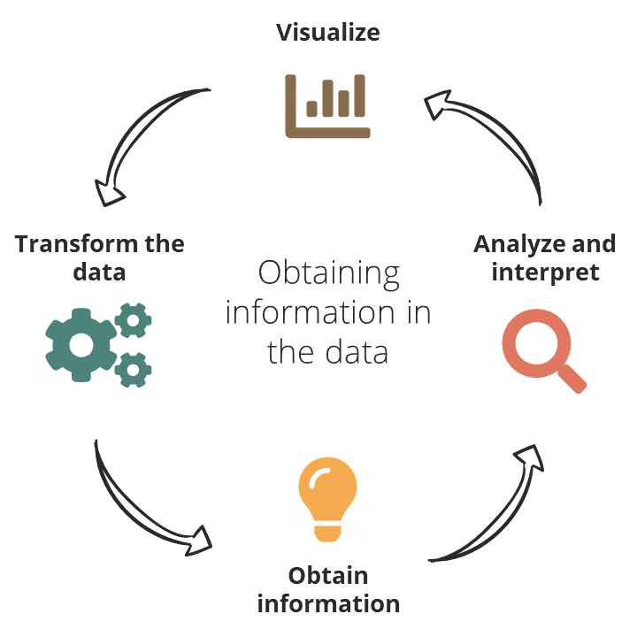
<br>
<i>Data insights: a visualization (Aisch 2019)</i>
</center>

---
## Graphical integrity — Edward Tufte (1942-)

.pull-left[
These are Tufte’s 6 principles:

1. **Comparisons**:  show comparisons to depict contrasts and differences

2. **Causality**:  demonstrate how one or more independent variables impact or influence dependent variables

3. **Multivariate**: combine various data

4. **Integration**:  incorporate various modes of information 

5. **Documentation**:  include attribution, detailed titles, and measurements (scales)

6. **Context**: describe the before and after state
]

.pull-right[
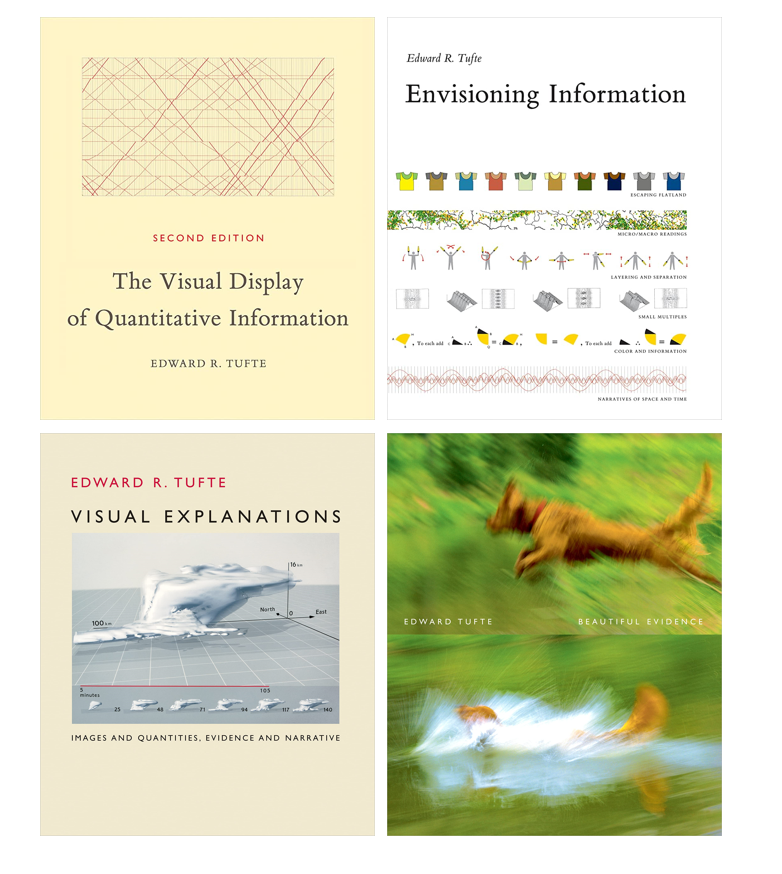
]

---
## <i>“Above all, show the data”</i> 

| **__Chartjunk__** | **__Excellence__** | 
|:-:|:-:|
| Excessive and unnecessary use of graphical effects in graphs | Communication of complex ideas with clarity, precision and efficiency | 

--
<br>
<center>

<br>
A chart with a considerable amount of junk in it.<br>
<i class="fa fa-question-circle"></i> <b>What problems do you identify in this figure?</b>
</center>

---

### <i>"The best statistical graphic ever drawn"</i>

<center>


The graphic is notable for its representation in two dimensions of six types of data: the number of Napoleon's troops; distance; temperature; the latitude and longitude; direction of travel; and location relative to specific dates. <a src="https://en.wikipedia.org/wiki/Charles_Joseph_Minard">Wikipedia</a>.

---
## <i>“Above all, show the data”:  Fair axis limits</i> 

Bar char by the German economic development agency GTAI. <a src="https://www.gtai.de/GTAI/Navigation/EN/invest,t=motivated-and-dependable-employees,did=214428.html">German labor market</a>.


```{r echo=F, eval=T, fig.height=6, fig.width=7, warning=F, fig.align='center'}
# Cargar librerías
library(ggplot2)
library(dplyr)

# Datos (promedio de horas semanales, 2013, fuente Eurofound)
df <- data.frame(
    country = c("Romania", "UK", "Germany", "Poland", "Netherlands",
                "Slovak Republic", "Czech Republic", "EU-28 average", "Spain",
                "Hungary", "Sweden", "Belgium", "Italy", "France"),
    hours = c(41.2, 40.8, 40.4, 39.9, 39.8,
              39.8, 39.7, 39.5, 39.5,
              39.2, 38.6, 38.1, 38.0, 37.4)
)

# Ordenar por horas
df$country <- factor(df$country, levels = df$country[order(df$hours, decreasing = F)])

# --- Figura 1 (estilo original con etiquetas numéricas) ---
p1 <- ggplot(df, aes(x = hours, y = country)) +
  geom_col(fill = "grey80") +
  geom_col(data = filter(df, country == "Germany"), 
           aes(x = hours, y = country), fill = "gold") +
  geom_text(aes(label = hours), hjust = -0.1, size = 4) +
  coord_cartesian(xlim = c(36, 42)) + 
  labs(caption = "Source: Eurofound 2014", x = NULL, y = NULL) +
  theme_minimal(base_size = 18) +
  theme(panel.grid.major = element_blank(),
        panel.grid.minor = element_blank(),
        axis.text.y = element_text(face = ifelse(df$country == "Germany", "bold", "plain")))

p1
 
```


---

## <i>“Above all, show the data”:  Fair axis limits</i> 


```{r echo=F, eval=T, fig.height=5.5, fig.width=13, fig.align="center", warning=F}
# Cargar librerías
library(ggplot2)
library(dplyr)

# Datos (promedio de horas semanales, 2013, fuente Eurofound)
df <- data.frame(
    country = c("Romania", "UK", "Germany", "Poland", "Netherlands",
                "Slovak Republic", "Czech Republic", "EU-28 average", "Spain",
                "Hungary", "Sweden", "Belgium", "Italy", "France"),
    hours = c(41.2, 40.8, 40.4, 39.9, 39.8,
              39.8, 39.7, 39.5, 39.5,
              39.2, 38.6, 38.1, 38.0, 37.4)
)

# Ordenar por horas
df$country <- factor(df$country, levels = df$country[order(df$hours, decreasing = F)])

# --- Figura 1 (estilo original con etiquetas numéricas) ---
p1 <- ggplot(df, aes(x = hours, y = country)) +
  geom_col(fill = "grey80") +
  geom_col(data = filter(df, country == "Germany"), 
           aes(x = hours, y = country), fill = "gold") +
  geom_text(aes(label = hours), hjust = -0.1, size = 4) +
  coord_cartesian(xlim = c(36, 42)) + 
  labs(caption = "Source: Eurofound 2014", x = NULL, y = NULL) +
  theme_minimal(base_size = 18) +
  theme(panel.grid.major = element_blank(),
        panel.grid.minor = element_blank(),
        axis.text.y = element_text(face = ifelse(df$country == "Germany", "bold", "plain")))

# Cargar librerías
library(patchwork)


# Datos (promedio de horas semanales, 2013, fuente Eurofound)
df <- data.frame(
    country = c("Romania", "UK", "Germany", "Poland", "Netherlands",
                "Slovak Republic", "Czech Republic", "EU-28 average", "Spain",
                "Hungary", "Sweden", "Belgium", "Italy", "France"),
    hours = c(41.2, 40.8, 40.4, 39.9, 39.8,
              39.8, 39.7, 39.5, 39.5,
              39.2, 38.6, 38.1, 38.0, 37.4)
)

# Ordenar por horas
df$country <- factor(df$country, levels = df$country[order(df$hours, decreasing = F)])

# --- Figura 1 (estilo original con etiquetas numéricas) ---
p2 <- ggplot(df, aes(x = hours, y = country)) +
  geom_col(fill = "grey80") +
  geom_col(data = filter(df, country == "Germany"), 
           aes(x = hours, y = country), fill = "gold") +
  geom_text(aes(label = hours), hjust = -0.1, size = 4) +
  labs(caption = "Source: Eurofound 2014", x = NULL, y = NULL) +
  theme_minimal(base_size = 18) +
  theme(panel.grid.major = element_blank(),
        panel.grid.minor = element_blank(),
        axis.text.y = element_text(face = ifelse(df$country == "Germany", "bold", "plain")))

p1 + p2
 
```


**The size of this gap is an illusion.**


<i class="fa fa-info-circle"></i> Bars in a **bar chart** should (almost) always **extend to zero** (absolute magnitude of values). Not necessary for **line chars** (change in the dependent variable as the independent value changes).


---


## <i>“Above all, show the data”:  Fair axis limits</i> 


.pull-left[

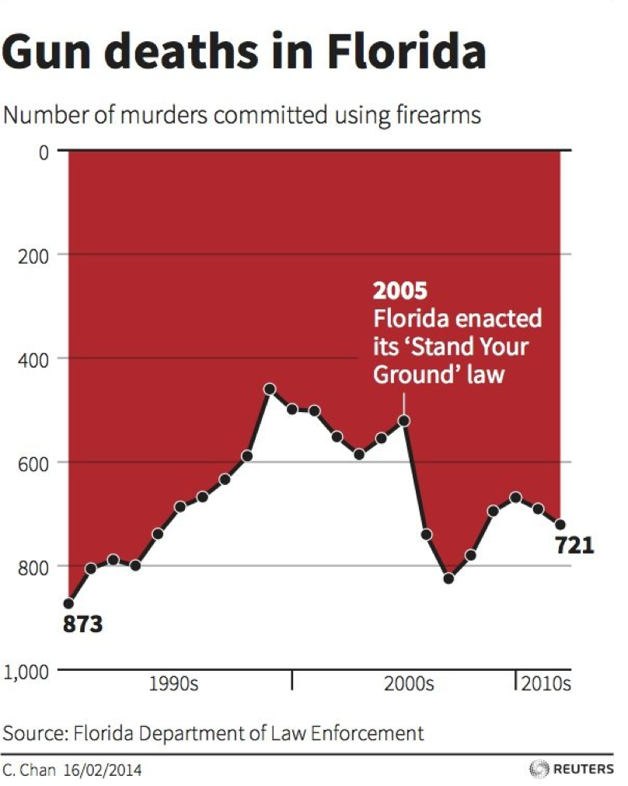

]

--

.pull-right[
- Immediate visual impression that gun deaths declined sharply after stand-your-ground legislation was enacted in Florida
- **The decline is an illusion**
]


---
class: animated, fadeIn

## <i>“Above all, show the data”:  Fair axis limits</i> 

```{r  echo=F, eval=T, fig.height=6, fig.width=7}
temp_df <- data.table::fread("img/combined_temperature.csv")

library(dplyr)
library(ggplot2)

# Average across all countries per year
yearly_avg <- temp_df %>%
  group_by(Year) %>%
  summarise(
    mean_temp = mean(`Annual Mean`, na.rm = TRUE),
    mean_smooth = mean(`5-yr smooth`, na.rm = TRUE)
  )

# Plot
p1<-ggplot(yearly_avg[yearly_avg$Year<2005,], aes(x = Year)) +
  geom_line(aes(y = mean_temp), color = "steelblue", size = 1) +
  labs(
    title = "Average annual temperature",
    y = "Temperature (°C)",
    x = "Year",
    caption = "Data source: NCEI"
  ) +
  theme_minimal(base_size = 14) + 
    coord_cartesian(ylim = c(0, 110)) +
  scale_y_continuous(breaks=seq(0,110,10)) +
  scale_x_continuous(breaks=seq(1900,2010,25))


# Plot
p2 <- ggplot(yearly_avg[yearly_avg$Year<2005,], aes(x = Year)) +
  geom_line(aes(y = mean_temp), color = "steelblue", size = 1) +
  labs(
    title = "Average annual temperature",
    y = "Temperature (°C)",
    x = "Year",
    caption = "Data source: NCEI"
  ) +
  theme_minimal(base_size = 14) + 
  scale_x_continuous(breaks=seq(1900,2010,25))

p1
``` 

---

## <i>“Above all, show the data”:  Fair axis limits</i> 

```{r  echo=F, eval=T, fig.height=6, fig.width=14}
temp_df <- data.table::fread("img/combined_temperature.csv")

library(dplyr)
library(ggplot2)

# Average across all countries per year
yearly_avg <- temp_df %>%
  group_by(Year) %>%
  summarise(
    mean_temp = mean(`Annual Mean`, na.rm = TRUE),
    mean_smooth = mean(`5-yr smooth`, na.rm = TRUE)
  )

# Plot
p1<-ggplot(yearly_avg, aes(x = Year)) +
  geom_line(aes(y = mean_temp), color = "steelblue", size = 1) +
  labs(
    title = "Average annual temperature",
    y = "Temperature (°C)",
    x = "Year",
    caption = "Data source: NCEI"
  ) +
  theme_minimal(base_size = 14) + 
    coord_cartesian(ylim = c(0, 110)) +
  scale_y_continuous(breaks=seq(0,110,10)) +
  scale_x_continuous(breaks=seq(1900,2030,25))


# Plot
p2 <- ggplot(yearly_avg, aes(x = Year)) +
  geom_line(aes(y = mean_temp), color = "steelblue", size = 1) +
  labs(
    title = "Average annual temperature",
    y = "Temperature (°C)",
    x = "Year",
    caption = "Data source: NCEI"
  ) +
  theme_minimal(base_size = 14) + 
  scale_x_continuous(breaks=seq(1900,2030,25))

p1 + p2
```

When we talk about global temperature, a change of 1–2 °C is very significant.<br>
<small><a href="https://doi.org/10.1126/science.abn7950">Armstrong McKay, David I. (2022). "Exceeding 1.5°C global warming could trigger multiple climate tipping points". Science. 377 (6611): eabn7950</a>.</small>

---
class: animated, fadeIn

### <i>“Above all, show the data”: double-axis

```{r  echo=F, eval=T, fig.height=6, fig.width=7}
library(scales)

world <- data.table::fread("img/Mundo_ Producto interior bruto (2024).csv")
eeuu <- data.table::fread("img/Estados Unidos_ Producto interior bruto (2024).csv")

world <- world[,c("Variable observation date", "Variable observation value")]
eeuu <- eeuu[,c("Variable observation date", "Variable observation value")]

# Unir por Year
gdp <- left_join(world, eeuu, by = "Variable observation date")

# Calcular factor de escala (para el eje secundario)
scaling_factor <- max(gdp$`Variable observation value.x`, na.rm = TRUE) / max(gdp$`Variable observation value.y`, na.rm = TRUE)

# Gráfico con doble eje (engañoso)
a <- ggplot(gdp, aes(x = `Variable observation date`)) +
  geom_line(aes(y = `Variable observation value.x`, color = "World"), size = 1.2) +
  geom_line(aes(y = `Variable observation value.y` * scaling_factor, color = "EEUU"), size = 1.2) +
  scale_y_continuous(
    name = "World GDP (USD billions)",
    labels = label_number(scale = 1e-12, big.mark = ".", decimal.mark = ","),
    sec.axis = sec_axis(~ . / scaling_factor, name = "EEUU GDP (USD billions)", labels = label_number(scale = 1e-12, big.mark = ".", decimal.mark = ","))
  ) +
  scale_color_manual(values = c("World" = "steelblue", "EEUU" = "firebrick")) +
  theme_minimal(base_size = 14) +
  labs(
    title = "World and EEUU GDP",
    x = "Year",
    color = ""
  ) +
  theme(
    plot.title = element_text(face = "bold"),
    legend.position = "top"
  )

a
```

Is the GDP of the US equal to the global GDP?

---
class: animated, fadeIn

### <i>“Above all, show the data”: double-axis

```{r  echo=F, eval=T, fig.height=6, fig.width=14}

world <- data.table::fread("img/Mundo_ Producto interior bruto (2024).csv")
eeuu <- data.table::fread("img/Estados Unidos_ Producto interior bruto (2024).csv")

world <- world[,c("Variable observation date", "Variable observation value")]
eeuu <- eeuu[,c("Variable observation date", "Variable observation value")]

# Unir por Year
gdp <- left_join(world, eeuu, by = "Variable observation date")

# Calcular factor de escala (para el eje secundario)
scaling_factor <- max(gdp$`Variable observation value.x`, na.rm = TRUE) / max(gdp$`Variable observation value.y`, na.rm = TRUE)

# Gráfico con doble eje (engañoso)
a <- ggplot(gdp, aes(x = `Variable observation date`)) +
  geom_line(aes(y = `Variable observation value.x`, color = "World"), size = 1.2) +
  geom_line(aes(y = `Variable observation value.y` * scaling_factor, color = "EEUU"), size = 1.2) +
  scale_y_continuous(
    name = "World GDP (USD billions)",
    labels = label_number(scale = 1e-12, big.mark = ".", decimal.mark = ","),
    sec.axis = sec_axis(~ . / scaling_factor, name = "EEUU GDP (USD billions)", labels = label_number(scale = 1e-12, big.mark = ".", decimal.mark = ","))
  ) +
  scale_color_manual(values = c("World" = "steelblue", "EEUU" = "firebrick")) +
  theme_minimal(base_size = 14) +
  labs(
    title = "World and EEUU GDP",
    x = "Year",
    color = ""
  ) +
  theme(
    plot.title = element_text(face = "bold"),
    legend.position = "top"
  )


b <- ggplot(gdp, aes(x = `Variable observation date`)) +
  geom_line(aes(y = `Variable observation value.x`, color = "World"), size = 1.2) +
  geom_line(aes(y = `Variable observation value.y`, color = "EEUU"), size = 1.2) +
  scale_color_manual(values = c("World" = "steelblue", "EEUU" = "firebrick")) +
   scale_y_continuous(
    name = "PIB (USD billions)",
    labels = label_number(scale = 1e-12, big.mark = ".", decimal.mark = ","))+
  theme_minimal(base_size = 14) +
  labs(
    title = "World and EEUU GDP",
    x = "Year",
    y = "GDP (USD billions)",
    color = ""
  ) +
  theme(
    plot.title = element_text(face = "bold"),
    legend.position = "top"
  )


a + b
```

Data with the same units of measurement are better displayed using **the same scale** on a single axis.

---
class: animated, fadeIn

### <i>“Above all, show the data”: double-axis</i>

<center>
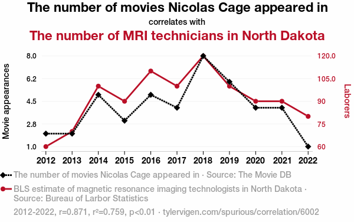
<br>

Spurious correlations (<a href="https://tylervigen.com/spurious-correlations">link</a>).
</center>

When dealing with dual axes with two different units of measurement, in most cases it is preferable to use two separate plots rather than a plot with a double axis.


---
## <i>“Above all, show the data”</i> 
- Fair axis limits
- Encourage the eye to compare values
- Label important parts, axes, units, legends, captions

---
## <i>“Above all, show the data”</i> 
- Fair axis limits
- Encourage the eye to compare values
- Label important parts, axes, units, legends, captions
- Consider interactive visualizations (<a src="https://plotly.com/">plotly</a>, <a src="https://ggvis.rstudio.com/">ggvis</a>, <a src="https://ramnathv.github.io/rCharts/">rCharts</a>, <a src="https://ggvis.rstudio.com/">ggvis</a>, <a src="https://shiny.rstudio.com/">shiny</a>)

---

## Maximize the data-ink ratio

$$ Data-ink\;ratio=\;\frac{Data-ink}{Total\;ink\;in\;graphic}  $$
--

<center>
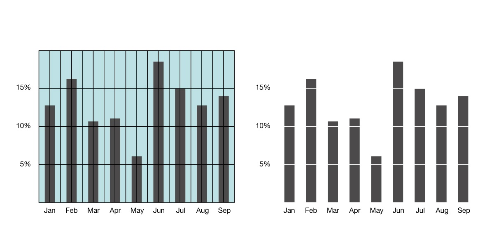


<i class="fa fa-question-circle"></i><b> Which graph has higher data-ink ratio?</b>

---

## Maximize the data-ink ratio

$$ Data-ink\;ratio=\;\frac{Data-ink}{Total\;ink\;in\;graphic}  $$

<center>


<i class="fa fa-question-circle"></i><b> Which graph has higher data-ink ratio?</b>

--

As a general principle, **increase the data-ink ratio to the maximum** that is possible in your graph.

---
### Erase non data-ink

<center>


<br>
<i class="fa fa-question-circle"></i><b> What is the data-ink ratio here?</b>
</center>
Design by Nigel Holmes. TIME magazine.

---
layout: false
class: left, bottom, inverse, animated, bounceInDown

# <i>“Nothing is beautiful from every point of view”</i>

## Horace

---
layout: true
class: animated, fadeIn

---
## Visual bias #1

<center>
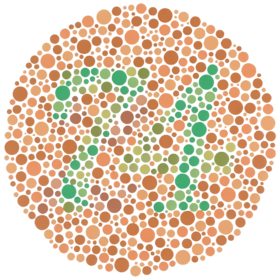
<br><br>
<i class="fa fa-question-circle"></i><b> What is the number above?</b>

</center>

---
## Visual bias #2

<center>

<br><br>
<i class="fa fa-question-circle"></i><b> Does the dancer spin clockwise or counter-clockwise?</b>

</center>

---
## Visual bias #2

<center>
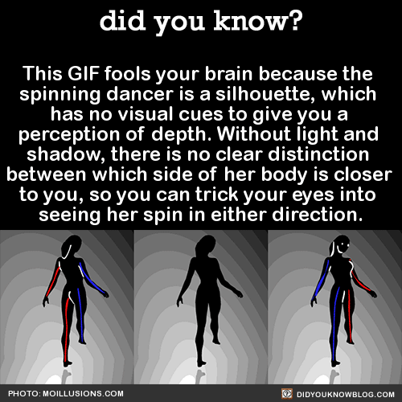
<br><br>
<i class="fa fa-question-circle"></i><b> Does the dancer spin clockwise or counter-clockwise?</b>

</center>

---
## Visual bias #3

<center>

<br><br>
<i class="fa fa-question-circle"></i><b> Is the dress black and blue, or white and gold?</b>

</center>

---
## Visual bias #4

.pull-left[
In 1951, the psychologist Solomon Asch asked volunteers to evaluate whether A, B or C has the same length as the bar on the left. In reality, only one person was the subject, the others were actors who were instructed to give the (same) wrong answer. 

]

.pull-right[
<center>

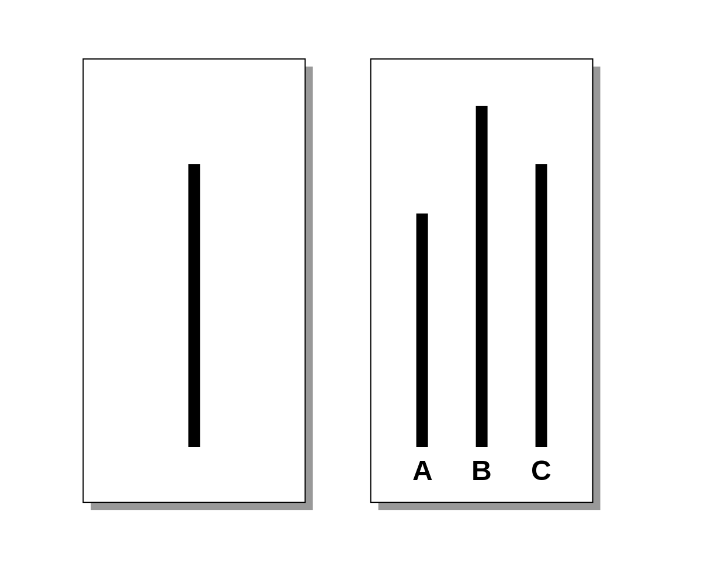


</center>
]

---
## Visual bias #4

.pull-left[
In 1951, the psychologist Solomon Asch asked volunteers to evaluate whether A, B or C has the same length as the bar on the left. In reality, only one person was the subject, the others were actors who were instructed to give the (same) wrong answer. 

**Asch found that 37% of the test subjects also give the wrong answer to conform to the group.**
]

.pull-right[
<center>


</center>
]

---
# People are different

- The brain has some unexpected biases, and the social context matters
- Do not assume people see the same thing as you
- Approximately 8% of men are color-blind

---
## Misperceptions: edges, contrasts and colors

<center>

<br>The Hermann grid effect.
</center>

---
## Misperceptions: edges, contrasts and colors

<center>

<br><br>
The checkershadow illusion.
</center>

---
## Misperceptions: edges, contrasts and colors

<center>

<br><br>
The checkershadow illusion.
</center>

---
## Misperceptions: Gestalt rules

<center>
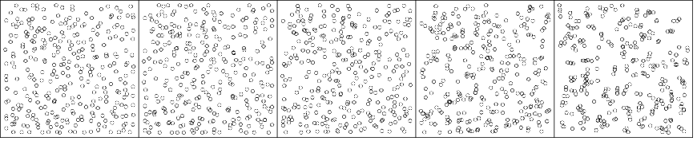
<br>
<i class="fa fa-question-circle"></i><b> Which distribution is random uniform?</b>
<br>
</center>

---

## Misperceptions: Gestalt rules

<center>
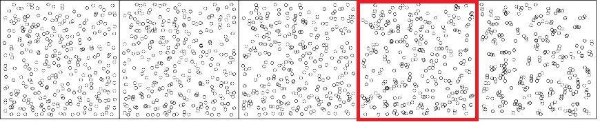
</center>

---
## Misperceptions: Gestalt rules

.pull-left[The strong inferences we make about relationships between visual elements from relatively sparse visual information are called “Gestalt rules”.]
.pull-right[
<center>

<br>
<i class="fa fa-question-circle"></i><b> Which distribution is random uniform?</b>
<br>
</center>
]


---
## Misperceptions: Gestalt rules
.pull-left[The strong inferences we make about relationships between visual elements from relatively sparse visual information are called “Gestalt rules”.

Each panel shows simulated data. The upper panel shows a random point pattern generated by a **Poisson process**. The lower panel is from a **Matérn model**, where new points are randomly placed but cannot be too near already-existing ones. Most people see the Poisson-generated pattern as having more structure, or less ‘randomness’, than the Matérn, whereas the reverse is true!

**Source**: <a src="https://socviz.co/lookatdata.html">Data Visualization: A Practical Introduction (2018)</a>.

]
.pull-right[
<center>

<br>
<i class="fa fa-question-circle"></i><b> Which distribution is random uniform?</b>
<br>
</center>
]


---
# The eye is imperfect

- Know the classic biases and avoid them
- Always verify your visual impressions

---
## Standard palettes

<center>
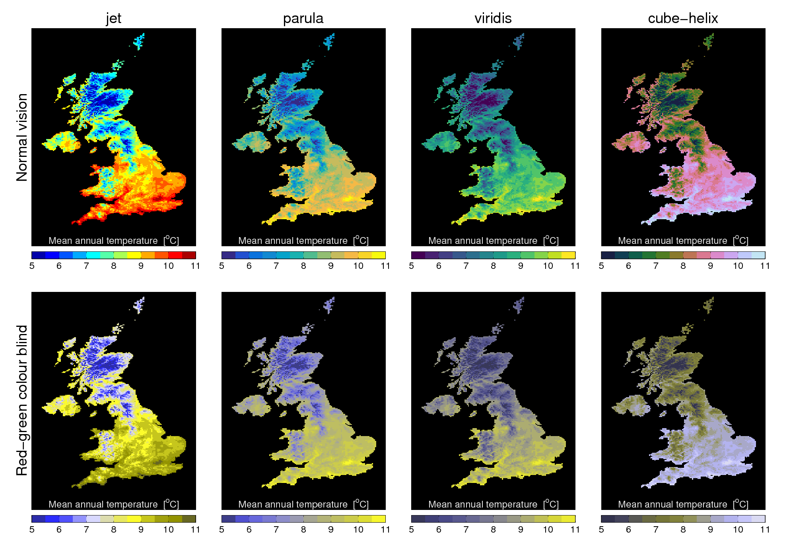
<br>
UK mean temperature, shown for four different colour scales, for both normal vision (top) and a red-green colour blind simulation (bottom).
<br>
The palette “Viridis” is optimized for human vision.
</center>

**Source**: <a src="https://www.climate-lab-book.ac.uk/2015/new-viridis-colour-scale/">Climate Lab Book</a>.
---
layout: false
class: left, bottom, inverse, animated, bounceInDown

# <i>“I never make the same mistake twice. More like three or four times just to be sure.”</i>

## Unknown

---
layout: true
class: animated, fadeIn

---
# Cleveland's three visual operations of pattern perceptions

.pull-left[
1. **Detection**: the visual recognition that a geometric object encodes a physical value
2. **Assembly**:  grouping of detected graphical elements
3. **Estimation**:  visual assessment of the relative magnitude of two or more quantitative physical values

<br>
##### Credit: John Rauser

]
.pull-right[
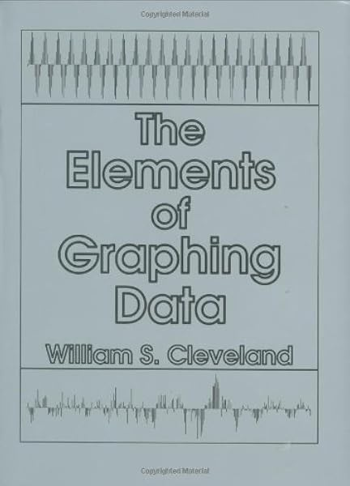
]

---

# Levels of estimation

##### Credit: John Rauser

Three different levels of estimation:

1. **Discrimination**: two values are different  &nbsp;   &nbsp;   &nbsp;   &nbsp;   &nbsp;    <code>X=Y X!=Y</code>
2. **Ranking**: something is bigger   &nbsp;   &nbsp;   &nbsp;   &nbsp;   &nbsp;   &nbsp;   &nbsp;   &nbsp;   &nbsp;   &nbsp;    &nbsp;   &nbsp;   &nbsp;   &nbsp;   <code>X>Y   X&lt;Y</code>
3. **Ratioing**: something is two times bigger   &nbsp;      &nbsp;   &nbsp;   &nbsp;    <code>X/Y = ?</code>

--
<br>
<br>
All of these involves comparison: **efficient comparison between different data points is nearly always the point of a visualization**.


---
# Cleveland’s ranking
##### Credit: John Rauser
<i class="fa fa-file"></i> Cleveland and McGill (1985) Graphical Perception and Graphical Methods for Analyzing Scientific Data. Science 29(4716):828-833

| Rank | Aspect judged |
| --- | --- |
| 1 | Position along a common scale | 
| 2 | Position on identical but unaligned scales |
| 3 | Length |
| 4 | Angle or slope |
| 5 | Area |
| 6 | Volume or Density or Color saturation |
| 7 | Color hue |

How accurate humans are at estimating quantities that are encoded in different ways.

--

- Seven different ways to  encode a quantitative value ranked from most effective to least effective 

---
## Color perception

There are three channels that are in encoded in any one color:


--
<br>
Color hue = color 

---
## Example with color hue
##### Credit: John Rauser
.pull-left[
<center>
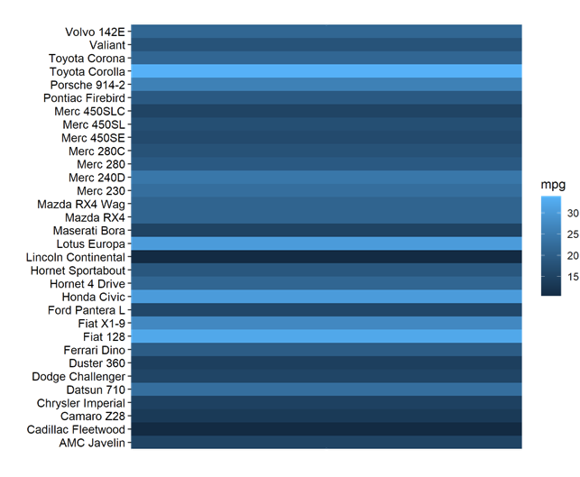
</center>
Chart that encodes information using hue - <small>Dataset of 32 cars that were tested in a 1974 issue of Motor Trend magazine. Fuel efficiency in miles per gallon or mpg</small>.  

]

---

## Example with color hue
##### Credit: John Rauser
.pull-left[
<center>

</center>
Chart that encodes information using hue - <small>Dataset of 32 cars that were tested in a 1974 issue of Motor Trend magazine. Fuel efficiency in miles per gallon or mpg</small>.   

]

.pull-right[
The first Cleveland's estimation task is **discrimination**: 
<br>
<i class="fa fa-question-circle"></i> What do you think about these two values: **Pontiac Firebird** vs  **Merc450SLC**, are they the same or different?
]

---

## Example with color hue
##### Credit: John Rauser

.pull-left[
<center>

</center>
Chart that encodes information using hue - <small>Dataset of 32 cars that were tested in a 1974 issue of Motor Trend magazine. Fuel efficiency in miles per gallon or mpg</small>.   

]

.pull-right[
The first Cleveland's estimation task is **discrimination**: 
<br>
<i class="fa fa-question-circle"></i> What about **Merc450SLC** vs **Dodge Challenger**, are they the same or different?
]

---

## Example with color hue
##### Credit: John Rauser

.pull-left[
<center>

</center>
Chart that encodes information using hue - <small>Dataset of 32 cars that were tested in a 1974 issue of Motor Trend magazine. Fuel efficiency in miles per gallon or mpg</small>.    

]

.pull-right[
The second Cleveland's estimation task is **ranking**: 
<br>
<i class="fa fa-question-circle"></i> What about **Toyota Corolla** vs **Chrysler Imperial**, which has better fuel efficiency?


]


---

## Example with color hue
##### Credit: John Rauser

.pull-left[
<center>

</center>
Chart that encodes information using hue - <small>Dataset of 32 cars that were tested in a 1974 issue of Motor Trend magazine. Fuel efficiency in miles per gallon or mpg</small>.    

]

.pull-right[
The second Cleveland's estimation task is **ranking**: 
<br>
<i class="fa fa-question-circle"></i> What about **Toyota Corolla** vs **Chrysler Imperial**, which has better fuel efficiency?

But you need a **legend** to know if light blue is in the high or low scale: **hue does not have a natural ranking**.
]


---

## Example with position
##### Credit: John Rauser
This is how the data should have been plotted: ranking, discrimination and rationing are trivial!
<center>
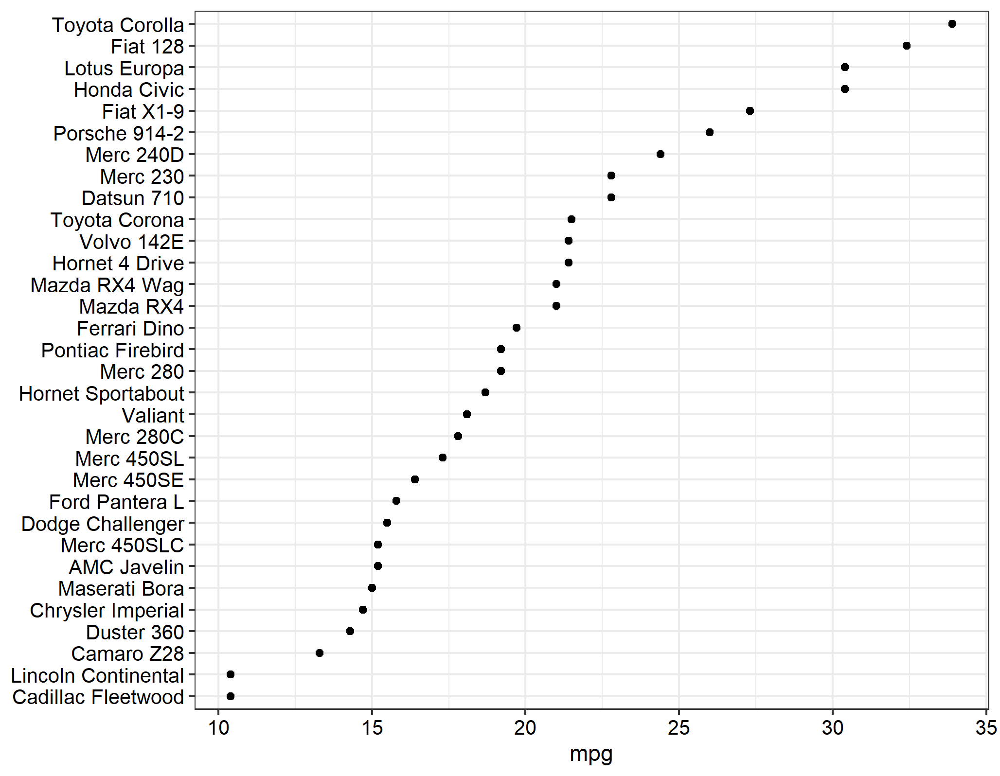
</center>

---
## Why stacking is bad?
##### Credit: John Rauser
<center>
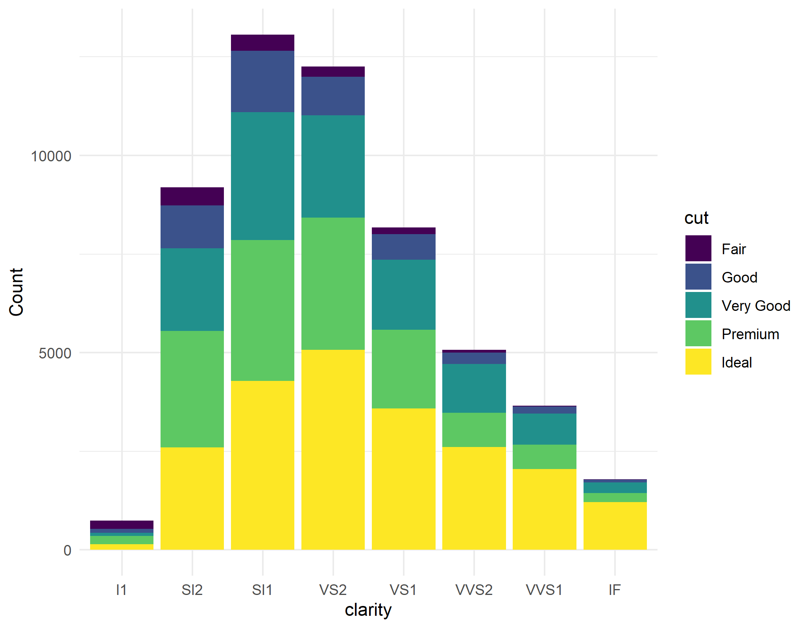
<br>

Dataset of 54,000 diamonds. <b>Stacked bar chart</b>: Count of diamonds in each combination of cut and clarity.
<br>
<i class="fa fa-question-circle"></i> Are there more  SI1 premium cut diamonds or SI2 premium cut diamonds?

</center>

---

## Why stacking is bad?
##### Credit: John Rauser
<center>
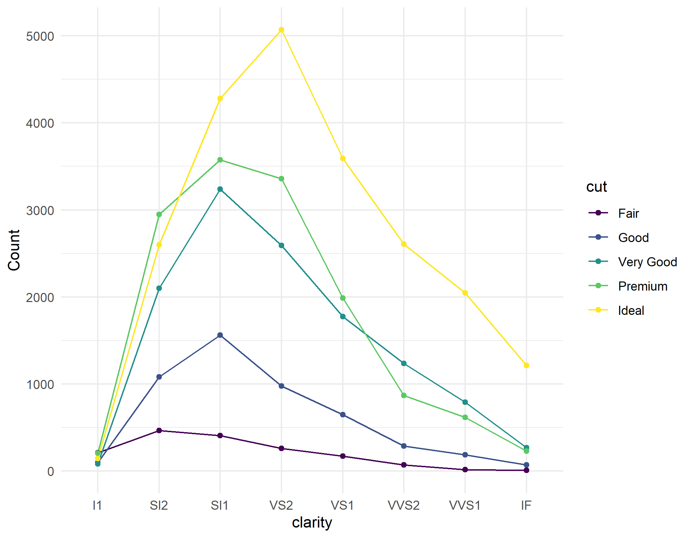
<br>

Dataset of 54,000 diamonds. <b>Parallel coordinates chart</b>.<br>

<i class="fa fa-info-circle"></i> If you want to communicate the count in each combination of cut and clarity, <b>encode that information using position on a common scale</b>.

</center>


---
layout: false
class: left, bottom, inverse, animated, bounceInDown

# <i>“A picture is worth a thousand words”</i>

## Probably Tess Flanders

---
layout: true
class: animated, fadeIn


---
# The power of images
.pull-left[
### Mazamet ville morte
In 1973, a journalist
realized that the number of
**casualties on the road** is
the same as the population
of the city **Mazamet**.

He
asked people to play
dead, so that people can
“**_see_**” the death burden on
the French population.


From 1973, the death toll
kept decreasing in France.]

.pull-right[
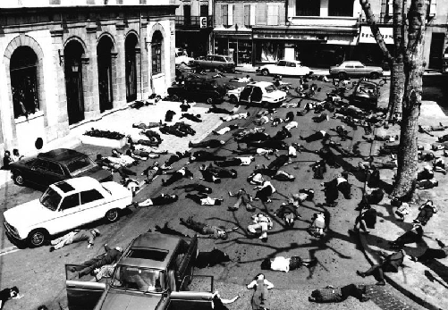</img>
]

---

# Recap

1. Think about your audience and your message

2. Hide the figure, show the data (or the reverse)

3. See through the eyes of your audience

---

class: animated, fadeIn

### What problems do you identify in the following news?

<center>
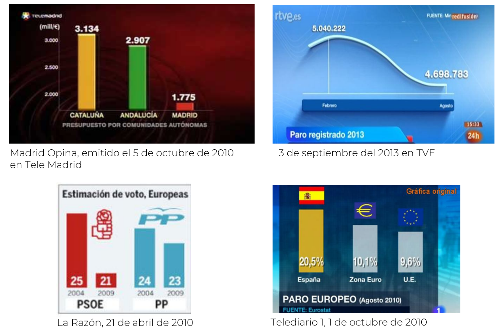
<br>

--

If you find more news like this, add it to the ATENeA!

---

## Case study #1
<center>
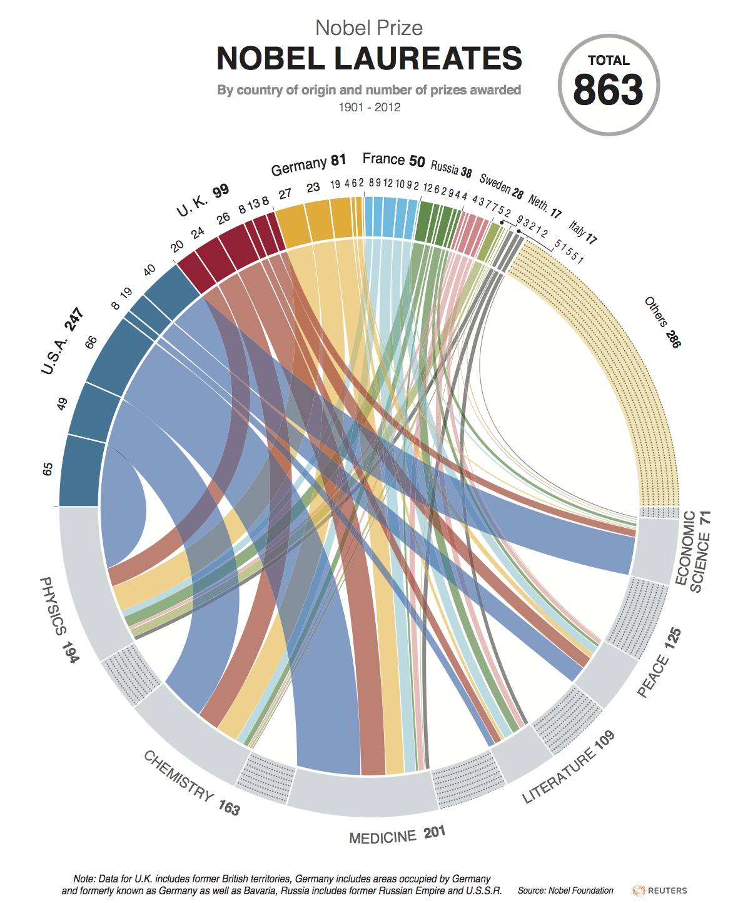</img>
</center>

---

## Case study #2
<center>
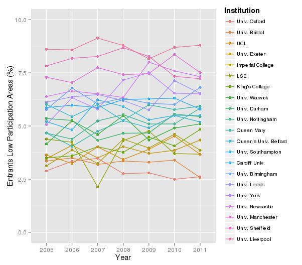</img>
</center>

---

## Case study #3
<center>
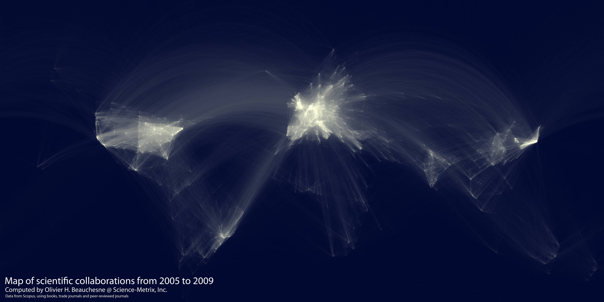</img>
</center>

---

## Case study #4
<center>
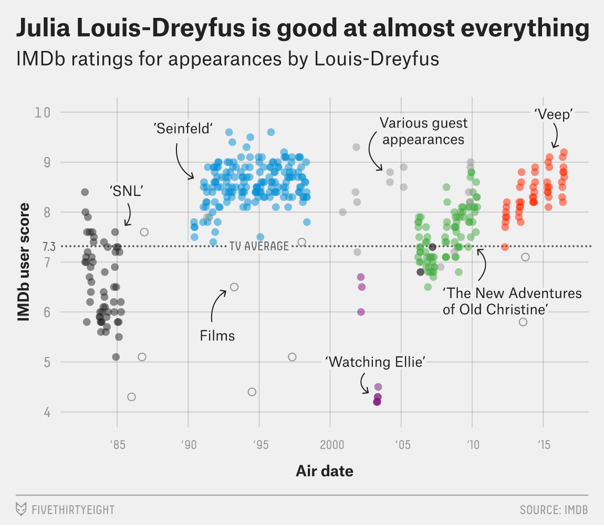</img>
</center>

---

## Case study #5
<center>
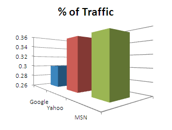</img>
</center>

---

## Case study #6
<center>
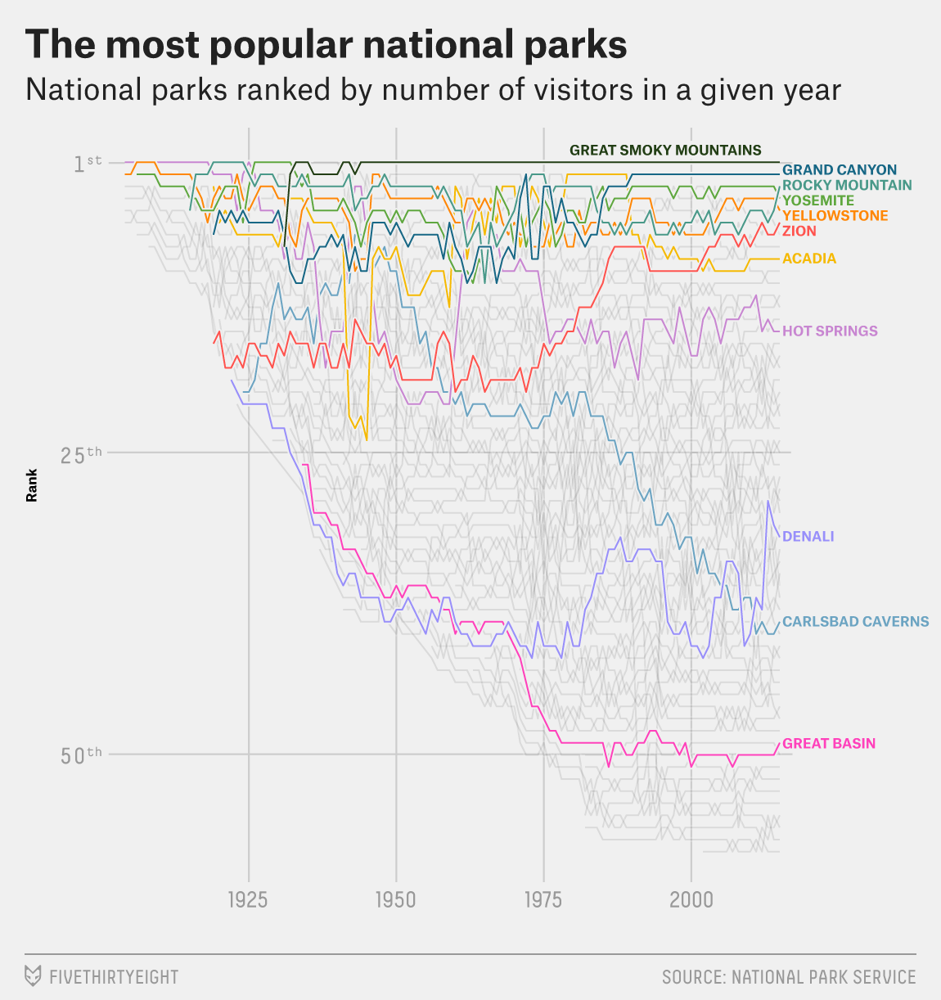</img>
</center>

---

## Case study #7
<center>
</img>
</center>

---
layout: false
class: left, bottom, inverse, animated, bounceInDown

#### Thanks to Guillaume Fillion for kindly providing his materials.

