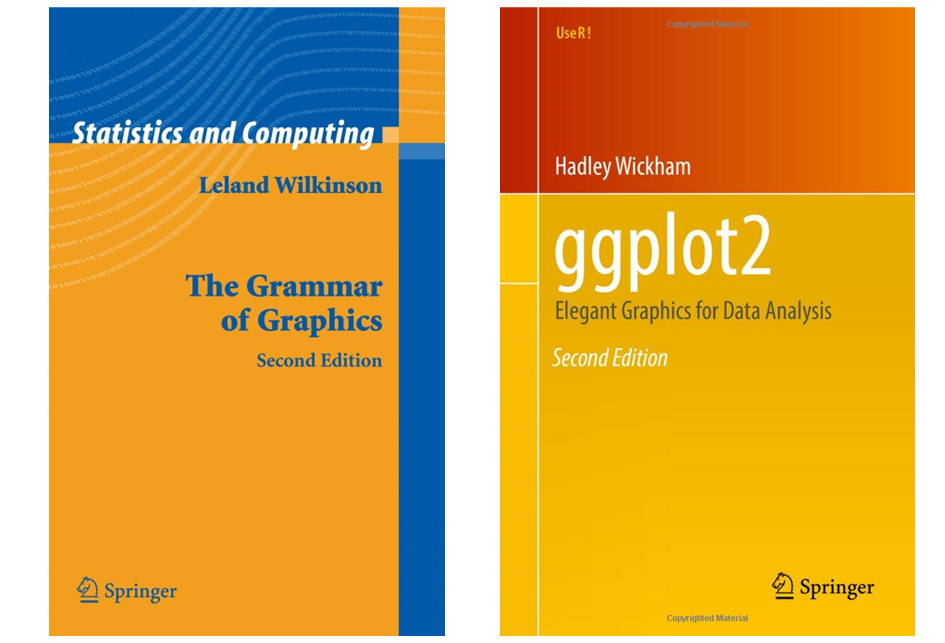
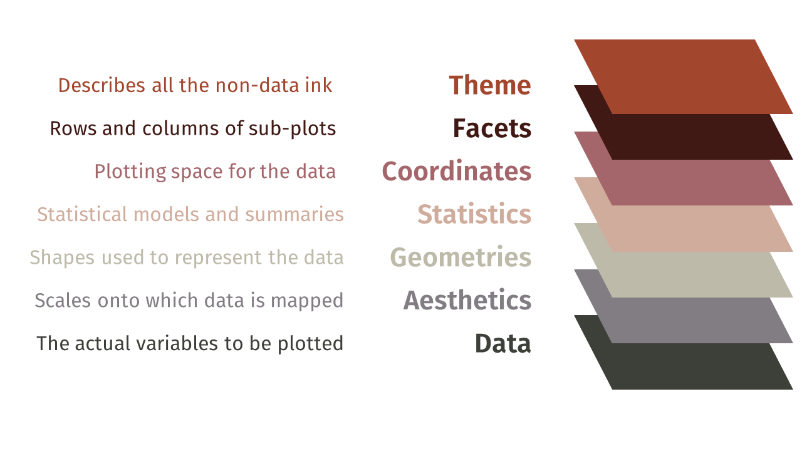

```{r setup, include=FALSE}
options(htmltools.dir.version = FALSE)
# Animations: https://github.com/daneden/animate.css#animations
knitr::opts_chunk$set(echo = FALSE, eval = TRUE, fig.width = 4.5, fig.height = 3.5, fig.show = 'hold', message = FALSE, message = FALSE, warning = F,  fig.retina = 3)
library(ggplot2)
# pagedown::chrome_print("T2.1_slides_sol.html")
# Package for slides
# remotes::install_github('yihui/xaringan')
```

class: center, middle, animated, bounceInDown

#### Theory lessons <br>

| Marta Coronado Zamora | Jose F. Sánchez | 
|:-:|:-:|
| <a href="mailto:Marta.coronado@uab.cat"><i class="fa fa-paper-plane fa-fw"></i> marta.coronado@uab.cat</a> | <a href="mailto:JoseFrancisco.Sanchez@uab.cat"><i class="fa fa-paper-plane fa-fw"></i>&nbsp; josefrancisco.sanchez@uab.cat</a> | 
| <a href="https://bsky.app/profile/geneticament.bsky.social"><i class="fab fa-bluesky fa-fw"></i>&nbsp; @geneticament</a> |                 <a href="https://twitter.com/JFSanchezBioinf"><i class="fab fa-twitter fa-fw"></i>&nbsp; @JFSanchezBioinf</a> |
| <a href="https://portalrecerca.uab.cat/es/organisations/grup-de-gen%C3%B2mica-bioinform%C3%A0tica-i-biologia-evolutiva-gbbe/"><i class="fa fa-map-marker fa-fw"></i>&nbsp; Universitat Autònoma de Barcelona </a> |    <a href="http://www.germanstrias.org/technology-services/genomica-bioinformatica/"> <i class="fa fa-map-marker fa-fw"></i>Germans Trias i Pujol Research Institute (IGTP)</a> |

#### Practical lessons <br>

| Miriam Merenciano |
|:-:|
| <a href="mailto:miriam.merenciano@uab.cat"><i class="fa fa-paper-plane fa-fw"></i> miriam.merenciano@uab.cat </a> | 
|  <a href="https://portalrecerca.uab.cat/es/organisations/grup-de-gen%C3%B2mica-bioinform%C3%A0tica-i-biologia-evolutiva-gbbe/"><i class="fa fa-map-marker fa-fw"></i>&nbsp; Universitat Autònoma de Barcelona </a> |

<style>
.title-slide {
  background-image: url('img/1.png');
  background-size: 100%;
}
</style>

---
layout: true
class: animated, fadeIn

---

# Theory session dynamics

__Content__

- Theory 
- Examples and short exercises in class (<i class="fas fa-pencil-alt"></i>)  - complete and submit to [Atenea](https://atenea.upc.edu/course/view.php?id=105474)

  <i class="fas fa-laptop-code"></i> _Bring your laptop to theory sessions!_


**Interactive <i class="fab fa-r-project fa-fw"></i></i> documents**  
`R code` can be executed within RStudio!

```{r, echo=TRUE}
value <- 2
value + 3
```

---
layout: false
class: left, bottom, inverse, animated, bounceInDown

# Get started!
## **Graphics with `ggplot2`**

---
layout: true
class: animated, fadeIn

---
# The grammar of graphics

.pull-left[
#### Original grammar
<i class="fas fa-book"></i> Wilkinson, Leland. The grammar of graphics. Springer Science & Business Media, 2006.
]

.pull-right[
<center>

]

--

#### Adapted to `R` in the `ggplot2` package

<i class="fas fa-book"></i> Hadley Wickham. ggplot2: elegant graphics for data analysis. Springer, 2009.

"The grammar tells us that a __statistical graphic is a mapping from data to aesthetic attributes__ (colour, shape, size) __of geometric objects__ (points, lines, bars). The plot may also contain __statistical transformations__ of the data and is drawn on a specific __coordinate system__. __Facetting__ can be used to generate the same plot for different subsets of the dataset. It is the combination of these independent components that make up a graphic."

---

## Syntax 

In `ggplot2` there are different components we can add to a plot:

.pull-left[
```r
ggplot(data = <DATA>,
    mapping = aes(<MAPPINGS>)) +

    <GEOM_FUNCTION>(stat = <STAT>,
    position = <POSITION>) +
  
    <SCALE_FUNCTION>() +
  
    <COORDINATE_FUNCTION>() +
  
    <FACET_FUNCTION>() +
  
    <THEME_FUNCTION>
```

]



<center>
<p style="position:absolute; bottom:125px; right:200px;">
Grammar of Graphics:<br>A layered approach to elegant visuals
</p>

---

## Components

The layered grammar defines a plot as a combination of:

- __Layers__
    + Data
    + Aesthetic mapping
    + Geometric objects
    + Statistical transformation
    + Position adjustment
- __Scales__
- __Coordinate system__
- __Faceting specification__
- __Theme__ (not in the original grammar)


<center>
<p style="position:absolute; bottom:125px; right:200px;">
Grammar of Graphics:<br>A layered approach to elegant visuals

---

### Layers

**Layers** are responsible for creating the objects that we perceive on the plot. 

- __Data__
- __Aesthetic mapping__
- __Geometric objects__ 
- __Statistical transformation__
- __Position adjustment__

--

#### Syntax:

```{r, eval=FALSE, echo=TRUE}
ggplot(data = data,  mapping = aes(x = var1, y = var2, colour = var3)) +
  layer(geom = "point", stat = "identity", position = "identity")
```

---

### Layers: Data

The data layer specifies the data being plotted. Must be an **R data frame** object.

```{r, eval=TRUE, echo=TRUE}
head(iris, 5)
```

--

```{r, eval=TRUE, echo=TRUE, fig.width = 2.5, fig.height = 2.5, fig.align='center'}
ggplot(data = iris)
```
We get a blank square because we have not added any other layers yet!

---

### Layers: mapping data onto aesthetics

The `iris` data frame has different columns: **aesthetics**. 

The aesthetic layer, or aes for short, specifies how we want to map our data onto the scales of the plot (such as the `x` and `y` coordinates).

--

In `ggplot2` the aesthetic layer is specified using the `aes()` function.

```{r, eval=TRUE, echo=TRUE, fig.width = 2.5, fig.height = 2.5, fig.align='center'}
ggplot(data = iris, mapping = aes(x = Sepal.Width, y = Sepal.Length))
```

The graph shows variable and scales of `Sepal.Length` mapped onto the `x`-axis and `Sepal.Width` on the `y`-axis. What are we missing?

--

A **geom**!

---
### Layers: mapping data onto aesthetics

The **geom** is the geometric object to use display the data.

```{r, eval=TRUE, echo=TRUE, fig.width = 4.5, fig.height = 4.5, fig.align='center'}
ggplot(data = iris, mapping = aes(x = Sepal.Width, y = Sepal.Length)) +
  geom_point()
```

Now we have a scatterplot of the relationship between `Sepal.Length` and `Sepal.Width`.

---

### Layers: mapping data onto aesthetics
#### Main aesthetics types:

```{r fig.height=2}
# Position
ggplot() + 
  geom_segment(data = data.frame(x = c(0, 0.5),
                                 xend = c(1, 0.5),
                                 y = c(0.5, 0),
                                 yend = c(0.5, 1)),
                aes(x = x, y = y, xend = xend, yend = yend),
                arrow = arrow(length = grid::unit(12, "pt")), linewidth = .75) +
  annotate(geom = "text", x = 0.5, y = 1, label = "y", size = 6, vjust = 1, hjust = 2.5) +
  annotate(geom = "text", x = 1, y = 0.5, label = "x", size = 6, vjust = 2, hjust = 1) + 
  theme_void() +
  labs(title = "Position")

# Colour
ggplot() +
  geom_tile(data = data.frame(x = 0.15 + .2333*(0:3)),
            aes(x, y = .5, fill = factor(x)), width = .2, height = .6) +
  scale_fill_viridis_d(guide = "none") +
  theme_void() +
  labs(title = "Colour")

# Shape
ggplot() +
  geom_point(data = data.frame(x = (.5 + 0:3)/4),
             aes(x, y = .5, shape = factor(x)), size = 8, fill = "grey80", show.legend = FALSE) +
  scale_shape_manual(values = 21:24) +
  coord_cartesian(xlim = c(0,1)) +
  theme_void() +
  labs(title = "Shape")
  

# Line type
ggplot() +
  geom_segment(data = data.frame(x = rep(0.05, 4),
                                 xend = rep(0.95, 4),
                                 y = (1.5 + 0:3)/6,
                                 yend = (1.5 + 0:3)/6,
                                 linetype = 4:1),
               aes(x = x, y = y, xend = xend, yend = yend, linetype = linetype), linewidth = 1) +
  scale_linetype_identity() +
  theme_void() +
  labs(title = "Line type")

# Transparency
ggplot(data = data.frame(x = 0.15 + .2333*(0:3), transp = c(0.25, 0.5, 0.75, 1))) +
  geom_point(aes(x, y = .5), shape = 4) +
  geom_tile(aes(x, y = .5, alpha = transp ), width = .2, height = .6, fill = "#F1605DFF") +
  scale_alpha_identity() +
  theme_void() +
  labs(title = "Transparency")

# Size
ggplot() +
  geom_point(data = data.frame(x = (.5 + 0:3)/4),
             aes(x, y = .5, size = factor(x)), shape = 21, fill = "grey80", show.legend = FALSE) +
  scale_size_manual(values = c(2, 5, 8, 11)) + 
  coord_cartesian(xlim = c(0,1)) +
  theme_void() +
  labs(title = "Size")

# Adapted from: https://serialmentor.com/dataviz/aesthetic-mapping.html
```

#### <i class="fas fa-pencil-alt"></i> **Exercise** | Which aesthetic attributes can a continuous variable be mapped to? And a discrete variable?

```{r}
# Answer

```


--

<div style="background-color:#F0F0F0">
&emsp;<i class="fas fa-comment-dots"></i>
Answer:

<ul>
<li>Continuous: position, transparency and size</li>
<li>Discrete: all aesthetics (color, shape, line type, position, transparency and size)</li>
</ul>
&emsp;
</div>

---
### Layers: mapping data onto aesthetics

Data and mapping can be defined in the initial `ggplot()` call or in the layer (`geom_` or `stat_`)

```{r echo=TRUE, fig.width=3, fig.height=2.6}
# Default data and mapping used by the layer
ggplot(data = iris, mapping = aes(x = Sepal.Width, y = Sepal.Length)) +
  geom_point()
# No default defined, data and mapping in layer
ggplot() +
  geom_point(data = iris, mapping = aes(x = Sepal.Width, y = Sepal.Length))
```

#### <i class="fas fa-pencil-alt"></i> **Exercise** | With the code that generate the previous figure, experiment with the colour, size, transparency (<code>alpha</code>) and shape aesthetics.

```{r}
# Answer

```

<div style="background-color:#F0F0F0">
&emsp;<i class="fas fa-comment-dots"></i>
Answer:

&emsp;
</div>

---
### Layers: mapping data onto aesthetics

You can override data or mapping in layer.


```{r echo=TRUE}
p <- ggplot(data = iris, mapping = aes(x = Sepal.Width, y = Sepal.Length))

# Override data in layer
small_iris <- iris[iris$Species %in% "setosa", ]
p + geom_point(data = small_iris)

# Override mapping in layer (or remove y = NULL or add colour = Species)
p + geom_point(aes(y = Petal.Width))
```

<i class="fas fa-info-circle"></i> Note that even though we are mapping `Petal.Width` the graph stills shows `Sepal.Length` in the `y`-axis.

---

### Layers: mapping data onto aesthetics

All variables used in the plot should be in the data.

```{r echo=TRUE}
# Correct
ggplot(iris, aes(x = Sepal.Width, y = Sepal.Length)) + geom_point()

# Not recommended
ggplot(iris, aes(x = Sepal.Width, y = iris$Sepal.Length)) + geom_point()
SL_var <- iris$Sepal.Length
ggplot(iris, aes(x = Sepal.Width, y = SL_var)) + geom_point()
```

---
### Layers: mapping data onto aesthetics

#### <i class="fas fa-pencil-alt"></i> **Exercise** | Simplify the following code.


```{r echo = TRUE, eval = FALSE}
ggplot(mpg) +
  geom_point(aes(mpg$displ, mpg$hwy))

ggplot() +
  geom_point(mapping = aes(y = hwy, x = cty), data = mpg) +
  geom_smooth(data = mpg, mapping = aes(cty, hwy))

ggplot(diamonds, aes(carat, price)) +
  geom_point(aes(log(brainwt), log(bodywt)), data = msleep)
```

---

### Layers: mapping data onto aesthetics

#### <i class="fas fa-pencil-alt"></i> **Exercise** | Simplify the following code.

```{r echo = TRUE, eval = FALSE}
# Answer

ggplot(mpg, mapping = aes(x = displ, y = hwy)) + 
    geom_point()

ggplot(data = mpg, mapping = aes(cty, hwy)) +
  geom_point() +
  geom_smooth()

ggplot() +
  geom_point(aes(log(brainwt), log(bodywt)), data = msleep)

```


---

### Layers: mapping data onto aesthetics

#### Mapping (variable) vs. setting (constant)

```{r echo=TRUE}
p <- ggplot(iris, aes(Sepal.Width, Sepal.Length))

p + geom_point(aes(colour = Species)) # Map Species to colour
p + geom_point(aes(colour = "darkblue")) # Map "darkblue" to colour
p + geom_point(colour = "darkblue") # Set colour to "darkblue"
```

---

### Layers: mapping data onto aesthetics

__Group__ aesthetic: by default it is the combination of discrete variables (except position).

#### Multiple groups, one aesthetic:

```{r echo=TRUE, message=FALSE}
ggplot(nlme::Oxboys, aes(age, height)) +
  geom_line()

ggplot(nlme::Oxboys, aes(age, height, group = Subject)) + # or colour = Subject
  geom_line()
```

---

### Layers: mapping data onto aesthetics

__Group__ aesthetic: by default it is the combination of discrete variables (except position).

#### Different groups on different layers:


```{r echo=TRUE, message=FALSE}
ggplot(nlme::Oxboys, aes(age, height, group = Subject)) +
  geom_line() + geom_smooth(aes(group = Subject))

ggplot(nlme::Oxboys, aes(age, height, group = Subject)) +
  geom_line() + geom_smooth(aes(group = 1)) # o group = NULL
```

---
### Layers: mapping data onto aesthetics

#### <i class="fas fa-pencil-alt"></i> **Exercise** | Are the observations grouped in the following plot? If so, what variables are used for the grouping?

```{r, fig.align='center'}
ggplot(mtcars, aes(x = factor(cyl), fill = factor(am))) + 
  geom_bar(colour = "white")
```

--

<div style="background-color:#F0F0F0">
&emsp;<i class="fas fa-comment-dots"></i>
Answer:
There are 6 groups: two discrete variables where used: <code>cyl</code> and <code>am</code>.
&emsp;
</div>

---
### Layers: mapping data onto aesthetics

- Aesthetic attributes:
    + __Position__: x, y, xmin, xmax, ymin, ymax, xend, yend
    + __Colour__: colour, fill, alpha
    + __Differentiation__: shape, size, linetype
    + __Grouping__: group

- Each geom understands a different set of aesthetics
- Each geom requires some aesthetics (`?geom_*`)

---
### Layers: geometric objects

```{r fig.width=2.85, fig.height=2.85}
simple_data <- data.frame(
  var1 = c(5, 2, 7),
  var2 = c(9, 6, 3),
  text = c("A", "B", "C")
)

p <- ggplot(data = simple_data, mapping = aes(x = var1, y = var2, label = text)) + 
  labs(x = NULL, y = NULL)
p + geom_point() + labs(title = "geom_point")
p + geom_col() + labs(title = "geom_col")
p + geom_text() + labs(title = "geom_text")
p + geom_tile() + labs(title = "geom_tile")
p + geom_line() + labs(title = "geom_line")
p + geom_path() + labs(title = "geom_path")
p + geom_polygon() + labs(title = "geom_polygon")
p + geom_area() + labs(title = "geom_area")
```

#### <i class="fas fa-pencil-alt"></i> **Exercise** | Which geoms are collective? (multiple observations share a geometrical object)

--

<div style="background-color:#F0F0F0">
&emsp;<i class="fas fa-comment-dots"></i>
Answer:

Collective geoms: <code>geom_line</code>, <code>geom_path</code>, <code>geom_polygon</code>, <code>geom_area</code>.

&emsp;
</div>

---

### Layers: geometric objects

- Full list of geom_* functions:
    + [ggplot2 reference](https://ggplot2.tidyverse.org/reference/index.html#section-layer-geoms)
    + [ggplot2 cheat sheet](https://raw.githubusercontent.com/rstudio/cheatsheets/main/data-visualization.pdf), sorted by type

---

### Layers: statistical transformation

The statistics layer allows you plot statistical values calculated from the data. Transforms the data, typically by summarising  it  in  some  manner. 

A stat takes a dataset as input and returns a dataset as output, and so a stat can add new variables to the original dataset.

<center>
dataset <i class="fas fa-arrow-right"></i> statistical transformation <i class="fas fa-arrow-right"></i> dataset
</center>

```{r echo=TRUE, fig.width=3, fig.height=3}
ggplot(diamonds, aes(carat)) + geom_histogram(aes(y=after_stat(count)), binwidth = 0.1)
ggplot(diamonds, aes(carat)) + geom_histogram(aes(y=after_stat(density)), binwidth = 0.1)
```

New variables are accessed with `after_stat(var)` notation or `stat()` (v3.4.0+)

---

### Layers: statistical transformation


```{r echo=TRUE}
p <- ggplot(mtcars, aes(x = factor(cyl)))

p + geom_bar() + labs(title = "count") # uses stat = "bin" by default
p + geom_bar(aes(y = after_stat(count)/sum(after_stat(count)))) +
  labs(title = "count/sum(count)")
# p + geom_bar(aes(y = stat(count/sum(count))))
p + geom_bar(aes(y = after_stat(prop), group = 1)) + labs(title = "prop")
```

<i class="fas fa-info-circle"></i> Note that we need to specify `group =  1` (or `group = NULL`), otherwise the proportion are calculated within each group and therefore all proportions would be 1.

---

### Layers: statistical transformation

- Full list of stat_* functions:
    + `ggplot2` reference: [geoms](https://ggplot2.tidyverse.org/reference/index.html#section-layer-geoms) and [stats](https://ggplot2.tidyverse.org/reference/index.html#section-layer-stats)
    + [`ggplot2` cheat sheet](https://raw.githubusercontent.com/rstudio/cheatsheets/main/data-visualization.pdf)

- New variables from statistical transformations:
    + `stat_count`: count, prop
    + `stat_bin` or `stat_bin2d`: count, density
    + `stat_boxplot`: width, ymin, ymax, middle
    + `stat_smooth`: y, ymin, ymax, se
    + `stat_summary`: value
    
---

### Layers: position adjustment

Position adjustments apply minor tweaks to the position of elements within a layer.


```{r echo=TRUE}
p <- ggplot(mtcars, aes(x = factor(cyl), y = mpg, colour = factor(cyl)))

p + geom_point() + labs(title = "identity") # default point position
p + geom_point(position = "jitter") + labs(title = "jitter")
p + geom_point(position = position_nudge(x = 0.3)) + labs(title = "nudge")
```

---

### Layers: position adjustment

Position adjustments apply minor tweaks to the position of elements within a layer.


```{r echo=TRUE}
b <- ggplot(mtcars, aes(x = factor(cyl), fill = factor(gear)))

b + geom_bar() + labs(title="stack") # default bar position
b + geom_bar(position = "fill") + labs(title="fill")
b + geom_bar(position = "dodge") + labs(title="dodge")
```


---

### Layers: data + aes + geom + stat + position

```{r}
geom_examples <- data.frame(
  fun = c("geom_point","geom_line","geom_ribbon","geom_col","geom_text", "stat_ecdf"),
  aes = c("x, y, alpha, colour, size, shape...", "x, y, linetype...", "x, ymin, ymax...", "x, y, ..." ,"x, y, label, angle, fontface...", "x, colour, linetype"),
  geom = c("point", "line", "ribbon", "col", "text", "step"),
  stat = c("identity", "identity", "identity", "identity", "identity", "ecdf"),
  position = c("identity", "identity" , "identity", "stack", "identity", "identity")
)

knitr::kable(geom_examples, format = "markdown")
```

---

###  Layers: type of layers and annotations

We can add additional **metadata**, context and annotations, that help to give meaning to the raw data or highlight important features.

```{r echo=TRUE, fig.width=5, fig.height=3, fig.align='center'}
ggplot(iris, aes(x = Species, y = Petal.Width, colour = Species)) + 
  # Show data
  geom_jitter(show.legend = FALSE) +
  
  # Summarize
  geom_boxplot(fill = NA, show.legend = FALSE) +
  
  # Annotate
  geom_hline(yintercept = mean(iris$Petal.Width), alpha = 0.5)
```

---

### Layers: type of layers and annotations

- Common `geom_*` functions with metadata:
    + `geom_text()`, `geom_rect()`, `geom_point()`
    + `geom_line()`, `geom_path()`, `geom_segment()`

.pull-left[    
```{r eval=FALSE, echo=TRUE}
p <- ggplot(mtcars, aes(hp, mpg)) + geom_point()
p + 
  # Add red cercles
  geom_point(data = mtcars[mtcars$hp > 300 | mtcars$mpg > 30,],
             colour = "red", shape = 1, size = 7) +
  # Draw an arrow
  geom_segment(data = mtcars[mtcars$hp > 100 & mtcars$mpg > 30,],
               aes(xend = hp + 30, yend = mpg + 3),
               arrow = arrow(ends = "first", type = "closed", angle = 15, length = unit(0.5,"cm")),
               colour = "gray50") + 
  # Add text
  geom_text(data = mtcars[mtcars$hp > 100 & mtcars$mpg > 30,],
            aes(label = "Economical car"), position = position_nudge(x = 30, y = 3), hjust = 0)
```
]

.pull-right[    
```{r fig.width=6, fig.height=4.5, fig.align='center'}
p <- ggplot(mtcars, aes(hp, mpg)) + geom_point()
p + 
  geom_point(data = mtcars[mtcars$hp > 300 | mtcars$mpg > 30,],
             colour = "red", shape = 1, size = 7) +
  geom_segment(data = mtcars[mtcars$hp > 100 & mtcars$mpg > 30,],
               aes(xend = hp + 30, yend = mpg + 3),
               arrow = arrow(ends = "first", type = "closed", angle = 15, length = unit(0.5,"cm")),
               colour = "gray50") + 
  geom_text(data = mtcars[mtcars$hp > 100 & mtcars$mpg > 30,],
            aes(label = "Economical car"), position = position_nudge(x = 30, y = 3), hjust = 0)
```
]

---

### Layers: type of layers and annotations

- Special layers that act as normal geoms if parameters are within `aes()` or as annotations if outside.
    + `geom_vline()`, `geom_hline()`, `geom_abline()`
- Special layers that don't inherit global settings
    + `annotate()`, `annotation_custom()`

.pull-left[     
```{r eval=FALSE, echo=TRUE}
# Represent mpg vs. hp and annotate a subset of points with a rectangle
p_overview <- ggplot(mtcars, aes(hp, mpg)) +
  annotate(geom = "rect", xmin = 50, ymin = 25, xmax = 100, ymax = 35, fill = "red", alpha = 0.3 )+
  geom_point() +
  labs(x = NULL, y = NULL)
# Represent the subset of points
p_subset <- ggplot(mtcars[mtcars$hp <100 & mtcars$mpg >25,], aes(hp, mpg)) +
  geom_point()
# Add an inset with the full data
p_subset +
  annotation_custom(ggplotGrob(p_overview), xmin = 75, ymin = 30)
```
]

.pull-right[     
```{r fig.width=6, fig.height=4.5, fig.align='center'}
# Represent mpg vs. hp and annotate a subset of points with a rectangle
p_overview <- ggplot(mtcars, aes(hp, mpg)) +
  annotate(geom = "rect", xmin = 50, ymin = 25, xmax = 100, ymax = 35, fill = "red", alpha = 0.3 )+
  geom_point() +
  labs(x = NULL, y = NULL)
# Represent the subset of points
p_subset <- ggplot(mtcars[mtcars$hp <100 & mtcars$mpg >25,], aes(hp, mpg)) +
  geom_point()
# Add an inset with the full data
p_subset +
  annotation_custom(ggplotGrob(p_overview), xmin = 75, ymin = 30)
```
]

---

### Layers: type of layers and annotations

#### <i class="fas fa-pencil-alt"></i> **Exercise** | Exercise: what type of annotation is the most appropriate for the following cases:

A. To highlight some points

B. To add the expected linear trend

C. To write some text


```{r}
# answer

```

--

<div style="background-color:#F0F0F0">
&emsp;<i class="fas fa-comment-dots"></i>
Answer:
<br>
A. To highlight some points: <code>geom_point</code>, <code>annotate</code><br>
B. To add the expected linear trend: <code>geom_smooth</code><br>
C. To write some text <code>geom_text</code>

&emsp;
</div>

---

### Scales

Scales control the mapping from data to aesthetics. They take your data and turn it into something that you can perceive visually: e.g., size, colour, position or shape. 

- Types of scales
    + Axis: `x` and `y` position
    + Legend: the other aesthetics (fill, alpha, shape...)
- Default scales
    + `scale_<aes>_continuous()`: map continious values to visual values
    + `scale_<aes>_discrete()`: map discrete values to visual values
- Manual scales for discrete variables
    + `scale_<aes>_manual(values = c(1, 2, 4))`: map pdiscrete values to manualy chosen visual values
    
---

### Scales

In all scales you can define: `name`, `breaks` and `labels`.

```{r echo=TRUE, fig.width=5.5, fig.height=4.5, fig.align='center'}
ggplot(mtcars, aes(x = mpg, y = wt, shape = factor(gear))) +
  geom_point() +
  scale_y_continuous(name = "Weight", breaks = c(2.5,5)) +
  scale_x_continuous(name = quote(frac(miles, gallon))) +
  scale_shape_discrete(name = "Type", labels = c("III","IV","V"))
```

---

### Scales: legends

- Can be turned on/off
- Need the same name, breaks and labels to be merged

```{r echo=TRUE}
p <- ggplot(mtcars, aes(x = mpg, y = wt, shape = factor(gear), colour = factor(gear)))
p + geom_point()
p + geom_point(show.legend = FALSE)
p + geom_point() +
  scale_shape_discrete(name = "Type", labels = c("III","IV","V")) +
  scale_colour_discrete(name = NULL)
```

---

### Scales: continuous axes

```{r echo = TRUE}
p <- ggplot(mtcars, aes(hp, mpg)) + 
  geom_point()
p + labs(title = "untransformed")
p + scale_x_continuous(trans = "log10") + labs(title = "log(x)")
p + scale_y_reverse() + labs(title = "rev(x)")
```

---

### Scales: colour scales for discrete variables

```{r}
pd <- ggplot(data = iris, aes(Petal.Width, Sepal.Width, colour = Species)) +
  geom_point() + labs(x = NULL, y = NULL, colour = NULL)

pd + labs(title = "scale_colour_hue")
pd + scale_colour_brewer(palette = "Set2") + labs(title = "scale_colour_brewer")
pd + scale_colour_viridis_d(option = "E") + labs(title = "scale_colour_viridis_d")
```

---

### Scales: colour scales for continuous  variables

```{r}
pc <- ggplot(data = iris, aes(Petal.Width, Sepal.Width, colour = Sepal.Length)) +
  geom_point() + labs(x = NULL, y = NULL, colour = NULL)

pc + labs(title = "scale_colour_gradient")
pc + scale_colour_distiller(palette = "YlOrRd") + labs(title = "scale_colour_distiller")
pc + scale_colour_viridis_c(option = "A") + labs(title = "scale_colour_viridis_c")
```

---

### Coordinate system

The coordinate component allows you to adjust the `x` and `y` coordinates.

```{r, fig.width = 4, fig.height = 3}
rect <- data.frame(x = 50, y = 50)
line <- data.frame(x = c(1, 200), y = c(100, 1))
base <- ggplot(mapping = aes(x, y)) +
  geom_tile(data = rect, aes(width = 50, height = 50)) +
  geom_line(data = line) +
  labs(x = NULL, y = NULL)

base + labs(title = "coord_cartesian()")
base + coord_polar(theta = "x") + labs(title = "polar(theta = 'x')")
base + coord_polar(theta = "y") + labs(title = "polar(theta = 'y')")
base + coord_flip() + labs(title = "coord_flip()")
base + coord_transform(y = "log10") + labs(title = "coord_trans(y = 'log10')")
base + coord_fixed() + labs(title = "coord_fixed()")
# Adapted examples from ggplot2 book "ggplot2. Elegant Graphics for Data Analysis"
```
---

### Coordinate system
####Zoom

```{r echo=TRUE}
p <- ggplot(data = data.frame(x = c(1,2.5,3,3.5,5,3.5,3,2.5,1),
                            y = c(3,3.5,5,3.5,3,2.5,1,2.5,3)),
            aes(x, y)) +
  geom_polygon()
p + labs(title = "Full")
p + coord_cartesian(xlim = c(2,4)) + labs(title = "Image clipped")
```


---
### Coordinate system
#### Maps

```{r echo=TRUE, fig.width=5, fig.height=2.5, fig.align='center'}
# install.packages("maps"); library(maps)
if(require("maps")){
  worldmap <- map_data(map = "world")
  ggplot(worldmap, aes(x = long, y = lat, group = group)) +
    geom_polygon(fill = "gray20", colour = "gray92") +
    coord_quickmap()
}
```

- `coord_map` can use projections from package `mapproj` (needs to be installed)

---

### Facets

Faceting is a mechanism for automatically laying out multiple plots on a page. It splits the data into subsets, and then plots each subset into a different panel on the page. Such plots are often called small multiples.

```{r echo=TRUE, eval = TRUE}
p <- ggplot(mtcars, aes(x = wt, y = mpg, colour = factor(cyl),
                        shape = factor(am))) +
  geom_point(show.legend = FALSE) + labs(x = NULL, y = NULL)
p 
p + facet_wrap(~factor(cyl)) # 1d ribbon of panels that is wrapped into 2d
p + facet_grid(factor(am) ~ factor(cyl)) # 2d grid of panels defined by variables which form the rows and columns
```

---

### Facets

`facet_grid` have two additional arguments: `scales` and `space`.

```{r echo=TRUE}
msleep$name <- factor(msleep$name, levels = msleep$name[order(msleep$sleep_total)])
p <- ggplot(msleep[msleep$vore %in% c("carni","insecti"), ], 
            aes(x = sleep_total, y = name)) +
  geom_point() + scale_x_log10()
p + facet_grid(vore~.)
p + facet_grid(vore~., scales = "free", space = "free")
```

---


### Themes

- Complete themes `theme_*()`
- Theme elements `theme()`

```{r}
p <- ggplot(iris, aes(Sepal.Width, Sepal.Length)) + geom_point()
p + theme_classic() + labs(title = "theme_classic()\n")
p + theme(axis.text.y = element_text(colour = "red", size = 12)) + labs(title = "theme(axis.text.y=...)")
p + theme(panel.grid = element_line(linetype = 2, linewidth = 1.5)) + labs(title = "theme(panel.grid=...)")
```

- Full list of theme elements: `?theme`


---

## Components

The layered grammar defines a plot as a combination of:

- __Layers__
    + Data
    + Aesthetic mapping
    + Geometric objects
    + Statistical transformation
    + Position adjustment
- __Scales__
- __Coordinate system__
- __Faceting specification__
- __Theme__ (not in the original grammar)


<center>
<p style="position:absolute; bottom:125px; right:200px;">
Grammar of Graphics:<br>A layered approach to elegant visuals

---

## Components

#### <i class="fas fa-pencil-alt"></i> **Exercise** |  Update the plot to match the requirements below

```{r echo=TRUE}
p <- ggplot(msleep, aes(x = vore, y = sleep_total, colour = vore,
                        fill = vore)) +
  geom_violin(alpha = 0.2, colour = NA) +
  geom_jitter(width = 0.3)
```

- Legend on top of the plot
- White background
- No ticks in y axis
- Axis labels rotated to an angle of 45 degrees

<i class="fas fa-key"></i> Note: check `?theme` options 

---

## Components

#### <i class="fas fa-pencil-alt"></i> **Exercise** |  Update the plot to match the requirements below


```{r echo=TRUE, eval=TRUE}
 p +
   theme(legend.position = "top",
         panel.background = element_rect(fill = "white"),
         axis.ticks.y = element_blank(),
         axis.text.x = element_text(angle = 45, vjust = 0.5))
```

---
layout: false
class: inverse, center, middle, animated, bounceInDown

### Upload `T2.1_slides.Rmd` with the completed exercises (text included) to [Atenea](https://atenea.upc.edu/course/view.php?id=105474)

