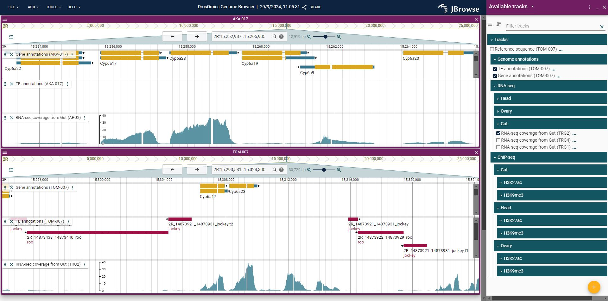
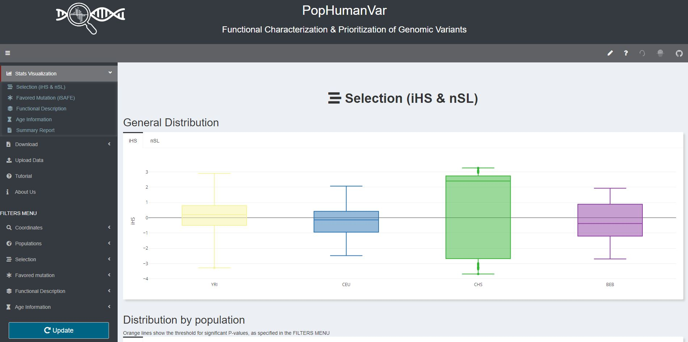

```{r setup, include=FALSE}
options(htmltools.dir.version = FALSE)
# Animations: https://github.com/daneden/animate.css#animations
# pagedown::chrome_print("T2.2_slides.html")
knitr::opts_chunk$set(echo = FALSE, eval = TRUE, fig.width = 4.5, fig.height = 3.5, fig.show = 'hold', message = FALSE, warning = FALSE,  fig.retina = 3)
library(ggplot2)
```


```{r xaringanExtra-clipboard, echo=FALSE}
library(xaringanExtra)
htmltools::tagList(
  xaringanExtra::use_clipboard(
    button_text = "<i class=\"fa fa-clipboard\"></i>",
    success_text = "<i class=\"fa fa-check\" style=\"color: #90BE6D\"></i>",
  ),
  rmarkdown::html_dependency_font_awesome()
)
```


class: center, middle, animated, bounceInDown

#### Theory lessons <br>

| Marta Coronado Zamora | Jose F. Sánchez | 
|:-:|:-:|
| <a href="mailto:Marta.coronado@uab.cat"><i class="fa fa-paper-plane fa-fw"></i> marta.coronado@uab.cat</a> | <a href="mailto:JoseFrancisco.Sanchez@uab.cat"><i class="fa fa-paper-plane fa-fw"></i>&nbsp; josefrancisco.sanchez@uab.cat</a> | 
| <a href="https://bsky.app/profile/geneticament.bsky.social"><i class="fab fa-bluesky fa-fw"></i>&nbsp; @geneticament</a> |                 <a href="https://twitter.com/JFSanchezBioinf"><i class="fab fa-twitter fa-fw"></i>&nbsp; @JFSanchezBioinf</a> |
| <a href="https://portalrecerca.uab.cat/es/organisations/grup-de-gen%C3%B2mica-bioinform%C3%A0tica-i-biologia-evolutiva-gbbe/"><i class="fa fa-map-marker fa-fw"></i>&nbsp; Universitat Autònoma de Barcelona </a> |    <a href="http://www.germanstrias.org/technology-services/genomica-bioinformatica/"> <i class="fa fa-map-marker fa-fw"></i>Germans Trias i Pujol Research Institute (IGTP)</a> |

#### Practical lessons <br>

| Miriam Merenciano |
|:-:|
| <a href="mailto:miriam.merenciano@uab.cat"><i class="fa fa-paper-plane fa-fw"></i> miriam.merenciano@uab.cat </a> | 
|  <a href="https://portalrecerca.uab.cat/es/organisations/grup-de-gen%C3%B2mica-bioinform%C3%A0tica-i-biologia-evolutiva-gbbe/"><i class="fa fa-map-marker fa-fw"></i>&nbsp; Universitat Autònoma de Barcelona </a> |

<style>
.title-slide {
  background-image: url('img/1.png');
  background-size: 100%;
}
</style>

---
layout: true
class: animated, fadeIn

---

# Session content

- Biological data
- General statistical graphics used in bioinformatics
- Specialized libraries and software
    + Static
    + Interactive
- Creating plots with data from papers

---
layout: false
class: left, bottom, inverse, animated, bounceInDown

# Get started!
## **Tools for data visualization in bioinformatics**

---

layout: true
class: animated, fadeIn

---
# Biological data

- __Quantitative and qualitative data__: scatterplots, barplots, boxplots, heatmaps, ...
- __Molecular sequences__: alignments, motifs, genome browsers, ...
- __Species relationships__: trees, networks
- __Molecular pathways and interactions__: cell diagrams, networks, ...
- __Molecular structures__: 3D molecular viewers, ...
- __Anatomical structures__: anatograms, ...
- __...__

--

#### <i class="fas fa-pencil-alt"></i> **Exercise** | Go to the research articles from [Nature Communications](https://www.nature.com/search?journal=ncomms&article_type=research&date_range=last_5_years&order=date_asc) journal and describe the types of visualizations used. How far can you enlarge the previous list?

Use the collaborative *PADLET* available in Atenea:  https://atenea.upc.edu/course/section.php?id=907338

---

# General statistical graphics

## Biological example

Gene expression data from [GTEx project](https://gtexportal.org/home/):

```{r echo=TRUE}
data <- read.table(file = "https://raw.githubusercontent.com/marta-coronado/data/refs/heads/main/expression_data.txt", 
                   header = TRUE, sep ="\t",
                   stringsAsFactors = FALSE)
data[1:4,1:4]
```

---

## Biological example

The `data` data frame contains the expression of `r length(unique(data$gene_name))` genes in `r length(table(data$tissue))` tissues.

```{r echo=TRUE}
table(data$gene_type, data$tissue)
```

---

## Biological example

#### <i class="fas fa-pencil-alt"></i> **Exercise** |  Use `ggplot2` to answer the following questions:

- Which type of gene is more expressed on average?

```{r}
library(ggplot2)

```

<div style="background-color:#F0F0F0">
&emsp;<i class="fas fa-comment-dots"></i>
Answer:

&emsp;
</div>

- Which tissue has more expressed genes?

```{r}
data$expressed <- data$median_expression > 0

```

<div style="background-color:#F0F0F0">
&emsp;<i class="fas fa-comment-dots"></i>
Answer:

&emsp;
</div>

- Where is HLA-B gene expressed the most? Is its expression low, high or average compared to other genes?

```{r}
data_gene <- data[ data$gene_name %in% "HLA-B", ]

```

<div style="background-color:#F0F0F0">
&emsp;<i class="fas fa-comment-dots"></i>
Answer:

&emsp;
</div>

- Where are located the genes highly expressed in brain (median\_expression >20,000)?

```{r}
data_brain <- data[ data$tissue %in% "Brain" & data$expressed, ]
data_brain$gene_chr <- factor(data_brain$gene_chr, levels = c(as.character(1:22), "X", "Y", "MT"))

```

<div style="background-color:#F0F0F0">
&emsp;<i class="fas fa-comment-dots"></i>
Answer:

&emsp;
</div>

---

# Specialised libraries and software

- Integrated software suites
- Javascript
    + [BioJS](https://biojs.net)
- R libraries
    + Specialised repositories [bioconductor](https://bioconductor.org)
    + [`ggplot2` extensions](https://exts.ggplot2.tidyverse.org/gallery/)
    + [`htmlwidgets`](http://gallery.htmlwidgets.org/), some using BioJS libraries

--

#### <i class="fas fa-pencil-alt"></i> **Exercise** |  Which `ggplot2` extensions and `htmlwidgets` are designed to cover specific needs of biological data?

<div style="background-color:#F0F0F0">
&emsp;<i class="fas fa-comment-dots"></i>
Answer:

&emsp;
</div>

---

# Static visualizations: `ggplot2` extensions

## Phylogenetic trees: `ggtree`

```{r}
# Install ggtree from Bioconductor!
#if (!requireNamespace("BiocManager", quietly = TRUE))
#    install.packages("BiocManager")

#BiocManager::install("ggtree")
```

```{r echo =TRUE, fig.height=3, fig.width=3.5, warning=F}
library(ggtree)
set.seed(10); tr <- rtree(20)
ggtree(tr)
ggtree(tr, colour = "darkgreen", alpha = 0.8, size = 1.5)+
    scale_y_continuous(breaks = 1:20, position = "right", name = "edges") + 
    annotate(geom = "text", x = 0.5, y = 19, label = "It's a ggplot!") + 
    theme_gray() 
```

---

## Anatomical structures: `gganatogram`

```{r}
# Install from github
# devtools::install_github("jespermaag/gganatogram")
# sample data set
organ_df <- data.frame(organ = c("heart", "leukocyte", "nerve", "brain", "liver", "stomach", "colon"), 
 type = c("circulation", "circulation",  "nervous system", "nervous system", "digestion", "digestion", "digestion"), 
 colour = c("red", "red", "purple", "purple", "orange", "orange", "orange"), 
 value = c(10, 5, 1, 8, 2, 5, 5),
 stringsAsFactors=F)
```

```{r echo=TRUE, fig.height=3.75, fig.width=7}
library(gganatogram)
gganatogram(data=organ_df, fillOutline='#a6bddb', organism='human',
            sex='male', fill="value") +
    scale_fill_gradient(low = "white", high = "red") + 
    facet_wrap(~ type) 
```

---

## Sequence logos: `ggseqlogo`

```{r, warning=F}
# Install from CRAN
# install.packages("ggseqlogo")
## Or install from github
## devtools::install_github("omarwagih/ggseqlogo")

library(ggseqlogo)
# Sample data
data(ggseqlogo_sample)
# str(seqs_dna)
```

```{r echo=TRUE, fig.height=2.5, fig.width=3.5, warning=F}
library(ggseqlogo)
ggplot() + geom_logo(seqs_dna$MA0002.1) +
    theme_logo() + labs(title = "My TFBS profile")
ggplot() +
    annotate(geom = "rect", xmin = 2.5, xmax = 4.5,
             ymin = -Inf, ymax = Inf, alpha = 0.2) +
    geom_logo(seqs_dna$MA0008.1, method = "probability") +
    theme_logo() 
```

---
## Gene structures: `gggenes` y `gggenomes`

.pull-left[
```{r eval = F, echo = T}
library(gggenes)
ggplot(example_genes, aes(xmin = start, xmax = end, y = molecule, fill = gene)) +
  geom_feature(
    data = example_features,
    aes(x = position, y = molecule, forward = forward)
    ) +
  geom_feature_label(
    data = example_features,
    aes(x = position, y = molecule, label = name, forward = forward)
    ) +
  geom_gene_arrow() +
  geom_blank(data = example_dummies) +
  facet_wrap(~ molecule, scales = "free", ncol = 1) +
  scale_fill_brewer(palette = "Set3") +
  theme_genes()

```
]

.pull-right[
```{r eval = T, echo = F, fig.height=7,fig.width=8}
library(gggenes)
ggplot(example_genes, aes(xmin = start, xmax = end, y = molecule, fill = gene)) +
  geom_feature(
    data = example_features,
    aes(x = position, y = molecule, forward = forward)
    ) +
  geom_feature_label(
    data = example_features,
    aes(x = position, y = molecule, label = name, forward = forward)) +
  geom_gene_arrow() +
  geom_blank(data = example_dummies) +
  facet_wrap(~ molecule, scales = "free", ncol = 1) +
  scale_fill_brewer(palette = "Set3") +
  theme_genes()

```
]

---

## Show intersections: `UpSetR`

```{r, warning=F}
# Install from CRAN
# install.packages("UpSetR")
library(UpSetR)
```

```{r echo=TRUE, fig.height=5, fig.width=7.5, warning=F}
library(UpSetR)

mutations <- read.csv( system.file("extdata", "mutations.csv", package = "UpSetR"), header=T, sep = ",")

upset(mutations, sets = c("PTEN", "TP53", "EGFR", "PIK3R1", "RB1"), sets.bar.color = "#56B4E9",
order.by = "freq", empty.intersections = "on")
```

---

# Interactive visualizations

## Multiple alignment: `msaR`

```{r}
# Install from CRAN
# install.packages("msaR")
```


```{r echo=TRUE, out.width="50%"}
library(msaR)
seqfile <- system.file("sequences","AHBA.aln", package="msaR")
msaR(seqfile)
```

---

## Protein structure

[Example](http://www.rcsb.org/3d-view/4hhb/1) using [NGL](https://github.com/arose/ngl): a web application for molecular visualization: display molecules like proteins and DNA/RNA with a variety of representations.

<center>


---

## Genome browsers

Example by González lab at Institut Botànic de Barcelona: [DrosOmics](https://www.biologiaevolutiva.org/gonzalez_lab/drosomics/) 

<center>


Coronado-Zamora M, Salces-Ortiz J, González J. 2023. DrosOmics: A Browser to Explore -omics Variation Across High-Quality Reference Genomes From Natural Populations of *Drosophila melanogaster*. Mol Biol Evol 40:msad075.

---


## Shiny applications

Example by my group at UAB: [PopHumanVar](https://pophumanvar.uab.cat)

<center>


Colomer-Vilaplana A, Murga-Moreno J, Canalda-Baltrons A, Inserte C, Soto D, Coronado-Zamora M, Barbadilla A, Casillas S. PopHumanVar: an interactive application for the functional characterization and prioritization of adaptive genomic variants in humans. Nucleic Acids Res. 2022;50(D1):D1069-D1076.

---

# Wrap-up

- Most basic exploratory and communication graphs in Bioinformatics can be achieved with general-purpose statistical graphics tools
- The complexity and characteristics of some biological data requires specialized tools
    + If static requirements, `ggplot2` extensions may help
    + If interactive requirements, `htmlwidgets` may help
    + Check tools used in similar studies 


---

layout: false
class: inverse, center, middle, animated, bounceInDown

### Upload `T2.2_slides.Rmd` with the completed exercises (text included) to [Atenea](https://atenea.upc.edu/course/view.php?id=95546)
