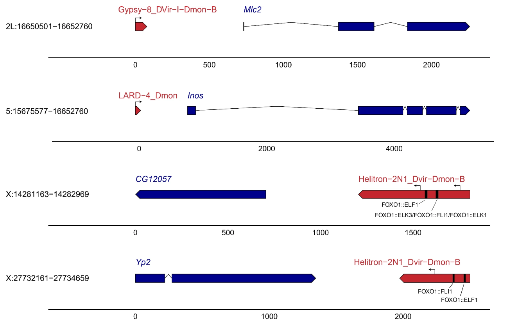
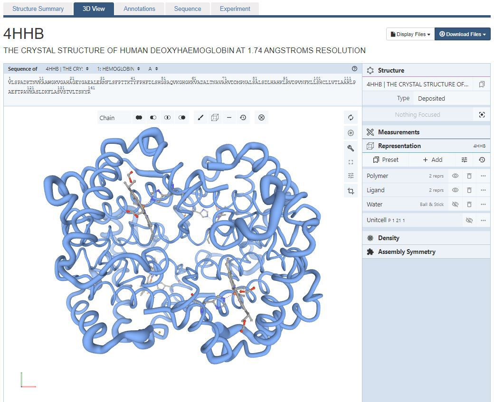

```{r setup, include=FALSE}
options(htmltools.dir.version = FALSE)
# Animations: https://github.com/daneden/animate.css#animations
# pagedown::chrome_print("T2.2_slides.html")
knitr::opts_chunk$set(echo = FALSE, eval = TRUE, fig.width = 4.5, fig.height = 3.5, fig.show = 'hold', message = FALSE, warning = FALSE,  fig.retina = 3)
library(ggplot2)
library(dplyr)
```


```{r xaringanExtra-clipboard, echo=FALSE}
library(xaringanExtra)
htmltools::tagList(
  xaringanExtra::use_clipboard(
    button_text = "<i class=\"fa fa-clipboard\"></i>",
    success_text = "<i class=\"fa fa-check\" style=\"color: #90BE6D\"></i>",
  ),
  rmarkdown::html_dependency_font_awesome()
)
```


class: center, middle, animated, bounceInDown

#### Theory lessons <br>

| Marta Coronado Zamora | Jose F. Sánchez | 
|:-:|:-:|
| <a href="mailto:Marta.coronado@uab.cat"><i class="fa fa-paper-plane fa-fw"></i> marta.coronado@uab.cat</a> | <a href="mailto:JoseFrancisco.Sanchez@uab.cat"><i class="fa fa-paper-plane fa-fw"></i>&nbsp; josefrancisco.sanchez@uab.cat</a> | 
| <a href="https://bsky.app/profile/geneticament.bsky.social"><i class="fab fa-bluesky fa-fw"></i>&nbsp; @geneticament</a> |                 <a href="https://twitter.com/JFSanchezBioinf"><i class="fab fa-twitter fa-fw"></i>&nbsp; @JFSanchezBioinf</a> |
| <a href="https://portalrecerca.uab.cat/es/organisations/grup-de-gen%C3%B2mica-bioinform%C3%A0tica-i-biologia-evolutiva-gbbe/"><i class="fa fa-map-marker fa-fw"></i>&nbsp; Universitat Autònoma de Barcelona </a> |    <a href="http://www.germanstrias.org/technology-services/genomica-bioinformatica/"> <i class="fa fa-map-marker fa-fw"></i>Germans Trias i Pujol Research Institute (IGTP)</a> |

#### Practical lessons <br>

| Miriam Merenciano |
|:-:|
| <a href="mailto:miriam.merenciano@uab.cat"><i class="fa fa-paper-plane fa-fw"></i> miriam.merenciano@uab.cat </a> | 
|  <a href="https://portalrecerca.uab.cat/es/organisations/grup-de-gen%C3%B2mica-bioinform%C3%A0tica-i-biologia-evolutiva-gbbe/"><i class="fa fa-map-marker fa-fw"></i>&nbsp; Universitat Autònoma de Barcelona </a> |

<style>
.title-slide {
  background-image: url('img/1.png');
  background-size: 100%;
}
</style>

---
layout: true
class: animated, fadeIn

---

# Session content

- Biological data
- General statistical graphics used in bioinformatics
- Specialized libraries and software
    + Static
    + Interactive
- Creating plots with data from papers

---
layout: false
class: left, bottom, inverse, animated, bounceInDown

# Get started!
## Tools for data visualization in bioinformatics

---

layout: true
class: animated, fadeIn

---
# Biological data

- __Quantitative and qualitative data__: scatterplots, barplots, boxplots, heatmaps, ...
- __Molecular sequences__: alignments, motifs, genome browsers, ...
- __Species relationships__: trees, networks
- __Molecular pathways and interactions__: cell diagrams, networks, ...
- __Molecular structures__: 3D molecular viewers, ...
- __Anatomical structures__: anatograms, ...
- __...__

--

#### <i class="fas fa-pencil-alt"></i> **Exercise** | Go to the research articles from [Nature Communications](https://www.nature.com/search?journal=ncomms&article_type=research&date_range=last_5_years&order=date_asc) journal and describe the types of visualizations used. How far can you enlarge the previous list?

Use the collaborative **PADLET** available in Atenea:  https://atenea.upc.edu/course/section.php?id=907340

---

## General statistical graphics

### Biological example

Gene expression data from [GTEx project](https://gtexportal.org/home/):

```{r echo=TRUE}
data <- read.table(file = "https://raw.githubusercontent.com/marta-coronado/data_visualization/refs/heads/main/T/2/expression_data.txt", 
                   header = TRUE, sep ="\t", stringsAsFactors = FALSE)
```

<div style="font-size: 60%;">
```{r, echo = F, tidy=T}
head(data, 10) %>% 
  tibble() %>% 
  DT::datatable(
    options = list(
      scrollY = 300,
      scrollX = 600,
      pageLength = 25,
      fontSize = '5%',
      dom = "ti",
      ordering = FALSE,
      rownames = FALSE,
      options = list(pageLength = 5, scrollX=T),
      class = 'white-space: nowrap' 
    )
  )
``` 
</div>
---

## Biological example

The `data` data frame contains the expression of `r length(unique(data$gene_name))` genes in `r length(table(data$tissue))` tissues.

```{r echo=F}
table(data$gene_type, data$tissue) %>% 
  knitr::kable()
```

---

## Biological example

#### <i class="fas fa-pencil-alt"></i> **Exercise** |  Use `ggplot2` to answer the following questions:

- Which type of gene is more expressed on average?

<div style="background-color:#F0F0F0">
&emsp;<i class="fas fa-comment-dots"></i>
Answer:

&emsp;
</div>

- Which tissue has more expressed genes?

<div style="background-color:#F0F0F0">
&emsp;<i class="fas fa-comment-dots"></i>
Answer:

&emsp;
</div>

- In which tissue is HLA-B gene expressed the most? Is its expression low, high or average compared to other genes?

<div style="background-color:#F0F0F0">
&emsp;<i class="fas fa-comment-dots"></i>
Answer:

&emsp;
</div>

- In which chromosomes are located the genes highly expressed in brain (median\_expression >20,000)?

<div style="background-color:#F0F0F0">
&emsp;<i class="fas fa-comment-dots"></i>
Answer:

&emsp;
</div>

---

## Biological example

#### <i class="fas fa-pencil-alt"></i> **Exercise** |  Use `ggplot2` to answer the following questions:

- Which type of gene is more expressed on average?

  - What variables do we want in the `x`-axis and in the `y`-axis?
  - What `geom_()` is the most appropriate?

---
## Biological example

- Which tissue has more expressed genes?

  - What `geom_()` is the most appropriate?
  - What variables do we want in the `x`-axis and in the `y`-axis?

```{r , warning=F, echo = T}
library(dplyr)

# we filter the genes that are expressed:
data_expr <- data %>% filter(median_expression > 0)

```


---

## Biological example

- In which tissue is HLA-B gene expressed the most? Is its expression low, high or average compared to other genes?

  - What `geom_()` is the most appropriate?
  - What variables do we want in the `x`-axis and in the `y`-axis?


```{r, warning=F, echo = T}
library(dplyr)

data_gene <- data %>%
  filter(gene_name %in% "HLA-B")
```

<div style="font-size: 60%;">

```{r, warning=F, echo = F}
data_gene %>% 
  tibble() %>% 
  DT::datatable(
    options = list(
      scrollY = 300,
      scrollX = 600,
      pageLength = 25,
      fontSize = '5%',
      dom = "ti",
      ordering = FALSE,
      rownames = FALSE,
      options = list(pageLength = 5, scrollX=T),
      class = 'white-space: nowrap' 
    )
  )
```

</div>

---

## Biological example

- In which chromosomes are located the genes highly expressed in brain (median\_expression >20,000)?

  - What `geom_()` is the most appropriate?
  - What variables do we want in the `x`-axis and in the `y`-axis? 

```{r, warning=F, echo = T}
data_brain <- data %>%
  filter(tissue == "Brain" &
           median_expression > 0)
```


---

# Specialised libraries and software

- Integrated software suites
- Javascript
    + [BioJS](https://biojs.net)
- R libraries
    + Specialised repositories [bioconductor](https://bioconductor.org)
    + [`ggplot2` extensions](https://exts.ggplot2.tidyverse.org/gallery/)
    + [`htmlwidgets`](http://gallery.htmlwidgets.org/), some using BioJS libraries

--

#### <i class="fas fa-pencil-alt"></i> **Exercise** |  Which `ggplot2` extensions and `htmlwidgets` are designed to cover specific needs of biological data?

<div style="background-color:#F0F0F0">
&emsp;<i class="fas fa-comment-dots"></i>
Answer:

&emsp;
</div>

Use the collaborative **PADLET** available in Atenea:  https://atenea.upc.edu/course/section.php?id=907340


---

## Static visualizations: `ggplot2` extensions

### Phylogenetic trees: `ggtree`

```{r}
# Install ggtree from Bioconductor!
#if (!requireNamespace("BiocManager", quietly = TRUE))
#    install.packages("BiocManager")

#BiocManager::install("ggtree")
```

```{r echo =TRUE, fig.height=3, fig.width=3.5, warning=F, fig.align='center'}
library(ggtree)
set.seed(10); tr <- rtree(20)

ggtree(tr, colour = "darkgreen", alpha = 0.8, size = 1.5)+
    scale_y_continuous(breaks = 1:20, position = "right", name = "edges") + 
    annotate(geom = "text", x = 0.5, y = 19, label = "It's a ggplot!") 
```

---

### Anatomical structures: `gganatogram`

```{r}
# Install from github
# devtools::install_github("jespermaag/gganatogram")
# sample data set
organ_df <- data.frame(organ = c("heart", "leukocyte", "nerve", "brain", "liver", "stomach", "colon"), 
 type = c("circulation", "circulation",  "nervous system", "nervous system", "digestion", "digestion", "digestion"), 
 colour = c("red", "red", "purple", "purple", "orange", "orange", "orange"), 
 value = c(10, 5, 1, 8, 2, 5, 5),
 stringsAsFactors=F)
```

```{r echo=TRUE, fig.height=4.75, fig.width=8, fig.align='center'}
library(gganatogram)

gganatogram(data=organ_df, fillOutline='#a6bddb', organism='human',
            sex='female', fill="value") +
    scale_fill_gradient(low = "white", high = "red") + 
    facet_wrap(~ type) 
```

---

### Sequence logos: `ggseqlogo`

```{r, warning=F}
# Install from CRAN
# install.packages("ggseqlogo")
## Or install from github
## devtools::install_github("omarwagih/ggseqlogo")

library(ggseqlogo)
# Sample data
data(ggseqlogo_sample)
# str(seqs_dna)
```

```{r echo=TRUE, fig.height=4.5, fig.width=7.5, warning=F, fig.align='center'}
library(ggseqlogo)

ggplot() + 
  geom_logo(seqs_dna$MA0002.1) +
  theme_logo() + 
  labs(title = "My TFBS profile")

```

---
### Gene structures: `gggenes` y `gggenomes`

.pull-left[
```{r eval = F, echo = T}
library(gggenes)
ggplot(example_genes, aes(xmin = start, xmax = end, y = molecule, fill = gene)) +
  geom_feature(
    data = example_features,
    aes(x = position, y = molecule, forward = forward)
    ) +
  geom_feature_label(
    data = example_features,
    aes(x = position, y = molecule, label = name, forward = forward)
    ) +
  geom_gene_arrow() +
  geom_blank(data = example_dummies) +
  facet_wrap(~ molecule, scales = "free", ncol = 1) +
  scale_fill_brewer(palette = "Set3") +
  theme_genes()

```
]

.pull-right[

<small>
Figure 7 - Tahami, M.S., Vargas-Chavez, C., Poikela, N., Coronado-Zamora, M., et al. Transposable elements in Drosophila montana from harsh cold environments. Mobile DNA 15, 18 (2024). https://doi.org/10.1186/s13100-024-00328-7
]

---

### Show intersections: `UpSetR`

```{r, warning=F}
# Install from CRAN
# install.packages("UpSetR")
library(UpSetR)
```

```{r echo=TRUE, fig.height=5, fig.width=7.5, warning=F, fig.align='center'}
library(UpSetR)

mutations <- read.csv( system.file("extdata", "mutations.csv", package = "UpSetR"), header=T, sep = ",")

upset(mutations, sets = c("PTEN", "TP53", "EGFR", "PIK3R1", "RB1"), sets.bar.color = "#56B4E9",
order.by = "freq", empty.intersections = "on")
```

---

## Interactive visualizations

### Multiple alignment: `msaR`

```{r}
# Install from CRAN
# install.packages("msaR")
```


```{r echo=TRUE, out.width="50%"}
library(msaR)
seqfile <- system.file("sequences","AHBA.aln", package="msaR")
msaR(seqfile)
```

---

### Protein structure

[Example](http://www.rcsb.org/3d-view/4hhb/1) using [NGL](https://github.com/arose/ngl): a web application for molecular visualization: display molecules like proteins and DNA/RNA with a variety of representations.

<center>


---

### Genome browsers

Example from my postdoc (González lab): [DrosOmics](https://www.biologiaevolutiva.org/gonzalez_lab/drosomics/) 

<center>


Coronado-Zamora M, Salces-Ortiz J, González J. 2023. DrosOmics: A Browser to Explore -omics Variation Across High-Quality Reference Genomes From Natural Populations of *Drosophila melanogaster*. Mol Biol Evol 40:msad075.

---


### Shiny applications

Example: [**ShinyGO**](http://bioinformatics.sdstate.edu/go/): allows in-depth analysis of gene lists, with graphical visualization of enrichment, pathway, gene characteristics and protein interactions.

<center>


Ge SX, Jung D & Yao R. 2020. Bioinformatics 36:2628–2629.

---

# Wrap-up

- Most basic exploratory and communication graphs in Bioinformatics can be achieved with general-purpose statistical graphics tools
- The complexity and characteristics of some biological data requires specialized tools
    + If static requirements, `ggplot2` extensions may help
    + If interactive requirements, `htmlwidgets` may help
    + Check tools used in similar studies 

---

## <i class="fa fa-rocket"></i> Challenge: analyze a real scientific dataset

We want practice with real-world data sets that are the appropriate to build our `ggplot2` skills. You have available to choose from 7 datasets. Make a meaningful representation of the data they contain. You have available the corresponding research article and a short description of the data.

Datasets from: Whitlock, Michael C, and Dolph Schluter. 2020. The Analysis of Biological Data. Third Edition.

- Submit your visualizations in Atenea (https://atenea.upc.edu/mod/assign/view.php?id=5311512)
- This is optional

---

## <i class="fa fa-rocket"></i> Challenge: analyze a real scientific dataset


### 1. Zika and head size
Zika virus can be spread by mosquitos, sexual contact or from mom to fetus. In 2015 there was an outbreak in Brazil that spread to other countries in the Americas. Small head size (microcephaly) associated with abnormal brain development was frequently reported in newborn babies of infected mothers. Here are data for head measurements of fetuses in pregnant women infected with Zika, taken from ultrasounds between 33 and 36 weeks. A head size between 80 and 94 mm is considered normal for uninfected mothers at this age.

Data link: https://raw.githubusercontent.com/marta-coronado/TAB-data-figs/refs/heads/main/P2_datasets/chap02e2bZikaBiparietalDiameter.csv
- [Read the study](https://www.nejm.org/doi/full/10.1056/nejmoa1602412)


---

## <i class="fa fa-rocket"></i> Challenge: analyze a real scientific dataset


### 2. Life at high altitude
Living at high altitude represents some physiological challenges of living with a limited oxygen supply. Human populations in the Andes, Ethiopia, and Tibet have faced these challenges, and adapted. One potential mechanism of this adaptation is to raise the hemoglobin content of blood to get more oxygen. Beall et al. measured the hemoglobin content of people from these three populations as well as a control of males living at sea level in America.

Data link: https://raw.githubusercontent.com/marta-coronado/TAB-data-figs/refs/heads/main/P2_datasets/chap02e3bHumanHemoglobinElevation.csv
- [Read the study](https://www.pnas.org/doi/10.1073/pnas.252649199)


---

## <i class="fa fa-rocket"></i> Challenge: analyze a real scientific dataset


### 3. Don't go to the light!
The study found that moth populations from urban areas with decades of light pollution exhibit a significantly weaker attraction to light compared to moths from pristine, dark-sky areas, suggesting an evolutionary adaptation to artificial light at night

Data link: https://raw.githubusercontent.com/marta-coronado/TAB-data-figs/refs/heads/main/P2_datasets/chap02q15MothsToLight.csv
- [Read the study](https://royalsocietypublishing.org/doi/10.1098/rsbl.2016.0111)


---

## <i class="fa fa-rocket"></i> Challenge: analyze a real scientific dataset


### 4. Hearing color
Some people experience one of their senses through another. For example, you might hear the name “Bob” and see grey. Saenz and Koch were interested to see how this type of perception impacted the ability to complete complex multi-sensory tasks. So they compared people with and without this unique type of sensory perception (known as synesthetes) to a group of people without such abilities, on a test involving rhythmic temporal patterns similar to Morse code. 

Data link: https://raw.githubusercontent.com/marta-coronado/TAB-data-figs/refs/heads/main/P2_datasets/chap02q10Synesthetes.csv
- [Read the study](https://www.sciencedirect.com/science/article/pii/S0960982208007343)


---

## <i class="fa fa-rocket"></i> Challenge: analyze a real scientific dataset


### 5. Eat less, live longer?
For some reason, restricting food intake often increases lifespan. To see if this was the case, Mattison et al fed 17 rhesus monkeys (7 females, 10 males) a reduced diet with 30% of the normal nutrition, and 17 other rhesus monkeys (8 females, 9 males) a normal nutritious diet.

Data link: https://raw.githubusercontent.com/marta-coronado/TAB-data-figs/refs/heads/main/P2_datasets/chap02q35FoodReductionLifespan.csv 
- [Read the study](https://www.nature.com/articles/nature11432)


---

## <i class="fa fa-rocket"></i> Challenge: analyze a real scientific dataset


### 6. A gene for monogamy?
The gene for the vasopressin receptor V1a is expressed at higher levels in the forebrain of monogamous than promiscuous vole species. To see if expression of this gene influenced monogamy, Lim et al experimentally enhanced V1a expression in the forebrain of 11 males of the meadow vole - a solitary promiscuous species, and compared the percentage of time these and control males spent huddling with a female placed with him (ass a measure of monogamy). 

Data link: https://raw.githubusercontent.com/marta-coronado/TAB-data-figs/refs/heads/main/P2_datasets/chap03q15VasopressinVoles.csv
- [Read the study](https://www.nature.com/articles/nature02539)


---

## <i class="fa fa-rocket"></i> Challenge: analyze a real scientific dataset


### 7. Running with a lighter load
Male spiders in the genus Tidarren are tiny and weigh about 1 percent as much as females. Just before sexual maturity, males voluntarily amputate one of their two organs just before sexual maturity. Could this maybe allow them to move faster?

Data link: https://raw.githubusercontent.com/marta-coronado/TAB-data-figs/refs/heads/main/P2_datasets/chap03e2SpiderAmputation.csv
- [Read the study](https://www.pnas.org/content/101/14/4883)


---

## <i class="fa fa-rocket"></i> Challenge: analyze a real scientific dataset


<i class="fa fa-key"></i> Hint: you can read the data directly using the link as:

```{r eval = F, echo = T}
data <- read.csv("https://raw.githubusercontent.com/marta-coronado/TAB-data-figs/refs/heads/main/P2_datasets/chap03e2SpiderAmputation.csv")
```

---

layout: false
class: inverse, center, middle, animated, bounceInDown
