```{r setup, include=FALSE}
options(htmltools.dir.version = FALSE)
# Animations: https://github.com/daneden/animate.css#animations
# pagedown::chrome_print("T2.2_slides.html")
knitr::opts_chunk$set(echo = FALSE, eval = TRUE, fig.width = 4.5, fig.height = 3.5, fig.show = 'hold', message = FALSE, warning = FALSE,  fig.retina = 3)
library(ggplot2)
library(dplyr)
```


```{r xaringanExtra-clipboard, echo=FALSE}
library(xaringanExtra)
htmltools::tagList(
  xaringanExtra::use_clipboard(
    button_text = "<i class=\"fa fa-clipboard\"></i>",
    success_text = "<i class=\"fa fa-check\" style=\"color: #90BE6D\"></i>",
  ),
  rmarkdown::html_dependency_font_awesome()
)
```


class: center, middle, animated, bounceInDown

#### Theory lessons <br>

| Marta Coronado Zamora | Jose F. Sánchez | 
|:-:|:-:|
| <a href="mailto:Marta.coronado@uab.cat"><i class="fa fa-paper-plane fa-fw"></i> marta.coronado@uab.cat</a> | <a href="mailto:JoseFrancisco.Sanchez@uab.cat"><i class="fa fa-paper-plane fa-fw"></i>&nbsp; josefrancisco.sanchez@uab.cat</a> | 
| <a href="https://bsky.app/profile/geneticament.bsky.social"><i class="fab fa-bluesky fa-fw"></i>&nbsp; @geneticament</a> |                 <a href="https://twitter.com/JFSanchezBioinf"><i class="fab fa-twitter fa-fw"></i>&nbsp; @JFSanchezBioinf</a> |
| <a href="https://portalrecerca.uab.cat/es/organisations/grup-de-gen%C3%B2mica-bioinform%C3%A0tica-i-biologia-evolutiva-gbbe/"><i class="fa fa-map-marker fa-fw"></i>&nbsp; Universitat Autònoma de Barcelona </a> |    <a href="http://www.germanstrias.org/technology-services/genomica-bioinformatica/"> <i class="fa fa-map-marker fa-fw"></i>Germans Trias i Pujol Research Institute (IGTP)</a> |

#### Practical lessons <br>

| Miriam Merenciano |
|:-:|
| <a href="mailto:miriam.merenciano@uab.cat"><i class="fa fa-paper-plane fa-fw"></i> miriam.merenciano@uab.cat </a> | 
|  <a href="https://portalrecerca.uab.cat/es/organisations/grup-de-gen%C3%B2mica-bioinform%C3%A0tica-i-biologia-evolutiva-gbbe/"><i class="fa fa-map-marker fa-fw"></i>&nbsp; Universitat Autònoma de Barcelona </a> |

<style>
.title-slide {
  background-image: url('img/1.png');
  background-size: 100%;
}
</style>

---
layout: true
class: animated, fadeIn

---

# Session content

- Interactive data visualization
- In R
    + `htmlwidgets`
    + `shiny`

---
layout: false
class: left, bottom, inverse, animated, bounceInDown

# Get started!
## Interactive and dynamic data visualization

---
layout: true
class: animated, fadeIn

---

## Example 1

```{r gganimate, warning=FALSE, fig.width=7, fig.height=5, eval =T, fig.align='center'}
library(ggplot2)
# install.packages('devtools')
# devtools::install_github('thomasp85/gganimate')
# install.packages('gganimate')
# install.packages('farver')
# install.packages('gifski')
library(gifski) # In Linux - Ubuntu needs cargo package
library(gganimate)
library(gapminder)
p <- ggplot(gapminder, aes(x = gdpPercap, y = lifeExp, size = pop, colour = country)) +
  geom_point(alpha = 0.7, show.legend = FALSE) +
  geom_text(data = gapminder[gapminder$country %in% c("China", "Spain", "United States"), ],
            aes(label = country, size = NULL, colour = NULL), show.legend = FALSE) +
  scale_colour_manual(values = country_colors) +
  scale_size_area(max_size = 12) +
  coord_cartesian(xlim = c(0, 50000)) +
  # Here comes the gganimate specific bits
  labs(title = 'Year: {frame_time}', x = 'GDP per capita\n(US$, inflation-adjusted)', y = 'Life expectancy') 

p <- p +   transition_time(year) +
  ease_aes('linear')

q <- animate(p, width = 5, height = 3.5, unit = "in", res = 150)
# anim_save("gapminder.gif", q)
#q
```

```{r, fig.align='center'}
q
```

---

## Example 2

```{r plotly, warning=FALSE, fig.width=9, fig.height=7, fig.align='center'}
# install.packages("plotly")
library(gapminder)
library(ggplot2)
library(plotly)

data_2007 <- gapminder[gapminder$year == 2007, ]

p <- ggplot(data_2007,
            aes(x = gdpPercap,
                y = lifeExp,
                size = pop,
                color = continent)) +
  geom_point(alpha = 0.8) +
  scale_x_log10() +
  theme_minimal()

ggplotly(p)
```

---

## Example 3

<center>
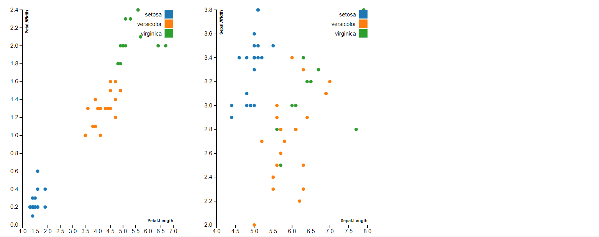
</center>

[Link](https://bwlewis.github.io/crosstool/)

---

## Example 4

<center>
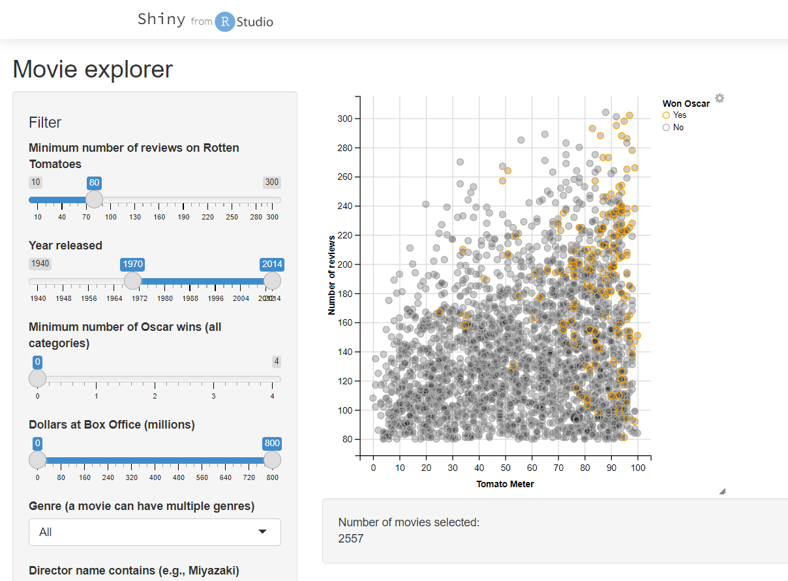
</center>

[Link](https://shiny.rstudio.com/gallery/movie-explorer.html)


---

## Example 4

<center>


</center>

[Link](https://shiny.rstudio.com/gallery/movie-explorer.html)


---

#### <i class="fas fa-pencil-alt"></i> **Exercise** | Describe the previous visualizations. Are they dynamic? And interactive? If so, what types of interaction do you identify?

<div style="background-color:#F0F0F0">
&emsp;<i class="fas fa-comment-dots"></i>
Answer:

&emsp;
</div>

---

## Types of interaction

- **Interactive plot area**
    + Action: hover, click, brush
    + Response: zoom, identify, link, add/remove
- **Interactive controls** (outside the plot)
    + Action: click, drag
    + Response: choose data set, variables, parameters and redraw

---

## How interaction works
.pull-left[
- **Basic framework**: web browsers  
  `html` + `css` + `JavaScript`
- Options for interaction:
    + **Client-side**  
      Static `html` page with `JavaScript` code
      Executed within the browser
      
    + **Server-side**  
      Dynamic `html` page  
      Executed in the host machine
]
.pull-right[
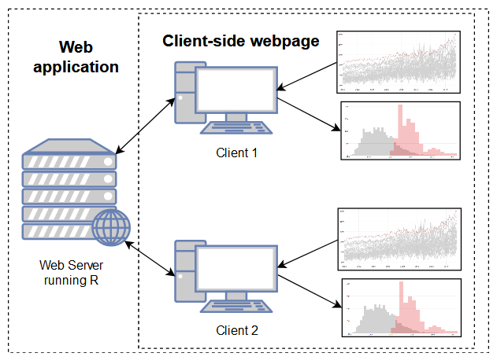]

---


## In R

In recent years there has been a shift from using static R graphics to using interactive JavaScript web components for data analysis and data visualization: we need **R Bindings to JavaScript libraries**

--
- The `htmlwidgets` package
  
  Provides a framework for creating R bindings to `JavaScript` libraries. HTML Widgets can be:
  + Used at the R console for data analysis just like conventional R plots
  + Embedded within R Markdown documents
  + Incorporated into Shiny web applications
  + Saved as standalone web pages
  
  Executed in browser (client-side)  
  Standalone `html` file
  
--

- `Shiny` applications
  
  Framework for interactive web applications in `R`  
  Executed in host machine (server-side)  
  Needs `R` running

---
layout: false
class: left, bottom, inverse, animated, bounceInDown

# `htmlwidgets`

---


layout: true
class: animated, fadeIn

---

## What are `htmlwidgets`?

.pull-left[
Bridge between `R` and `JavaScript` libraries:


| `R` package | `JavaScript` library |
|-------------|----------------------|
| plotly      | plotly.js (D3.js)    |
| networkD3   | D3.js                |
| dygraphs    | Dygraphs.js
| leaflet     | leaflet.js           |
| ...         | ...                  |

[Full list of `htmlwidgets`](http://www.htmlwidgets.org/)
]
.pull-right[
<center>
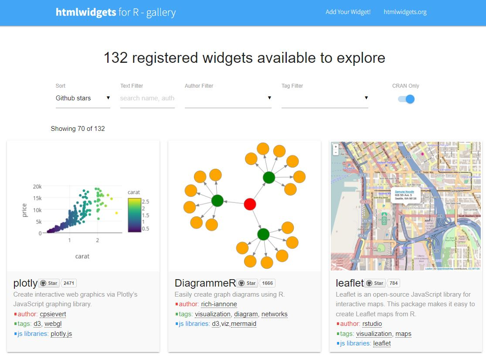
]
---


## Example: `plotly`

```{r fig.width=7, fig.height=5, fig.align='center', eval= TRUE}
library(ggplot2)
library(plotly)
p <- ggplot(data = diamonds, aes(x = cut, fill = clarity)) +
            geom_bar(position = "dodge")
ggplotly(p)
```

---

## Example: `networkD3`

```{r fig.width=7, fig.height=5, fig.align='center', fig.height=10, fig.width=20}
# install.packages("networkD3")
library(networkD3)
src <- c("A", "A", "A", "A", "B", "B", "C", "C", "D")
target <- c("B", "C", "D", "J", "E", "F", "G", "H", "I")
networkData <- data.frame(src, target)
plot<-simpleNetwork(networkData)
plot
```

<center>


---

## Example: `dygraphs`

```{r fig.width=7, fig.height=5, fig.align='center'}
# install.packages("dygraphs")
library(dygraphs)
dygraph(nhtemp, main = "New Haven Temperatures") %>% 
  dyRangeSelector(dateWindow = c("1920-01-01", "1960-01-01"))
```

---

## Example: `leaflet`

```{r fig.width=7, fig.height=5, fig.align='center'}
# install.packages("leaflet")
library(leaflet)
leaflet() %>%
  addTiles() %>%  # Add default OpenStreetMap map tiles
  addMarkers(lng=2.112642, lat=41.3889273, popup="We are here!")
```

---

#### <i class="fas fa-pencil-alt"></i> **Exercise** | Tranform the following graphics made with `ggplot2` into `plotly` interactive versions. What kind of interaction does `plotly` add?


```{r echo = T, fig.width=7, fig.height=4.5, eval=FALSE}
p1 <- ggplot(iris, aes(Sepal.Length, Petal.Length, shape = Species, colour = Species)) +
  geom_point()

p2 <- ggplot(iris, aes(Species, Petal.Length, fill = Species)) +
  geom_boxplot()
```

<div style="background-color:#F0F0F0">
&emsp;<i class="fas fa-comment-dots"></i>
Answer:

&emsp;
</div>

---
layout: false
class: left, bottom, inverse, animated, bounceInDown

# `Shiny`

---
layout: true
class: animated, fadeIn

---

## What is Shiny?


- Framework to create dynamic, reactive html pages without `html`, `css` or `JavaScript`
    + There isn't any static html output
    + Needs an R session running
- Creates web applications
    + Interactive visualizations
    + Much more

[Gallery of  `Shiny` apps](https://shiny.posit.co/r/gallery/)

---


## Syntax

```{r echo=TRUE, eval=FALSE}
library(shiny)

# Web page
ui <- fluidPage()

# Running R session
server <- function(input, output){}

# Connection ui + server
shinyApp(ui = ui, server = server)
```

--

Two basic files: `ui.R` and `server.R` (or have them both in `app.R`)

- `ui`
    + html specifications (R functions)
    + input functions
    + output functions
- `server`
    + instructions to build and rebuild R objects
    + refers to input and output in `ui`

---

### **Let's create a Shiny app!**

First, install the `shiny` package:

```{r, echo=T, eval=F}
install.packages("shiny")
library(shiny)
```

Create a new `Shiny Web App` in RStudio:
<center>
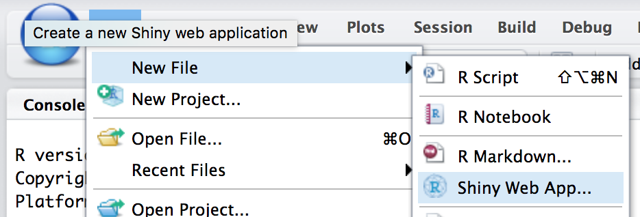

---

### **Let's create a Shiny app!**

First, install the `shiny` package:

```{r, echo=T, eval=F}
install.packages("shiny")
library(shiny)
```

As an application name you can type `test_app` and create a Single File (`app.R`) and save it in a Directory:

<center>
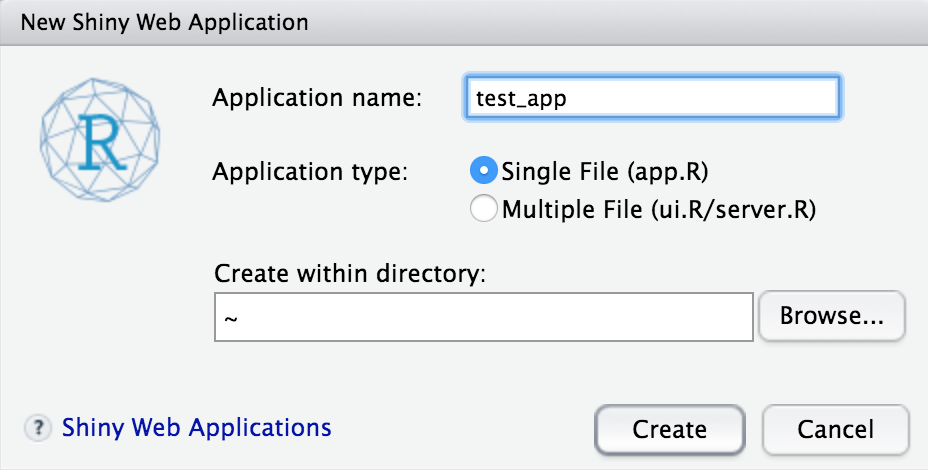

--
</center>
**Run the app! 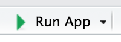** 

---

## Parts of the UI

UI is <i>de facto</i> an HTML file.

- In building `myui` (or `ui.R` file) what we really do is to construct an HTML file with R functions.
- By default, uses [bootstrap](http://getbootstrap.com/), the most popular HTML, CSS, and JS framework for developing responsive, mobile first projects on the web.

Parts of the UI:<br>

--

1. HTML tags<br>

--

2. Layout<br>

--
3.  Input (control widgets)<br>

--

4.  Output


---
### UI: HTML tags

- You can build UI by using HTML tags
- Use `names(tags)` to see all available tags

#### <i class="fas fa-pencil-alt"></i> **Exercise** |  Modify your `app.R` adding the following code inside `fluidPage()` and run the app again.

```{r, echo = TRUE, eval=FALSE}
ui <- fluidPage(
  
titlePanel(HTML('<h1>Old Faithful Geyser Data</h1>
        <hr><br>
        <p> I`m a paragraph showing how to write
        <strong>bold</strong> and <em>italics</em>.<br>
        This is a <code>block of code</code>.<br>
        I can also put <a href="http://www.google.com">a link to google</a>.<br>
        And I can also add images!<br>
        <center></center></p>
        <h2>The app</h2>')),
    # Sidebar with a slider input for number of bins
```

Which HTML tags are you able to identify? What are they used for?

<div style="background-color:#F0F0F0">
&emsp;<i class="fas fa-comment-dots"></i>
Answer:

&emsp;
</div>

---

### UI: Layout

- **Panels**
  + Panel functions are used to put a group of elements together into a single ‘panel’.
  + There are several panel functions defined in shiny:

`absolutePanel()`,
`conditionalPanel()`,
`fixedPanel()`,
`headerPanel()`,
`inputPanel()`,
`mainPanel()`,
`navlistPanel()`,
`sidebarPanel()`,
`tabPanel()`,
`tabsetPanel()`,
`titlePanel()`,
`wellPanel()`,

- **Layouts**
  + Layout functions are used to organize panels and elements into an existing layout.
  + There are several layout functions defined in shiny:

<center>
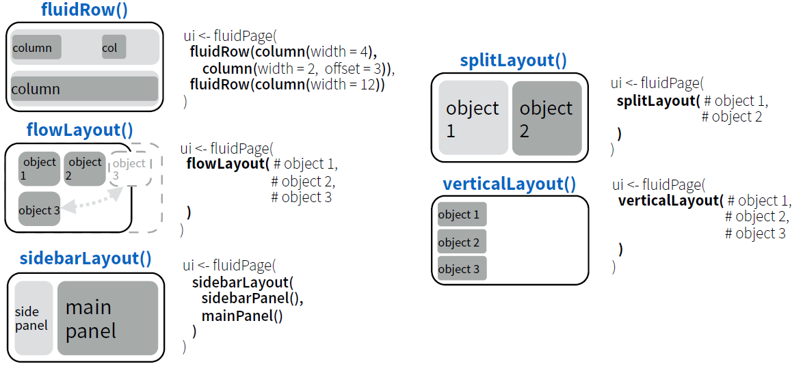

---

### UI: Layout

#### <i class="fas fa-pencil-alt"></i> **Exercise** | Which layouts and panels are used in the `app.R`?

<div style="background-color:#F0F0F0">
&emsp;<i class="fas fa-comment-dots"></i>
Answer:

&emsp;
</div>

---

### UI: Inputs (control widgets)

- Wigets are web elements that users can interact with. 

- The standard Shiny widgets are:

<center>
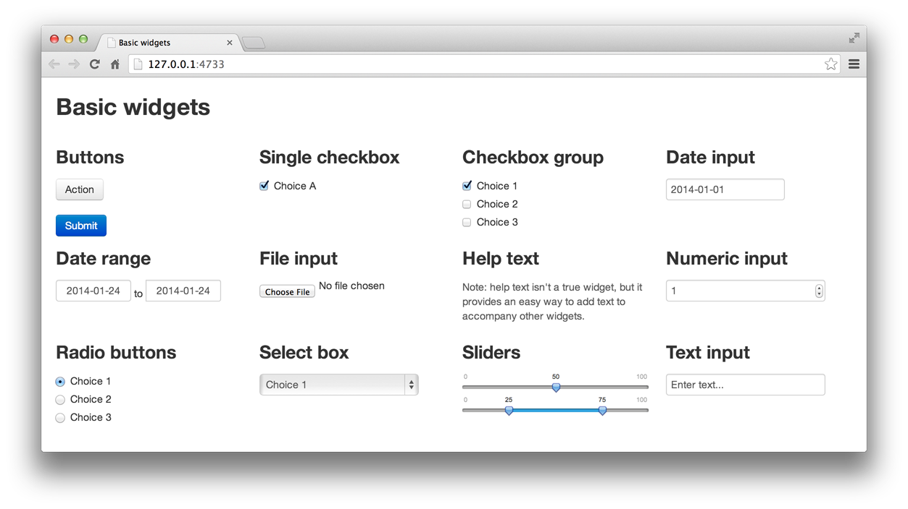

[Widget gallery](https://shiny.posit.co/r/gallery/widgets/widget-gallery/)

---

### UI: Inputs (control widgets)

- Increase counter: `actionButton`, `actionLink`
- TRUE/FALSE: `checkboxInput`
- Date: `dateInput`, `dateRangeInput`
- File: `fileInput`
- Number: `numericInput`
- Text: `textInput`, `passwordInput`
- Select elements: `radioButtons`, `selectInput`, `sliderInput`
- Trigger reaction: `submitButton`

--

#### <i class="fas fa-pencil-alt"></i> **Exercise** | Which widget(s) are used in the `app.R`?

<div style="background-color:#F0F0F0">
&emsp;<i class="fas fa-comment-dots"></i>
Answer:

&emsp;
</div>

---

### UI: Output

- The output will be updated automatically when an input widget changes: **reactivity**
  + when an user manipulates the app, Shiny reruns parts of `server.R` to create an updated output
  
Types of outputs:
  
- Plot: `plotOutput`
- Image: `imageOutput`
- Text: `textOutput`
- Code:  `verbatimTextOutput`
- Table: `tableOutput`

---

### UI and server: Output
<center>
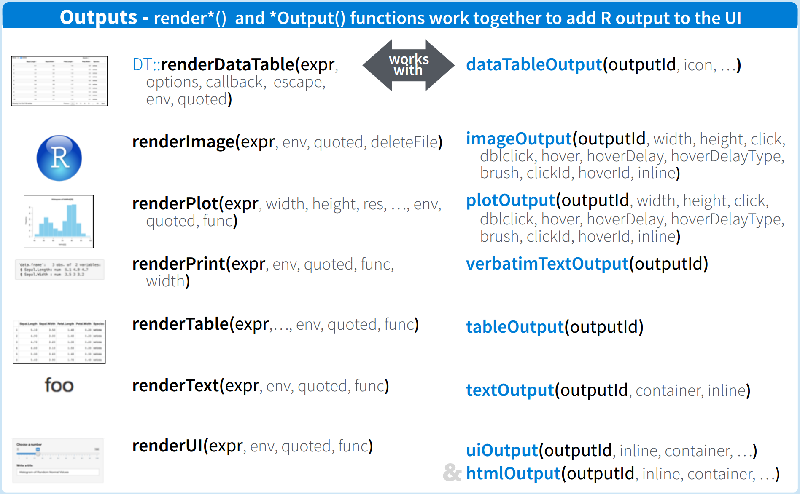

---

## Shiny app summary

#### <i class="fas fa-pencil-alt"></i> **Exercise** | Create a shiny app named 'Cars' with the following requirements:

1. **Layout**: sidebar layout.
2. A **slider** in the sidebar panel with `inputId` "nrows" and `label` "Number of rows:", which controls how many rows of the data set `datasets::cars` to use in the following analysis. The minimum value is 1, maximum value is 50 and default value is 10.
3. In the main panel, create a **scatterplot** with `x` axis 'speed' and `y` axis 'dist' on the top and a table showing the data on the bottom, using `outputId` "`carsPlot`" and "`carsTable`" respectively.
4. Use HTML tags to format the UI: indicating an app title and your name.

<i class="fas fa-key"></i> You can use a subset of your data in ggplot as `cars[1:input$nrows,]`

```{r}

```

  

<div style="background-color:#F0F0F0">
&emsp;<i class="fas fa-comment-dots"></i>
Answer:

&emsp;
</div>

#### Upload your app to [Atenea](https://atenea.upc.edu/course/section.php?id=907341)


---
## Shiny app summary

<center>
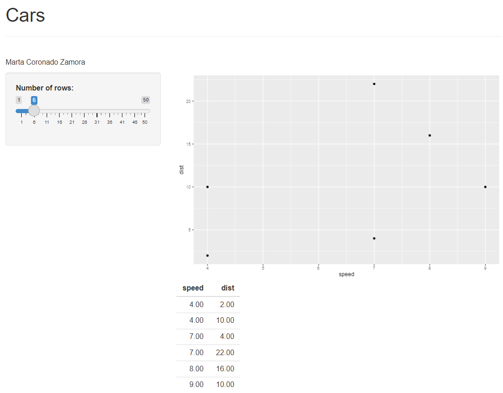

---

layout: false
class: inverse, center, middle, animated, bounceInDown

### Upload your app to [Atenea](https://atenea.upc.edu/course/section.php?id=907341)
