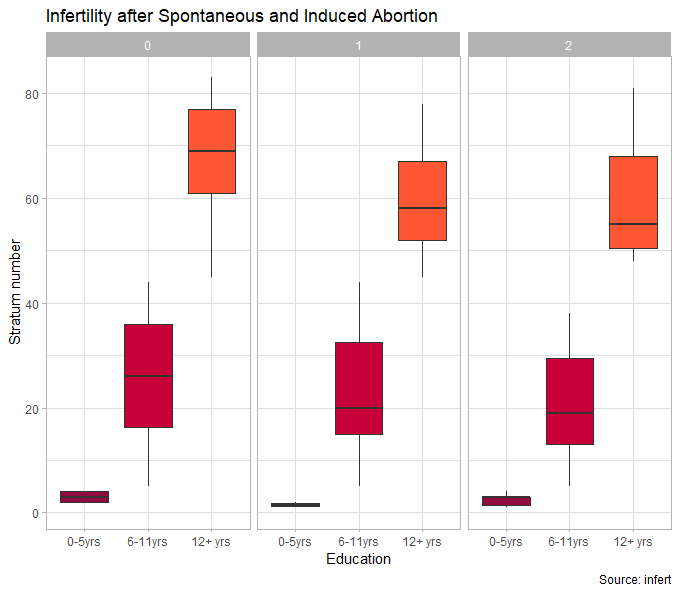

# <i class="fa fa-rocket"></i> Try to reproduce a plot!

With your knowledge on `ggplot2` try to write the code that reproduce the same figure.

| Plot | Dataset      | Description                                                       | Hint                                                                            |
|-------|--------------|-------------------------------------------------------------------|---------------------------------------------------------------------------------|
| 1     | `Titanic`    | Survival of passengers on the Titanic                             | Color palette is: "#79AEB2", "#4A6274"                                          |
| 2     | `ToothGrowth`  | The Effect of Vitamin C on Tooth Growth in Guinea Pigs            | Color palette is: "#58A6A6", "#EFA355"                                          |
| 3     | `msleep`       | An updated and expanded version of the mammals sleep dataset.     | You can color in gray the NA values inside the scale_fill (na.value = "grey80") |
| 4     | `mpg`          | Fuel economy data from 1999 and 2008 for 38 popular models of car | Color palette is: "#4CC3CD", "#FEE883"                                          |
| 5     | `midwest`      | Midwest demographics.                                             | Two aesthetics are combined inside geom_point(), color and size.                |
| 6     | `diamonds`     | Prices of 50,000 round cut diamonds                               | The viridis palette is used.                                                    |
| 7     | `HairEyeColor` | Hair and Eye Color of Statistics Students                         | Color palette is: "#58A6A6", "#EFA355"                                          |
| 8     | `infert`       | Infertility after Spontaneous and Induced Abortion                | Color palette is: "#900C3F", "#C70039", "#FF5733"                               |                              |


<a href="titanic2020_11_7D10_3_14.png" target="new">
    
    </a><a href="toothGrowth2020_11_7D10_6_32.png" target="new">
    
    </a><a href="msleep2020_11_7D10_9_41.png" target="new">
    
</a>
<a href="mpg2020_11_7D10_10_11.png" target="new">
    
</a><a href="midwest2020_11_7D10_10_38.png" target="new">
    
</a> <a href="diamonds2020_11_7D10_11_9.png" target="new">
    
</a><a href="HairEyeColor2020_11_7D10_11_42.png" target="new">
    
</a> <a href="infert2020_11_7D10_11_54.png" target="new">
    
</a>

```{r reproducing-ggplot2}
# p1

# p2

# 

```

# <i class="fa fa-rocket"></i> Future challenges

Using any of the previous datasets, or other ones (you can use any from the `datasets` package), try to create a new challenging figure for next course students.